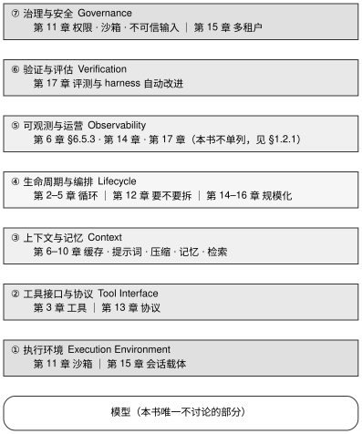

# 第 1 章 · Agent = Model + Harness

---

## 1.1 循环只占 2%–10%，剩下的是什么

一个真正能投入生产的 coding agent，其代码库里到底包含什么？

很多初学者甚至部分团队在初次构建 agent 时，往往以为其核心就是几十行代码写成的一个 `while` 循环：向模型发送消息、解析返回的工具调用、在本地执行并将结果追加进上下文，然后进入下一轮。但这种简化的控制流只描述了最外层的轮询，完全没有触及工具契约、上下文装配、状态持久化、崩溃恢复和权限治理等关键系统组件。

为了观察工业级实现的真实结构，我对四个代表性项目的主循环文件代码量进行了统计，并与该文件所在包的非测试代码总行数进行对比，结果见表 1-1。

表 1-1：四项目循环占比

| 项目 | 循环文件 | 行数 | 所在包 | 包内非测试行数 | 循环占比 |
|---|---|---|---|---|---|
| pi-mono | `packages/agent/src/agent-loop.ts` | 796 | `packages/agent` | 12,921 | **6.2%** |
| opencode | `packages/opencode/src/session/prompt.ts` | 1,631 | `packages/opencode` | 82,408 | **2.0%** |
| codebuff | `packages/agent-runtime/src/run-agent-step.ts` | 1,414 | `packages/agent-runtime` | 14,159 | **10.0%** |
| goose | `crates/goose/src/agents/agent.rs` | 6,207 | `crates/goose` | 158,349 | **3.9%** |

表 1-1 的行数和占比均为本书测量数据。其中 opencode 项统计的是 V1 所在的 `packages/opencode`；其 V2 架构将循环重构于 `packages/core/src/session/runner/llm.ts`。由于该仓库同时保留了两套实现，第 2 章 §2.2.1 分别标注了对应的版本与路径。

在这四个样本中，主循环文件仅占所在核心包非测试代码总量的 **2%–10%**。这一统计直观表明：主循环只占系统极小一部分体积。决定系统在真实工程环境中能否稳定运行的关键机制——工具接口设计、上下文预算与缓存稳定性控制、故障恢复以及安全沙箱——全部位于这 90% 以上的外围代码中。单靠调整循环逻辑根本无法触及这些深层机制。§1.4 的消融实验进一步证实：单独迁移提示词策略往往带来负收益，而工具体系、中间件与记忆架构的改造才能带来持久的正向收益。

Anatomy 一文（厂商自述）用简洁的公式概括了基础模型与外围执行系统的关系；ETCLOVG 综述亦以这一划分为研究对象：

$$\text{Agent} = \text{Model} + \text{Harness}$$

**harness（执行框架）**指代 agent 架构中除基础模型之外的所有工程组件：代码结构、参数配置、运行时逻辑、工具链、沙箱环境、上下文管理策略、故障恢复机制与安全治理边界。主循环仅仅是运行时控制逻辑的一部分。在传统软件工程中，harness 常见于 test harness（测试框架/测试夹具）等表达，本书统一译为**执行框架**，在后续章节中直接以 harness 称呼。

如果仅关注循环而忽视 harness 其余组件的系统化建设，会造成多大的性能折损？表 1-2 汇集了三组在固定基座模型下的对比实验。

表 1-2：三组只改 harness 的实验

| 来源 | 做了什么 | 结果 |
|---|---|---|
| Bölük 文 | 16 个开源/闭源模型，**只改一件事**：编辑工具采用何种格式（patch / replace / hashline；其中 hashline 是一种基于目标行内容哈希进行定位的编辑格式，模型输出「行哈希＋新内容」，无需生成完整 diff） | 替换掉 patch 格式后，16 个模型的任务通过率平均提升 **15 pp**；其中提升最为显著的 Grok Code Fast 1 通过率由 6.7% 跃升至 68.3% |
| Improving Deep Agents 文 | gpt-5.2-codex，**只改动**系统提示词、工具定义与中间件三处实现 | 在 Terminal-Bench 2（命令行真实任务基准）上的通过率由 52.8% 提升至 **66.5%**（+13.7 pp） |
| Meta-Harness | 自动化 harness 参数搜索 + 动态工具过滤策略 | 在 Terminal-Bench 2 上达到 **76.4%** 的通过率，超越了人工调优的 Terminus-KIRA（74.7%），在 Claude Opus 4.6 梯队中位列第 2（仅次于 ForgeCode 的 81.8%） |

需要说明的是，这三组数据重在揭示工程改造的方向性价值，而非保证绝对收益：Bölük 文基于自建任务集且未独立复现，Improving Deep Agents 文属于厂商自述，Meta-Harness 则为论文实测数据（本书未复现）。读者不应将上述百分点直接视作自身系统的预期收益。

这三组实验展示出一个关键事实：**在底层模型保持不变的前提下**，决定 Agent 实际执行上限的正是 harness。选择确定基座模型之后，工程师全部的工程自由度都在 harness 之中。这绝不意味着「模型能力不重要」，而是表明在模型既定的现实约束下，系统工程设计具有远超预期的杠杆效应。关于具体系统的实施路径，应严格按照 §1.5 阐述的依赖顺序推进——先构建沙箱隔离，再打磨上下文管理，最后完善状态恢复。

---

## 1.2 七层切分与真实项目的重量分布

### 1.2.1 七层：一个够用的切分

在学术界目前的系统化梳理中，覆盖面最广的是 ETCLOVG 综述（尚未通过同行评审）。该工作将 harness 划分为七个逻辑层次，取各层英文首字母记作 **ETCLOVG**：

1. **Execution Environment（执行环境）**——宿主沙箱、资源隔离、配额限制与网络访问策略。
2. **Tool Interface（工具接口）**——工具契约定义、动态发现机制与标准化通信协议。
3. **Context Management（上下文管理）**——上下文窗口预算分配、历史压缩与记忆检索。
4. **Lifecycle / Orchestration（生命周期与编排）**——主循环运转、多 agent 协作机制以及长任务的休眠与唤醒。
5. **Observability（可观测性）**——全链路追踪、运行时指标、审计日志与 Token 成本分析。
6. **Verification（验证流程）**——运行时断言与 CI 阶段对输出代码的自动化校验。
7. **Governance（治理与安全）**——权限策略引擎、拦截钩子、安全审计与声明式约束。

这一分层模型的突出价值在于：它将 **Observability（可观测性）与 Governance（治理与安全）提升为独立的一级层次**，而非视作生命周期钩子的附加产物。这种划分符合底层的系统设计规律：安全治理要求在**每一次工具调用真正执行之前**完成严格的权限评估与策略校验。这类前置检查必须作为循环核心结构的有机组成部分，无法在循环实现后再通过外挂补齐——正如第 11 章 §11.5.1 所梳理的纵深防护体系，所有策略都必须在工具副作用发生前生效。

本书以第 11 章与第 15 章重点探讨治理体系，但并未为可观测性单独设立独立章节。原因在于本次全景调研未发现足够多的、具有实质架构分歧的实现差异，未能满足本书「存在关键分歧方成专章」的选材标准（详见后记 D）。

关于可观测性的工程实践，本书将其融入到具体约束场景中：第 6 章 §6.5.3 阐述了如何对缓存命中率、失效根因与成本消耗进行归因分析；第 14 章讲解了如何借助只追加的事件日志与重放机制快速定位异常轮次与出错工具；第 17 章则给出了评估系统改造效果的度量体系。可观测性机制同样不可在后期凭空追加：只追加事件日志是状态恢复与故障归因的权威数据源，若系统在运行初期未规划好事件模型，半年后便无法找回丢失的历史执行轨迹。



图 1-1 展示了执行框架的七层体系与本书 17 个章节的映射关系。自底向上，系统由执行环境、工具接口、上下文管理、生命周期与编排、可观测性、验证流程以及安全治理七层构成。其中上下文管理层（第 6–10 章）占据了整整五章篇幅——这正是当下工程实践中试错成本最高、架构分歧最密集的地带。模型本身是唯一的外部输入，而可观测性分散于缓存归因（§6.5.3）、事件日志（第 14 章）与评测回路（第 17 章），治理层则由沙箱隔离（第 11 章）与多租户载体（第 15 章）共同托底。

### 1.2.2 三个同心圆：你在造哪一层

Böckeler 从开发者角色的视角将系统划分为三个同心圆（实践者文章，非实证分析）：

1. **内核（Inner Core）**：模型本身。
2. **中环（Middle Ring）**：由 coding agent 研发团队内置的核心 harness——包含系统提示词、代码检索架构以及编排运行时。
3. **外环（Outer Ring）**：**用户级 harness**——由最终用户或企业团队针对具体代码库所定制的配置层，常见形式包括 AGENTS.md、自定义 linter 规则、代码审查指令（review skills）与自动化钩子。

Böckeler 一文侧重于外环的设计实践，而**本书聚焦于中环的架构构建**——即工程师从底层打造自主 agent 时所需编写的核心系统。尽管两者的具体技术实现不同，但在控制论与架构决策标准上（见 §1.3）保持统一，因此外环的设计范式在本书后续分析中会被多次引申参考。

### 1.2.3 真实项目的层次分布

七层划分并非停留在纸面的抽象分类，映射到具体代码实现时，各开源项目在各层上的工程比重呈现出鲜明的差异，见表 1-3。

表 1-3：四项目层次分布

| 层 | pi-mono | opencode | codebuff | goose | 说明 |
|---|---|---|---|---|---|
| 循环（L） | `pi-mono/packages/agent/src/agent-loop.ts:1-796` | `opencode/packages/opencode/src/session/prompt.ts:1-1631` | `codebuff/packages/agent-runtime/src/run-agent-step.ts:1-1414` | `goose/crates/goose/src/agents/agent.rs:1-6207` | goose 的循环最为庞大，主要因为其将模型提供方适配与扩展管理逻辑耦合在同一代码谱系中 |
| 上下文（C） | `pi-mono/packages/agent/src/harness/compaction/`、`pi-mono/packages/agent/src/types.ts:200` 的 `transformContext` 回调 | `opencode/packages/opencode/src/session/compaction.ts`（历史裁剪与消息压缩集中于该文件，见第 8 章 §8.2） | `codebuff/packages/agent-runtime/src/compact-history.ts` | `goose/crates/goose/src/agents/moim.rs`、`goose/crates/goose-provider-types/src/cache_semantics.rs`（后者位于独立 crate，未计入 §1.1 的行数统计） | 各项目均将其实现为独立子系统，其代码规模普遍显著超过循环本体 |
| 工具（T） | 工具注册表 + `pi-mono/packages/agent/src/types.ts:277`、`:292` 的 `before/afterToolCall` 钩子 | `opencode/packages/opencode/src/tool/` | `codebuff/packages/agent-runtime/src/tools/handlers/tool/` | `goose/crates/goose/src/agents/extension_manager.rs` + MCP 协议适配 | 详见第 3 章 |
| 治理（G） | 回调机制（`pi-mono/packages/agent/src/types.ts:277` 的 `beforeToolCall`） | 依赖注入服务（`opencode/packages/opencode/src/session/processor.ts:89` 获取、`:372` 调用） | 循环本身不直接执行工具，统一通过注入的 `requestToolCall` 分发（`codebuff/common/src/types/contracts/agent-runtime.ts:63-75`） | 可插拔式检查器与专属确认通道（`goose/crates/goose/src/agents/agent.rs:808-810`、`goose/crates/goose/src/agents/tool_confirmation_router.rs:8-27`） | 四家项目的接口定义各有不同，但核心共性是**绝不在主循环内部硬编码权限判断逻辑**——循环体中不存在任何一处 `if (isDangerous)` |

表 1-3 提炼自本书对四个主力代码库的深度普查。

需要说明的是，goose 当前正在推进将循环迁移至基于 `state_machine` 的重构架构，旧实现与新状态机同时存在于代码库中（迁移策略详见第 2 章 §2.2.5）。表 1-3 与 §1.1 中的统计均基于迁移前的 `agents/agent.rs`；由于两套实现并存，该行数统计与表格所指分析对象严格一致。

表 1-3 揭示了一个核心工程模式：**成熟的 agent 架构普遍将安全治理、上下文管理与持久化状态剥离出循环核心，并通过一组严格定义的窄接口（narrow interface）按需注入。** 以 pi-mono 为例，其核心循环仅通过 9 个函数回调获取外部能力；这 9 个回调构成了 `AgentLoopConfig` 中所有的函数类型字段（其余仅包含 `model` 与 `toolExecution` 两个基础配置字段）。codebuff 则通过 7 个按运行作用域注入的依赖函数（`AgentRuntimeScopedDeps`），实现了单套核心循环在本地 CLI 与云端多租户环境下的完全复用。第 2 章将对这些接口设计展开深入剖析。

---

## 1.3 判断标准：什么该进 harness

七层模型界定了 harness 的静态范畴，但未回答具体功能应归入哪一层。我们可以通过两组正交的工程维度来清晰界定功能归属。

### 判断标准一：前馈引导还是反馈修正（Guides vs Sensors）

Böckeler 提出的核心分析主线，直接源自经典控制理论的二分法：前馈控制（feedforward control）与反馈控制（feedback control）。

- **Guides（前馈机制）**：在 agent 触发动作**之前**提供上下文引导，提升单次生成的正确率。
- **Sensors（反馈机制）**：在 agent 产生动作**之后**捕获执行状态与副作用，驱动模型自我纠偏。

面对系统中的任意机制，我们都可以提出一个明确的物理检验标准：「这项逻辑是在模型推理之前介入，还是在产出之后响应？」

这一维度能够精准诊断两类典型的系统性故障：

- **系统缺乏前馈机制**：agent 会高频重复犯下低级错误，必须完全依赖反馈进行多轮修正，最终表现为「每次都需要纠正三轮才能勉强写对代码」。
- **系统缺乏反馈机制**：各类规则与限制写得极为详尽，但**团队根本无法获知规则是否真正生效**，表现为「仓库根目录维护了极其复杂的 AGENTS.md，却没有任何观测手段证明模型遵守了约定」。

Böckeler 提出的一项关键工程实践值得单列：**必须使 sensor 产出的反馈信号专门针对模型的解析特性进行优化**——例如在自定义 linter 报错中不仅给出错误行号，更直接附带精确的修复代码指令。Böckeler 将此称为「良性的提示词注入（benign prompt injection）」。第 3 章讨论的工具错误信息设计正是这一思路的标准体现。

### 判断标准二：确定性计算还是概率型推理（Computational vs Inferential）

第二组决策维度独立于前馈/反馈划分，聚焦于执行实体的本质特征，见表 1-4。

表 1-4：确定性执行与模型推理

| | Computational（确定性计算） | Inferential（概率型推理） |
|---|---|---|
| 执行实体 | CPU / 确定性程序 | 神经网络 / 概率推理 |
| 典型实现 | 自动化测试、linter、类型检查器、AST 静态分析 | 语义相似度分析、AI Code Review、LLM-as-judge |
| 资源成本 | 毫秒级响应，计算廉价，可随每次代码变更频繁执行 | 秒级高延迟，成本昂贵，结果受随机种子与采样影响 |
| 结果一致性 | 100% 可复现 | 概率性分布 |

**核心架构原则**：凡是能用确定性算法清晰表达的约束，必须坚决下沉为确定性代码执行。模型推理应严格限制在**必须进行模糊语义理解**的场景（例如识别逻辑重复代码、评估过度设计、权衡代码可读性等）。

在评审一项功能设计时，先问一个根本问题：「这条约束能否编写为一个返回状态码 0 或非 0 的确定性程序？」只要答案为是，就绝不应将其委托给大模型。

将上述两组维度交叉组合，即可得到清晰的四象限工程矩阵，常见实现案例见表 1-5。

表 1-5：四象限例子

| 控制项 | 方向 | 类型 | 实现 |
|---|---|---|---|
| 编码规范指引 | 前馈 | 推理型 | AGENTS.md、Skills 定义文件 |
| 自动化重构工具 | 前馈 | 确定型 | 可直接调用的 Codemod 脚本 |
| 架构边界防护 | 反馈 | 确定型 | pre-commit 钩子中执行的模块依赖合规检查 |
| 代码审查反馈 | 反馈 | 推理型 | 专职 Code Review Skill / Agent |

表 1-5 构成了后续各章节在架构选型时的统一准则。第 11 章在探讨权限拦截策略时沿用了完全相同的逻辑：对于危险系统调用的拦截，坚决采用规则匹配与确定性沙箱，而非依赖大模型进行自我审查。

### 判断标准三：Ashby 必要多样性定律的工程推论

在系统控制论中，系统能够呈现的所有互异状态数量被称为多样性（variety）。W. Ross Ashby 提出的必要多样性定律（Law of Requisite Variety）指出：**调节器（控制器）的多样性必须不小于被调节系统本身的多样性，系统才可能实现稳定控制**。（其补充定理「一切优秀的调节器必然是被控系统的模型」出自 Conant 与 Ashby 于 1970 年发表的后续研究，而非 1956 年的经典原著。）

将其映射至 Agent 架构中：**大语言模型能够生成的文本与代码空间近乎无限，而任何在工程上可实施的 harness 所具备的规则与检查能力都是有限的**。面对这一客观不平衡，可行的架构收敛策略只有两条路径：

1. **强行收缩 Agent 的动作空间（Variety Reduction）**：锁定技术栈、固定项目模板与服务接口结构，限制 agent 可自由发挥的代码形态，使 harness 的确定性检查能够完整覆盖所有输出路径。正如 Böckeler 所言：「定义拓扑结构本质上是一次削减多样性的操作（defining topology is a variety-reduction move）」。
2. **通过工程手段倍增 harness 的调节能力（Regulator Amplification）**：利用自动化工具与专用 Agent 批量构建控制器——例如驱动 Agent 自动编写边界测试、从真实执行轨迹中自动提炼规范草稿、脚手架化生成定制 linter。

在评估一套 Agent 系统的稳定性风险时，只需对比其潜在输出状态集与现有监控拦截集的覆盖比例。如果 Agent 在自由环境中具备任意执行命令与修改文件的权限，而外围仅配置了一组基础单元测试，Ashby 定律从数学上即可判定该控制回路必然发生失控，无需等待线上故障暴露。

---

## 1.4 反面证据与失败模式

本章的核心立论是：在模型选定之后，系统的可靠性上限由 harness 的架构深度决定。然而，在采纳各项改造建议时，必须清醒认识到以下限制与反面证据。

### 反面证据一：提示词级优化不具备可迁移性，盲目引入往往带来负收益

最有力的一项反面实证出自 AHE 论文。研究团队在 Terminal-Bench 2（包含 89 个真实任务）基准上进行了 10 轮自动化演化（约 32 小时），随后将演化生成的**单一组件**分别移植回初始的种子 harness 中。该实验的设计严格遵循「向基准种子中单点增加组件」的控制变量法，其实测数据见表 1-6。

表 1-6：AHE 组件消融

| 单独换入种子的组件 | 相对种子的增益 |
|---|---|
| memory（长期记忆架构） | **+5.6 pp** |
| tool（工具实现与接口描述） | +3.3 pp |
| middleware（执行中间件） | +2.2 pp |
| **system prompt** | **−2.3 pp（回归）** |

表 1-6 的数据源自 AHE 论文的单次基准实测（本书未独立复现）。之所以将该结果作为核心约束引入，在于它直接推翻了工程界极为普遍的直觉误区：看到其他优秀项目的 System Prompt 效果出众，便原封不动复制到自身系统中。实验表明：**System Prompt 的单独迁移不仅无法带来收益，反而导致了 −2.3 pp 的性能回归**。该论文的结论明确指出：具有事实结构性的 harness 组件（工具定义、中间件链条、记忆存储）具有良好的跨任务与跨模型迁移能力；而由自然语言叙述的策略文本（那些提示词中的「你应该……」）高度依赖特定模型调优分布，无法直接跨域迁移。

这一发现直接界定了第 7 章的适用边界：书中展示的 System Prompt 具体措辞仅代表对应项目在特定模型下的经验快照，绝不可直接照抄；可以借鉴的是其分层组织结构与缓存边界划分。相比之下，第 3 章的工具设计与第 9 章的记忆读写路径具有显著更高的复用价值。

### 反面证据二：组件收益不可线性叠加

AHE 论文的另一项重要发现是：将三个正收益组件（记忆 +5.6 pp、工具 +3.3 pp、中间件 +2.2 pp）的单点增益简单相加，理论值高达 **+11.1 pp**，但在全量方案组合下，系统的实际总增益仅为 **+7.3 pp**。在困难任务子集上，单独开启记忆模块的版本甚至取得了超过全量组合的通过率（63.3% 对 53.3%）。（这里的难度分级采用 Terminal-Bench 2 官方榜单标注：4 项简单、55 项中等、30 项困难。）

其背后的物理原因是：各个独立组件为了保障正确性，均引入了各自的校验与重试逻辑；多层机制叠加后，容易引发级联冗余检查，在长周期复杂任务中过早耗尽了步骤配额与上下文预算。

这一证据告诫我们：即使将每一层 harness 孤立调至最优，盲目组合依然可能导致整机性能退化。第 17 章将详细讨论组合评测方法；工程师必须在自身的回归基准上验证多组件联合启用的实际表现。

### 反面证据三：自动化改动无法预判引入的隐性能力回归

在 AHE 实验中，演化 Agent 被要求在每次修改 harness 前，明确写下**具有可证伪性的预测**（预测本次改动将修复哪些已知失败任务，同时可能破坏哪些原本通过的任务），并与下一轮执行的实际评测结果进行严格比对，数据见表 1-7。

表 1-7：演化 agent 的预测力

| 预测类型 | 精确率 | 召回率 | 相对随机基线 |
|---|---|---|---|
| 修复预测（fix） | 33.7% | 51.4% | 约 5 倍提升 |
| 回归预测（regression） | 11.8% | 11.1% | 仅约 2 倍提升 |

统计表明：**Agent 能够较好地推演某项修改能够修复的具体问题，但几乎无法预见该修改会在边缘场景中破坏哪些既有能力**。因此，工程演化绝非单调递增的上升曲线，大量修改在触发全面评测后不得不被回滚。

这一结论同样适用于人工架构重构：**本书后续给出的所有优化范式均针对特定的技术痛点，但无法保证这些改动在读者的特定业务场景中不引发侧面回归**。采纳任何架构建议的前提，是系统已经建立起自动化回归测试网。

### 反面证据四：harness 收益随基座模型能力跃迁呈现差异化衰减

现有实验表明，harness 带来的部分增益确实会随着基座模型自身推理能力的增强而发生衰减。

AHE 在跨模型迁移实验中提供了一组定量参考：将一套固化的 harness 分别挂载至 5 个不同的基座模型上，均测得了正向收益，但增益幅度呈现明显分化：DeepSeek 获得 +10.1 pp，Qwen 获得 +6.3 pp，Gemini Flash Lite 获得 +5.1 pp。论文给出的解释是：**距离能力饱和点越远的模型，越高度依赖 harness 所固化下来的协作模式与上下文约束**。

换言之，模型推理能力越强，harness 中那些「代劳模型思考与规划」的逻辑价值越低。但必须看清这一衰减的物理边界：沙箱隔离不会因模型变强而多余，POSIX 进程崩溃恢复不会因模型变强而消失，原子化审计日志与严格的 Token 成本熔断亦然。**随模型进化而贬值的是「弥补模型智力缺陷」的补丁逻辑；而在物理世界中不可替代的，是「模型能力再强也无法自我提供」的基础设施层**——环境隔离、状态持久化、全链路观测与权限治理。

第 11、14、15 与 17 章所聚焦的，正是这些历经模型代际更迭依然稳固的底层工程设施。

---

## 1.5 可以直接采用的最小实现

### 1.5.1 系统演进的依赖顺序

构建一套健壮的 Agent 系统并非平铺直叙的待办清单，各层次之间存在严格的依赖拓扑。表 1-8 给出了经过工业验证的最小建造路径，确保系统在每个阶段都具备独立运行与自证价值的能力。

表 1-8：建造顺序

| 阶段 | 核心建设目标 | 阶段验收标志 | 对应核心章节 |
|---|---|---|---|
| 0 | 最小状态机循环 + 单一工具支持 | 能够完成一个包含多轮工具调用的完整任务 | 第 2、3 章 |
| 1 | 执行环境与沙箱隔离 | 确保 Agent 无论执行何种异常操作均无法破坏宿主机环境 | 第 11 章 |
| 2 | 上下文预算控制与前缀缓存对齐 | 长周期对话不溢出窗口上限，调用成本受前缀缓存严格保护 | 第 6、8 章 |
| 3 | 状态持久化与崩溃恢复 | 进程被意外 `kill -9` 后能够从精确断点继续执行 | 第 14 章 |
| 4 | 全链路可观测性 | 线上出现异常时能够精确定位到具体的轮次、工具及 Payload | 第 6 章 §6.5.3、第 14 章、第 17 章（未设专章，理由见 §1.2.1） |
| 5 | 自动化验证回归流 | 建立一套可自动化执行并输出明确 Pass/Fail 判决的回归基准 | 第 17 章 |
| 6 | 生产级安全治理体系 | 多租户凭证隔离、声明式权限引擎与不可篡改审计追踪 | 第 11、15 章 |

**绝对不要跳过阶段 1。** 这是全书唯一一条不附加任何前置条件的强制性建议：在为 Agent 接入任何具备系统副作用（写文件、调网络、跑终端）的工具之前，必须优先完成执行环境隔离。具体防御策略与三层防护实施步骤详见第 11 章 §11.5.1。若团队当前正准备开放写权限工具，请立即先行研读该节，无需等待按序通读全书。

### 1.5.2 四象限系统自检清单

建议团队依据表 1-9 对现有系统进行全面盘点。任何一个象限的留白，都意味着系统在对应维度存在潜在的架构盲区。

表 1-9：四象限盘点

| | 前馈（Guides） | 反馈（Sensors） |
|---|---|---|
| **确定型** | 项目工程模板、代码生成脚本、强类型系统、标准 CLI | Linter 静态分析、单元测试、AST 架构规则检查、依赖扫描 |
| **推理型** | AGENTS.md 规范、定制 Skills、参考设计文档 | Review Agent 审查、LLM-as-judge 质量评定、日志异常检测 |

依据 §1.3 确立的工程原则进行逐项自检：
- [ ] 每一项业务约束均经过审查，确认「凡能编写为非 0 返回值的确定性代码，已全部下沉至确定性工具链」；
- [ ] 每一条前馈引导规则，均配套了对应的反馈机制以观测并验证其真实执行效果；
- [ ] 所有反馈工具（Sensor）的报错输出均针对大模型进行了信息增强（直接提供修复指令与示例）；
- [ ] 校验信号严格按照成本梯次部署：毫秒级确定性检查随每次变更执行，昂贵的推理型检查后置于关键集成节点。

### 1.5.3 启动开发前的第一道防线

在正式编写第 2 章的主循环代码之前，必须确立一项基础纪律：**为你的 Agent 建立一个哪怕仅包含 10 个典型用例的回归任务集，并在每次修改 harness 时严格记录改动前后的通过率变化。**

其背后的核心依据见 §1.4 反面证据三：工程师对代码修改能否「修复目标缺陷」具备 5 倍于随机水平的直觉，但对修改是否「引发边缘场景回归」的预判力仅有随机水平的 2 倍。缺少基准回归集，后续 16 章的任何局部优化都可能演变为损害全局鲁棒性的净风险。

最小化的回归记录仅需保留单行结构：包含 `run_id, task_id, harness_commit, model_id, outcome(pass|fail), tokens, wall_ms`。在代码变更前后分别运行完整测试，针对同一 `task_id` 分别统计修复（Fix）与回归（Regression）数量。**一旦发现单次变更引入的回归任务数达到或超过修复任务数，必须立即停止修改并排查副作用**。完整的度量与二阶回路治理方案见第 17 章。

---

## 1.6 版本与复核

### 本章基准

| 项 | 值 |
|---|---|
| 素材复核日期 | 2026-08-27 重测表 1-1 四行（goose `agent.rs` 从 5,248 行增至 6,207 行，新增部分约五分之四是文件内测试；占比区间不变）；2026-08-17（§1.1 三行数据、§1.4 消融口径与 §1.2.1 综述的出处于 2026-08-18 逐条取一手来源复核，见下方取证记录） |
| 底稿 | `docs/harness-engineering/reports/LLM Harness Architecture Report.md`、`docs/cybernetics/landscape/07-harness-engineering-as-regulator.md`。两份底稿文内均未标注成文日期；文件系统记录的创建时间分别是 2026-06-01 与 2026-07-21（`stat -f "%SB"`），本书按这两个时间标注，并在此说明这是文件时间戳、不是作者自己写下的成文日期 |
| 项目 commit | pi-mono `ccfe79ed2` (08-27)、opencode `5f5ea53afb` (08-27)、codebuff `6e4f6d642` (08-27)、goose `caf59517c` (08-27) |
| 外部来源基准 | 论文：Meta-Harness (arXiv:2603.28052)、AHE (arXiv:2604.25850)、Terminal-Bench 2 (arXiv:2601.11868)、*Agent Harness Engineering: A Survey*（Li et al., 2026；TMLR 双盲在审，**没有 arXiv 编号**，读者可从两处入口核实：作者项目页 `https://picrew.github.io/LLM-Harness/`（列出 17 位作者，第一作者 Junjie Li）与 OpenReview `https://openreview.net/forum?id=eONq7FdiHa`）。实践者文章：Böckeler《Harness engineering for coding agent users》，martinfowler.com，2026-04-02；Trivedy《The Anatomy of an Agent Harness》，LangChain Blog，2026-03-10；Trivedy《Improving Deep Agents with harness engineering》，LangChain Blog，2026-02-17；Bölük《We improved 15 LLMs at coding in one afternoon. Only the harness changed.》，blog.can.ac，2026-02-12（该域名现跳转至 stencil.so）。理论著作：W. Ross Ashby, *An Introduction to Cybernetics*, 1956；Roger C. Conant & W. Ross Ashby, *Every Good Regulator of a System Must Be a Model of That System*, International Journal of Systems Science, 1970 |

### 哪些会过期，怎么自己复核

| 类别 | 保鲜期 | 复核方式 |
|---|---|---|
| Agent = Model + Harness 的立论 | 长 | 不需要 |
| 七层切分 | 中 | 综述会有新版本；但七层的边界已被多方独立采用 |
| 本章的代码行数测量 | **短** | 见下方循环行数测量 |
| 「四家都把权限判定挪到循环体外」 | **短** | 按下方治理普查判定方法重扫四个循环文件 |
| 三组「只改 harness」的实测数字 | 中 | 基准与模型会换代，结论方向稳定 |
| AHE 的消融数字 | 中 | 单篇论文单个基准，需要更多复现；数字由来见下方 |
| 「harness 收益随模型变强而缩小」 | **短** | 这是当前最值得持续观察的一条 |

**循环行数测量。** 方法：统计 `.ts` 与 `.rs`（不含 `.tsx`），排除 `node_modules`、`target`、`dist` 与文件名匹配 `*.test.*` 者。四个包同一条命令。这四个包不含 CLI、UI、provider 适配。按这条口径，pi-mono `test/` 下三个非 `*.test.ts` 的测试辅助文件（`pi-mono/packages/agent/test/utils/calculate.ts`、`pi-mono/packages/agent/test/utils/get-current-time.ts`、`pi-mono/packages/agent/test/harness/session-test-utils.ts`，合计一百余行）被计进了「包内非测试行数」，对结论无影响。测量日期 2026-08-17。其余三个包把路径换成表 1-1 的循环文件与所在包即可。

```bash
cd projects   # 未克隆先见前言《怎么拿到这些项目的代码》
loc() { find "$1" -type f \( -name '*.ts' -o -name '*.rs' \) \
  -not -path '*/node_modules/*' -not -path '*/target/*' -not -path '*/dist/*' \
  -not -name '*.test.*' -not -path '*/tests/*' -exec cat {} + 2>/dev/null | wc -l; }
wc -l pi-mono/packages/agent/src/agent-loop.ts; loc pi-mono/packages/agent
```

这个测量的绝对值不重要，重要的是**数量级**。在四个架构差异较大的项目中，循环代码都只占个位数百分比，因此这一数量级比任何单个项目的数字更可靠。如果复核时发现某个项目的循环占到 30%，通常说明同一文件还承担了上下文管理或工具执行职责。这种职责混合如何增加修改和测试难度，见第 2 章。

**治理普查判定方法。** 在四个循环主体文件内 grep 权限、确认、危险判断相关的标识符（`permission` / `confirm` / `isDangerous` 等），再看命中处是判定逻辑本身，还是只把外部的判定挂进来（注册、注入、取结果）；后者记为循环体外。

```bash
grep -nEi 'permission|confirm|isDangerous' \
  pi-mono/packages/agent/src/agent-loop.ts \
  codebuff/packages/agent-runtime/src/run-agent-step.ts \
  opencode/packages/opencode/src/session/prompt.ts \
  goose/crates/goose/src/agents/agent.rs
```

2026-08-27 的结果（与 2026-08-17 相同）：pi-mono 与 codebuff 的循环文件零命中；opencode 命中 16 处，全是装配与调用（合并规则集、把 `Permission.Service` 注入执行上下文、调 `Permission.evaluate` 取结果，判定写在 `@/permission` 模块里）；goose 是把 `PermissionInspector` 注册进 `tool_inspection_manager`，判定在 inspector 里。

**AHE 消融数字怎么来的。** 三个角色 agent（Code Agent、Agent Debugger、Evolve Agent）共用同一个基座模型 GPT-5.4，推理档位 high；种子 harness 是只有 bash 的 NexAU0，通过率 69.7%；表 1-6 四个数是各变体减去种子得来的（75.3 / 73.0 / 71.9 / 67.4）。单基准单次实验。
