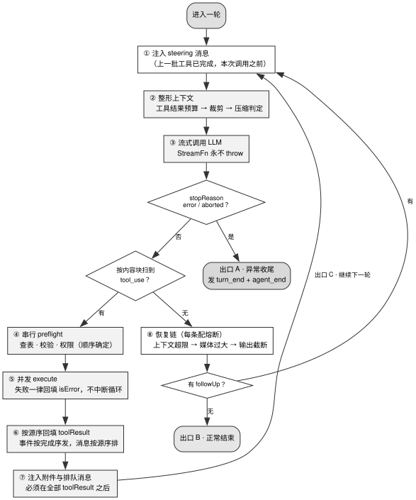

# 第 2 章 · Loop 是显式状态机，不是递归

---

## 2.1 循环管什么，不管什么

**Agent 循环（Agent Loop）**是整个执行系统的动力中枢与状态机核心。它的输入是会话上下文与工具集，按确定的时序循环推进：向模型发起流式推理 → 实时解析工具调用块 → 执行前置策略与权限拦截 → 并发执行工具 → 按源序回填结果至上下文 → 评估终止与中断条件。

它的职责严格限定在**单次运行内部的控制流调度**。它不负责物理持久化、不管理跨会话任务队列、不负责上下文历史压缩算法实现，亦不处理前端 UI 交互——这些职责全部归属于外围的**会话运行时（Session Runtime）**，详见第 14 章。

本章专注于循环本体的架构设计。尽管主循环代码在全系统中的代码量占比仅为 2%–10%（详见第 1 章 §1.1），但**崩溃恢复逻辑、熔断防护机制与动态插话注入点，必须作为循环核心结构的有机组成部分**。若基础拓扑设计出现偏差，后续将极难通过外挂方式补齐这些能力。这正是第 1 章 §1.2.1 所指出的「无法后期插入」在生命周期层的具体体现。

在工程实践中，循环设计最常出现的三类系统性陷阱如下（§2.2 至 §2.4 将逐一给出源码实证）：

1. **实现为函数递归**：导致状态分散于调用栈中，一旦发生异常便无法从断点精确恢复，只能全量冷启动；
2. **在循环内部盲目使用宽泛的 try/catch 吞没异常**：掩盖底层错误细节，使模型无法感知真实的失败原因，进而陷入死循环重试；
3. **混淆「事件流完成顺序」与「上下文历史组装顺序」**：导致历史记录在并发执行下随机乱序，彻底破坏模型所依赖的因果时序。

---

## 2.2 源码对照：七个循环，零个递归

### 2.2.1 七个实现，一种基本结构

表 2-1 汇总了全书深入剖析的七个开源 Agent 在主循环实现上的架构选型与源码位置。

表 2-1：七个主循环的实现方式与代码位置

| 项目 | 核心循环实现范式 | 源码精准位置 |
|---|---|---|
| pi-mono | 纯函数式内核，分层 `while (true)` 结构 | `packages/agent/src/agent-loop.ts:170`（全文件 796 行） |
| opencode | V1 命令式 `while (true)`；V2 事件溯源架构 | V1：`packages/opencode/src/session/prompt.ts:1088`；V2：`packages/core/src/session/runner/llm.ts:397-412` |
| codebuff | 双层解耦架构：turn 调度与 step 执行 | `packages/agent-runtime/src/run-agent-step.ts:670`（`loopAgentSteps`） |
| goose | 展开式长函数循环，正灰度推进显式状态机重构 | `crates/goose/src/agents/agent.rs:1991`（`reply_impl`）、`crates/goose/src/agents/state_machine/mod.rs:67` |
| craft-agents-oss | 依托 SDK 承载底层循环，自研 turn 编排层 | `packages/shared/src/agent/pi-agent.ts` |
| cloudflare-os | 移植 pi-mono 纯函数内核，运行于 Durable Object 环境 | `packages/workshop-backend/src/agent.ts:11-13`（import `@earendil-works/pi-agent-core`） |
| buzz | 运行于 Agent Client Protocol（ACP）隔离子进程中 | `crates/buzz-acp/`，详见第 14 章 |

需要说明的是，opencode 代码库中同时并存 V1 与 V2 两代实现（V2 基于事件溯源与 Effect 框架构建）。Claude Code 闭源，不在表 2-1 里：Anthropic 的 Agent SDK 文档把它的循环描述为「模型推理 → 执行工具 → 回填结果 → 再推理」的迭代过程，与表中各家一致，但本书没有源码依据，不把它计入「零个递归」的普查。

**在全书剖析的七个工业级实现中，无一例外地彻底摒弃了递归调用**。原因在于：系统级状态恢复需要跨轮次锁定上下文，故障熔断需要跨轮次累加计数，动态插话需要确定的时序插入槽位。递归会将这些关键状态隐式散落在各层栈帧与闭包中；因此，所有项目均采用 `while` 迭代配合显式 State 对象。

### 2.2.2 pi-mono：纯函数式最小内核解析

pi-mono 的核心循环展现了极高的抽象纯度。其内核由两层清晰的 while 循环构成：

```typescript
async function runLoop(/* ... */): Promise<void> {
    let currentContext = initialContext;
    let config = initialConfig;
    let firstTurn = true;
    // Check for steering messages at start (user may have typed while waiting)
    let pendingMessages: AgentMessage[] = (await config.getSteeringMessages?.()) || [];

    // Outer loop: continues when queued follow-up messages arrive after agent would stop
    while (true) {
        let hasMoreToolCalls = true;
        // Inner loop: process tool calls and steering messages
        while (hasMoreToolCalls || pendingMessages.length > 0) {
            // ...
            const message = await streamAssistantResponse(currentContext, config, signal, emit, streamFunction);
            newMessages.push(message);
            if (message.stopReason === "error" || message.stopReason === "aborted") {
                await emit({ type: "turn_end", message, toolResults: [] });
                await emit({ type: "agent_end", messages: newMessages });
                return;
            }
```
> `pi-mono/packages/agent/src/agent-loop.ts:155-200`（有省略：六个参数的签名、`turn_start` 埋点与 pendingMessages 注入两段，完整代码见仓库）

该分层循环包含三项核心架构特征：

- **外层 while 托管 Follow-Up 追问，内层 while 托管单轮 Turn 的工具迭代**。pi-mono 与 opencode V2 在未互相参照的情况下收敛于完全相同的双层结构，因为「Agent 已完成当前目标、但用户追加了新指令」与「当前轮次中仍有在途工具需要推进」属于不同层级的调度决策。
- **进入循环体前无条件先行拉取一次 Steering 消息**：注释明确指明，用户极可能在 Agent 上一轮响应结束至本轮拉起的微小间隙内输入了新的引导指令。
- **遇到不可恢复错误时果断 `return` 退出**：循环体内坚决不做盲目的就地弥补，所有错误恢复逻辑统一交由外围恢复链统一仲裁（详见第 5 章）。

**循环对宿主环境的全部外部依赖被精简为 9 个回调函数（见表 2-2）**：

表 2-2：pi-mono 循环对外界的 9 个回调

| 回调函数名 | 声明行号 | 架构用途与介入时机 |
|---|---|---|
| `convertToLlm` | `:178` | 将系统内部消息转换为特定 Provider 的网络线格式 |
| `transformContext` | `:200` | 每次向模型发起请求前动态改写上下文（压缩与裁剪钩子） |
| `getApiKey` | `:210` | 动态刷新模型调用凭证（应对 OAuth Token 过期） |
| `shouldStopAfterTurn` | `:222` | 在当前 Turn 结束后安全停止，严禁粗暴中断在途工具 |
| `prepareNextTurn` | `:229` | 轮次切换时动态调整上下文配置、基座模型或 Thinking 深度 |
| `getSteeringMessages` | `:244` | 本轮工具执行完毕后注入优先级极高的用户插话（第 4 章） |
| `getFollowUpMessages` | `:257` | Agent 即将自然终止时检查是否有待处理的追加任务（第 4 章） |
| `beforeToolCall` | `:277` | 工具真正执行前的策略与权限拦截钩子，支持直接 `block`（第 11 章） |
| `afterToolCall` | `:292` | 工具执行完毕后的副作用改写与清洗钩子（第 11 章） |

John Ousterhout 在《A Philosophy of Software Design》中深刻阐明：优秀的模块应具备「深模块（Deep Module）」特征——接口极其克制精炼，而内部实现完备充实。**pi-mono 将整个循环的外部交互收敛为这 9 个回调函数，构成了标准的窄接口（Narrow Interface）**，使得外围可以自由装配持久化、插话与恢复机制，而无需侵入循环内部逻辑。

### 2.2.3 codebuff：单套循环适配本地与云端双重部署

codebuff 将主循环的运行时依赖统一打包为一组注入契约：

```typescript
/** Per-run dependencies */
export type AgentRuntimeScopedDeps = {
  // Client (WebSocket)
  handleStepsLogChunk: HandleStepsLogChunkFn
  requestToolCall: RequestToolCallFn
  requestMcpToolData: RequestMcpToolDataFn
  requestFiles: RequestFilesFn
  requestOptionalFile: RequestOptionalFileFn
  sendAction: SendActionFn
  sendSubagentChunk: SendSubagentChunkFn
  apiKey: string
}
```
> `codebuff/common/src/types/contracts/agent-runtime.ts:63-75`

**同一份 `loopAgentSteps` 核心逻辑**：当这些依赖绑定到本地实现时，系统以单进程 CLI 形式运行（`requestToolCall` 直接在本地拉起执行器）；而当将其绑定至 WebSocket 反向 RPC 时，系统即可直接运行在云端多租户服务架构之上。

这种职责剥离赋予了循环极高的环境适应性：工程师可以随意将 `getSteeringMessages` 从内存队列替换为数据库轮询，亦可将终端渲染管道替换为分布式事件流广播，而底层的状态机循环逻辑保持 100% 静态不变。第 15 章的云端架构设计正是建立在这一解耦基础之上。

### 2.2.4 终止条件判定：常见陷阱与防御规范

终止条件的准确判定是循环实现中最易出现漏洞的环节。

**opencode**（V1）在实战中踩坑并沉淀了关键防御逻辑：

```typescript
          // Some providers return "stop" even when the assistant message contains
          // tool calls. Keep the loop running so tool results can be sent back to
          // the model, but ignore cleanup-marked interrupted orphans.
          const hasToolCalls =
            lastAssistantMsg?.parts.some(
              (part) => part.type === "tool" && !part.metadata?.providerExecuted && !isOrphanedInterruptedTool(part),
            ) ?? false

          if (
            lastAssistant?.finish &&
            !["tool-calls", "unknown"].includes(lastAssistant.finish) &&
            !hasToolCalls &&
            lastAssistant.parentID === lastUser.id
          ) { /* 记录告警并 break 退出 */ }
```
> `opencode/packages/opencode/src/session/prompt.ts:1103-1116`

这段注释揭露了一个普遍存在的线上事实：**部分模型 Provider 在返回的 Assistant 消息中明明包含结构化工具调用，但其 `finish_reason` 却依然错误地返回 `stop`**。因此，终止判定绝不能单纯盲信服务端的 `stop_reason`，而**必须在客户端深度扫描 Payload 中的 Content Block**。这个特例清单还在长：2026-08 的一次修复（PR #43892）又把 `"unknown"` 加进了「不退出」的名单——finish 原因缺失时同样按有工具调用处理，继续循环。

**codebuff** 则给出了最为严密的显式终止判定公式：

```typescript
// If the agent has the task_completed tool, it must be called to end its turn.
const requiresExplicitCompletion =
  agentTemplate.toolNames.includes('task_completed')

let shouldEndTurn: boolean
if (requiresExplicitCompletion) {
  // ...
  shouldEndTurn = !hadToolCallError && hasTaskCompleted
} else {
  // ...
  shouldEndTurn =
    !hadToolCallError &&
    (hasTaskCompleted || (hasNoToolResults && !isThinkOnly))
}
```
> `codebuff/packages/agent-runtime/src/run-agent-step.ts:596-612`（两处 `// ...` 各省略了原文一段解释性注释）

其中包含两个至关重要的工程细节：
- **`!hadToolCallError` 是终止判定的前置必要条件**：只要本轮存在工具执行报错，系统绝不能直接退出，而必须强制驱动下一轮迭代，让模型根据错误输出进行自我修正。
- **`isThinkOnly` 过滤机制**：若本轮模型输出仅包含 `<think>...</think>` 推理内容（或原生推理模型泄漏的孤立闭合标签），说明模型仍在思考阶段，必须继续推进迭代，严禁提前终止。

**pi-mono** 则通过集合谓词定义继续条件：只有当本轮的所有工具执行结果均显式标注 `terminate: true` 时才停止循环；否则只要有任一工具要求继续，状态机便持续推进。

### 2.2.5 goose：从六千行单体循环到模块化状态机

goose 的循环文件是调研样本中最庞大的单体实现：写作时（2026-08-16）5,248 行，2026-08-27 已增至 6,207 行，新增部分约五分之四是文件内测试。它在单个文件中混合了 Provider 协议适配、状态管理与扩展调度，导致单元测试极难开展。

为此，goose 启动了全面的状态机重构（PR #9574），引入了全新的 `state_machine` 模块。新架构把循环拆成 `state_machine/` 目录下 19 个 `ops_*.rs` 文件（如 `ops_llm.rs`、`ops_toolcalling.rs`、`ops_steer.rs`、`ops_compaction.rs`；2026-08-27 计数，其中 18 个已实现 `Operation` trait），将单轮执行清晰表达为一组 `Operation` 序列配合末尾的 `Inference`。2026-08 的 PR #11294 又把推理这一步移到独立的 `goose-agent` crate，`ops_llm.rs` 因此减少了七百多行：迁移仍在进行。

goose 仓库的 `AGENTS.md` 明确指出了重构的核心驱动力：「We are replacing the legacy agent loop in `crates/goose/src/agents/agent.rs` with the state machine in `crates/goose/src/agents/state_machine/`.」通过将庞杂的循环拆解为显式状态机，各个状态转移步骤获得了完全独立的测试能力。

---

## 2.3 判断标准：四条核心不变量

### 2.3.1 判断标准一：构建显式状态机，坚决摒弃函数递归

在审查循环实现时，应首先核验两个根本问题：「下一轮迭代是通过 `while` 循环推进，还是通过函数自调用进入？跨轮次存活的状态究竟是收敛在一个结构化对象中，还是散落在函数栈帧与异步闭包里？」

递归写法在 Demo 原型中看似轻巧，但在生产环境中存在致命缺陷：

1. **崩溃恢复逻辑无处落脚**：当系统被 `kill -9` 或断电重启后，散落在调用栈中的执行状态无法还原；而显式状态机只需定期将 State 对象持久化即可支持断点恢复。
2. **全局熔断计数器难以维护**：诸如「上下文超限时触发一次压缩，若压缩后依然超标则主动放弃」的策略，必须依赖跨轮次的计数器。在递归架构下，开发者要么被迫在每一层函数签名中层层透传参数，要么被迫使用危险的全局模块变量（导致多会话并发时状态相互污染）。

关于「递归会导致调用栈溢出」这一常见说法，必须基于真实的语言运行时进行科学厘定（本书实测基准为 Node v24.18.0）：

在 TypeScript/JavaScript 中，若采用同步递归，栈深达到约 10,000–11,000 层时便会抛出 `RangeError: Maximum call stack size exceeded`。然而在 Agent Loop 中，代码通常会先 `await` 模型的流式响应。**只要自调用发生在 `await` 之后，由于微任务机制会在此前释放当前同步调用栈，即使递归 100 万层也不会引发栈溢出**（代价转化为堆内存增长，实测 100 万层挂起状态约占用 381 MB 堆内存）。

然而在其他技术栈中，递归仍会遭遇物理限制：
- **Rust 的 `async fn` 自调用**：直接递归无法通过编译，编译器会报 `error[E0733]: recursion in an async fn requires boxing`，必须通过 `Box::pin` 进行堆分配封装。
- **Python 原生协程**：CPython 默认设定了 1000 层的递归硬上限，嵌套 `await` 在达到 1000 层时会直接崩溃抛出 `RecursionError`。

因此，**放弃递归的根本依据在于状态的集中化管理与恢复能力，而非单纯的栈溢出担忧**。

综合表 2-1 各家的做法，**State 对象应包含的内容**是：
- 历史消息序列；
- 工具执行上下文（宿主注入的对象）；
- 压缩策略的追踪信息（上次压缩发生在哪一轮、压缩了多少）；
- 各条恢复路径的计数器与熔断标志（第 5 章）；
- 当前轮次计数；
- 本轮进入下一状态的原因（状态转移原因）。

**State 中绝不应存放的内容**：单轮（per-turn）的临时变量（如本轮的模型原始响应、单次执行的临时工具输出）。一旦这些临时变量被错误挂载在持久 State 上，上一轮的输出极易在后续轮次中被重复组装进请求，诱发严重的模型语义幻觉。

### 2.3.2 判断标准二：模型流式函数永不向外抛出异常

pi-mono 在类型系统中对流式函数制定了严格的契约约束：

```typescript
/**
 * Stream function used by the agent loop. `Models.streamSimple` satisfies
 * this shape.
 *
 * Contract:
 * - Must not throw or return a rejected promise for request/model/runtime failures.
 * - Must return an AssistantMessageEventStream.
 * - Failures must be encoded in the returned stream via protocol events and a
 *   final AssistantMessage with stopReason "error" or "aborted" and errorMessage.
 */
export type StreamFn = (
	model: Model<Api>,
	context: Context,
	options?: SimpleStreamOptions,
) => AssistantMessageEventStream | Promise<AssistantMessageEventStream>;
```
> `pi-mono/packages/agent/src/types.ts:18-32`

无论是网络超时、429 限流还是用户手动 Abort，底层传输层必须将这些失败统一编码为流末尾的一条 `stopReason: "error" | "aborted"` 结构化消息。

**循环体内部绝不应包含冗长的 try/catch 块**。遵循此契约后，循环只需根据 `stopReason` 执行分支调度；底层的退避重试、指数抖动与连接保活逻辑全部下沉至 `StreamFn` 内部封装。

### 2.3.3 判断标准三：工具执行失败必须转化为结构化结果，严禁中断循环

当遇到工具不存在、参数 Schema 校验失败、权限拦截拒绝或底层命令执行报错时，**系统必须统一构造带有 `isError: true` 标记的 `toolResult` 消息回填至上下文**，驱动模型在下一轮迭代中阅读报错并自我纠偏。

工具报错绝不能导致主循环提前退出。将错误信息转化为模型的可见输入，而非转化为宿主进程的未捕获异常，是构建自愈型 Agent 的核心设计法则。

### 2.3.4 判断标准四：事件广播按完成顺序，上下文组装按源顺序

在并发执行多个工具时，必须严格区分两套时序系统：

```typescript
 * - "parallel": tool calls are prepared sequentially, then allowed tools execute concurrently.
 *   `tool_execution_end` is emitted in tool completion order after each tool is finalized,
 *   while tool-result message artifacts are emitted later in assistant source order.
```
> `pi-mono/packages/agent/src/types.ts:38-40`

- **面对前端 UI 与监控看板**：工具执行完成一个便即时广播一个事件（Completion Order），确保用户界面的实时响应体验；
- **面对模型历史上下文**：工具返回结果必须严格按照模型发起调用时的原始切片顺序（Source Order）进行重组回填。

若在组装历史时直接采用并发竞态的自然完成顺序，将导致相同的执行逻辑产生非确定性的上下文排列，彻底破坏前缀缓存的命中基础与因果逻辑。

---

## 2.4 反面证据与失败模式

图 2-1 展示了基于上述四条不变量构建的工业级循环状态机拓扑。



图 2-1 展现了一个工业级 Agent 循环单轮执行的八个核心阶段与三条分流出口。每一轮迭代依次流经：① 待处理引导消息（Steering）注入、② 上下文动态裁剪与整形、③ 流式模型推理、④ 串行工具预检与权限仲裁、⑤ 并发工具执行、⑥ 按源序回填工具结果、⑦ 注入尾部附件与排队消息、⑧ 触发分级恢复策略。控制流通过三个核心判定点（响应是否异常、是否存在工具调用、队列中是否仍有后续输入）分流至 A（异常终止）、B（正常结束）与 C（推进至下一轮迭代）三条出口。

### 2.4.1 失败模式一：轻信服务端的 stop_reason

如 §2.2.4 所述，opencode 在源码中明确警示：「`stop_reason === 'tool_use'` 并不可靠，部分 Provider 即使包含工具调用也会返回 `stop`」。若仅依赖该标志做分支判断，将导致循环在关键步骤发生静默漏执行。

### 2.4.2 失败模式二：输出截断时错误执行残缺工具

当模型输出触碰 `max_tokens` 上限而被截断（`stopReason: "length"`）时，流式反序列化出的工具参数可能表面上符合 JSON 语法，但实质上丢失了关键后半段内容（例如文件覆写内容被截断）。

pi-mono 的治理方案是强制将该轮所有工具调用判定为失败（`failToolCallsFromTruncatedMessage`），并提示模型重新组织输出。严禁在输出截断时尝试挑选并执行看似完整的参数切片。

### 2.4.3 失败模式三：残留孤儿工具调用引发全量协议拒绝

当系统遭遇强行打断（Ctrl-C、崩溃或超时）时，历史消息中极易遗留下包含 `tool_use` 却缺失对应 `tool_result` 的残缺 Assistant 消息。若该历史在后续轮次中直接重放，严格遵循协议规范的 Provider（如 DeepSeek 等）将直接返回 HTTP 400 拒绝服务。

codebuff 在**统一组装网络请求的唯一出口处**强制执行孤儿清理：检测并丢弃没有匹配结果的悬空工具调用，并将清洗后的合法状态同步回写至 Checkpoint 中。

### 2.4.4 失败模式四：在 tool_use 与 tool_result 之间交错注入普通消息

Anthropic 等模型 API 严格禁止在 `tool_use` 与其对应的 `tool_result` 块之间插入常规 User 消息或系统通知。附件与插话消息的物理注入点**必须严格放置在整批工具结果完全回填之后**（图 2-1 阶段 ⑦）。违背此约束将引发偶发且难以排查的 HTTP 400/422 协议错误。

### 2.4.5 反面证据：窄接口的工程折中

将循环收敛为极简的窄接口虽然带来了环境适应性，但也引入了客观的工程代价：
1. **调用链路深，调试追踪成本增加**：单次工具执行需要穿透多层拦截钩子，堆栈信息被大幅切碎；
2. **隐式约束无法完全通过类型签名约束**：例如 `transformContext` 钩子虽然赋予了外部改写上下文的自由度，但若外部逻辑在错误位置插入消息，将直接破坏前缀缓存的稳定性（详见第 6 章）。

---

## 2.5 可以直接采用的最小实现

### 2.5.1 核心 State 规范与双层循环伪代码

表 2-3 给出了工业级 State 对象的标准字段定义与熔断阈值。

表 2-3：可直接采用的 State 字段与上限

| 状态字段 | 数据类型 | 初始值 | 熔断上限 | 参考实现与依据 |
|---|---|---|---|---|
| `messages` | 消息队列 | 初始历史输入 | 由上下文预算模块管控（第 8 章） | — |
| `toolCtx` | 工具执行上下文 | 宿主注入对象 | — | — |
| `turnCount` | 整数 | `0` | 默认无上限，支持外层传入 `maxTurns` | — |
| `compactOnOverflowAttempted` | 布尔 | `false` | 单轮上限 1 次（进入新 Turn 时重置） | `opencode/packages/core/src/session/runner/llm.ts:368` |
| `truncationRetryCount` | 整数 | `0` | 1 次（截断时整批重发） | 对应失败模式二防御 |
| `mediaDowngradeAttempted` | 布尔 | `false` | 1 次（超大媒体降级） | 详见第 5 章 |
| `transition` | 状态枚举 | `undefined` | — | 记录状态转移原因，便于回归断言 |

双层循环的核心逻辑规范如下：

```
// 内层：负责单轮 Turn 的推进与工具执行
state = { messages, toolCtx, turnCount: 0, 各项熔断计数器, transition: undefined }
pending = await getSteeringMessages()          // 进循环前先取一次

while (hasMoreToolCalls or pending.length > 0):
  注入 pending 到 messages 并清空
  执行上下文整形（预算分配 → 历史裁剪 → 压缩评估）
  msg = await streamFn(...)                   // 严格遵循永不 throw 契约
  
  if msg.stopReason in (error, aborted):
      emit(turn_end); emit(agent_end); return // 出口 A：异常退出
      
  if msg.stopReason == length:
      整批工具标记失败并请求模型重新生成
      
  toolUses = 深度扫描内容块(msg)               // 严禁单看 stop_reason
  if toolUses 非空:
      prepared = 串行 preflight(toolUses)      // 查表 · 参数校验 · 权限拦截
      results  = 并发 execute(prepared)        // 错误统一回填 isError
      按模型调用的原始源序将 results 追加至 messages
      在全部 results 之后安全注入尾部附件与排队消息
      hasMoreToolCalls = not (所有工具均返回 terminate)
  else:
      hasMoreToolCalls = false
      
  pending = await getSteeringMessages()

// 外层：负责跨 Turn 的追问与恢复链调度
while (true):
  执行内层单轮循环
  评估分级恢复链（各项恢复严格受独立计数器约束）
  pending = await getFollowUpMessages()
  if pending 为空: 
      emit(agent_end); return                 // 出口 B：正常结束
  hasMoreToolCalls = false                    // 携带新指令重启内层循环
```

### 2.5.2 验收测试用例集

主循环作为纯逻辑内核，必须通过以下四项离线单元测试：
1. **传输异常测试**：Mock `streamFn` 返回 `stopReason: "error"`，断言系统正确触发 `turn_end` 与 `agent_end` 事件，且绝不发起多余调用；
2. **Provider 伪完成测试**：Mock `streamFn` 返回包含工具调用但 `stop_reason: "stop"` 的 Payload，断言循环准确识别工具并继续推进；
3. **工具异常隔离测试**：在工具实现中主动 throw 异常，断言系统生成 `isError: true` 的 `toolResult` 且主循环持续运转；
4. **并发时序一致性测试**：并发执行 3 个耗时不同的工具，人为使第 2 个工具最先完成，断言事件广播顺序为 2、1、3，而写入消息历史的顺序严格维持 1、2、3。

### 2.5.3 核心原则：回跳路径显式命名与上界约束

**在架构设计的第一天，必须为每一条可能导致循环回跳的状态转移路径赋予明确的名称与熔断上界**。

opencode 的「溢出压缩单轮仅限恢复 1 次」体现了对控制流完整生命周期的严格约束。严禁在系统中引入任何缺乏上界保护的隐式重试逻辑。

---

## 2.6 版本与复核

### 本章基准

| 项 | 值 |
|---|---|
| 素材复核日期 | 2026-08-17 |
| 底稿 | `docs/cloud-agent/session-runtime-and-agent-loop.md`（2026-08-10 成文），本章行号已按当前代码重新核对 |
| 项目 commit | pi-mono `ccfe79ed2` (08-27)、opencode `5f5ea53afb` (08-27)、codebuff `6e4f6d642` (08-27)、goose `caf59517c` (08-27)、craft-agents-oss `d7592c48` (08-27)、cloudflare-os `1411714` (08-26)、Roomote `49c97769` (08-27)、buzz `c856be0fb` (08-27)、kimi-code `676e4d822` (08-27)（日期均为提交日期，用 `git -C projects/<repo> log -1 --format='%h %cs' <短哈希>` 取得，2026-08-27）。§2.2.3 另引 codebuff 的历史版本 `da8b875c35` (2025-12-10)，那是删除 `backend/` 的提交 `5f5ede5a8f` 的父提交；复核用 `git -C projects/codebuff show da8b875c35:backend/src/client-wrapper.ts` 与 `git -C projects/codebuff show da8b875c35:npm-app/src/client.ts` |
| Claude Code | 闭源产品，本章没有它的源码引用。对它的描述依据 Anthropic 官方文档（Claude Code 文档、Prompt caching 文档）与工程博客，以及本书对其公开行为的观察；证据级别为厂商自述与本书观察，不是源码实证 |
| 外部规格基准 | 本章「API 拒绝插在 `tool_use` 与 `tool_result` 之间的消息」这条依赖 Anthropic Messages API 的工具使用文档。本书核对的是现行页面《Handle tool calls》（`platform.claude.com/docs/en/agents-and-tools/tool-use/handle-tool-calls`，[核实于 2026-08-17]），逐字引文与跨 provider 的适用范围写在第 4 章 §4.6 的「外部规格基准」一行。文档页会改版，复核时以你访问当日的页面为准 |

### 哪些会过期，怎么自己复核

| 类别 | 保鲜期 | 复核方式 |
|---|---|---|
| 四条判断标准 | 长 | 不需要 |
| 「这七个实现的主循环都不用递归」（本书普查 2026-08-17） | **短** | 按 §2.2.1 的判定方法重跑：对每个项目定位主循环，看下一轮靠迭代还是函数自调用，恢复路径上的局部递归不计。新项目可能有反例；遇到反例时按 §2.3.1 的两问判定：它是把跨轮次状态藏在栈帧与闭包里的那种递归（恢复与熔断两个问题照样在），还是只传一个可整体存下来的 State 对象的那种（那它与 while 等价）。栈深度那一条的适用条件同见 §2.3.1 |
| 具体 `file:line` | 中 | 按 §2.2 各处出处行的路径与行号直接核对；读整个判定表达式，不只看行号是否命中 |
| 终止条件的具体写法 | **短** | 各家在持续调整；codebuff 的 `isThinkOnly`（`run-agent-step.ts:594`）、opencode 的 `isOrphanedInterruptedTool` 这类补丁会随 provider 行为增减 |
| goose 的状态机迁移进度 | **短** | 迁移在进行中，legacy 与新路径当前并存。`ls goose/crates/goose/src/agents/state_machine/` 看文件数，读 goose 仓库 `AGENTS.md` 的「Agent Loop Migration」一节看是否还写着「replacing」；PR #9574 本身用 `git -C projects/goose log -1 --format='%h %cs %s' ca52cce628` 核对；4940→5116 的行数用 `git -C projects/goose show ca52cce628^:crates/goose/src/agents/agent.rs \| wc -l` 与 `git -C projects/goose show ca52cce628:crates/goose/src/agents/agent.rs \| wc -l` 计数 |
| 「有 provider 带工具调用返回 stop」 | 中 | 这是 provider 侧的 bug，可能被修掉，但不能指望 |
| §2.3.1 里递归与栈深度的实测数字 | 中 | 运行时升级会变。§2.3.1 有四档跑在 Node 上：同步递归、自调用排在本层 `await` 之后（这两档跑下方最后一条命令直接重测）、自调用排在本层 `await` 之前、异步生成器 `yield*` 递归委托（这两档把那条命令里的 `await 0` 挪到自调用之后、或改写成 `yield*` 委托即可复现）。Rust 与 Python 两档按 §2.3.1 给出的版本号与报错码（`E0733`、`RecursionError`）自己重跑 |

```bash
cd projects   # 未克隆先见后记《怎么复核这本书》D.1
node -e 'const S=n=>n?S(n-1)+0:0;const A=async n=>{await 0;return n?await A(n-1):0};try{S(1e6)}catch(e){console.log("同步递归 100 万层：",e.constructor.name)};A(1e6).then(()=>console.log("async 递归 100 万层：正常返回"))'
```

**特别提醒**：终止条件那几段是全书最易变的代码之一。复核时不要只看行号是否命中，要读整个判定表达式。各家会持续往里加特例（`isThinkOnly`、`isOrphanedInterruptedTool`、`providerExecuted`），这些特例都是事后补上的，源码里各自带着解释性注释，每一个都值得单独理解。
