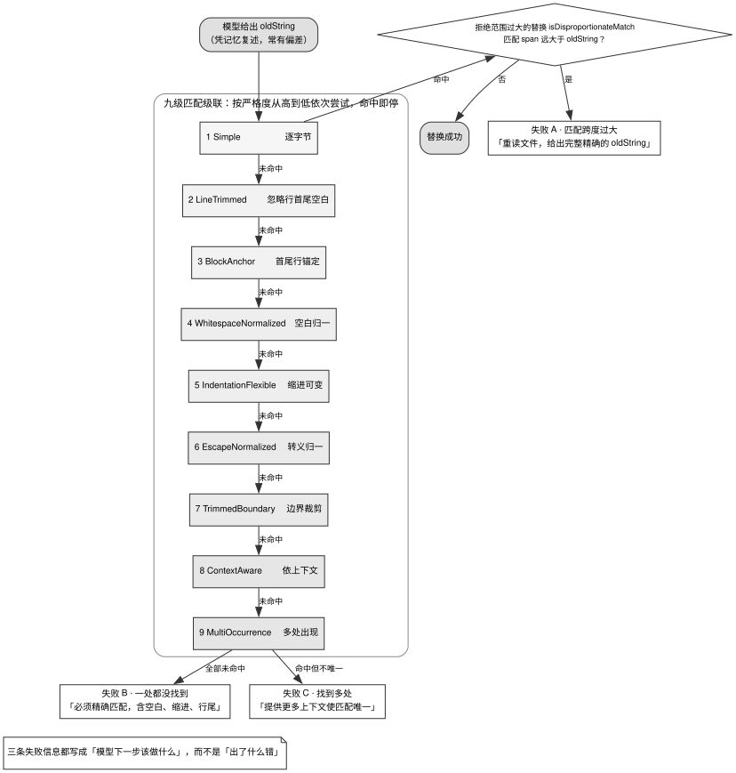

# 第 3 章 · 工具：接口、并行与错误回填

---

## 3.1 工具是模型唯一能触发副作用的地方

**工具（Tools）**是整个 Harness 体系中**模型直接触发外部物理副作用的唯一受控出口**。如果说循环决定了执行时序，上下文定义了信息边界，那么工具系统则决定了 Agent 能够对现实世界产生何种改变，以及在物理操作失败时系统如何捕获并引导自愈。

Anthropic 在《Writing effective tools for agents》中提出了一个深刻的工程洞见：

> When we traditionally write software, we’re establishing a contract between deterministic systems.
>
> Tools are a new kind of software which reflects a contract between deterministic systems and non-deterministic agents.

传统软件工程的本质是在**确定性系统之间**建立静态契约；而 Agent 工具则是**在确定性系统与非确定性模型之间**建立动态契约。这一本质差异决定了：传统的 API 端点调用行为高度确定（例如传入固定参数即可获得恒定响应）；而面对同一个自然语言意图，大模型可能会选择调用工具、可能仅凭先验知识直接作答、可能反问澄清细节，甚至可能**幻觉出完全不存在的工具签名**。

大模型不会像确定性程序那样严格稳定地选定函数并精准填充参数。因此，简单地将现有后端 API 逐个做一层薄封装，根本无法构建起高可用的 Agent 工具链。必须从工具抽象尺度划分、输出体积物理熔断、错误引导提示以及并发时序控制四个维度进行系统性设计。

在工具设计中最常引发系统退化的三类典型陷阱如下：

1. **工具无节制返回全量原始 Payload**：导致海量无用字符瞬时吞噬上下文窗口，同时摧毁第 6 章所依赖的前缀缓存稳定性；
2. **错误信息面向人类工程师而非模型设计**：直接返回诸如 `ENOENT: no such file or directory` 的裸系统错误码，导致模型无法获取排障依据，陷入死循环重试；
3. **工具过度细分或职责严重重叠**：模型在模糊的选项中难以准确决策，导致执行路径显著绕远；由于这种选型错误不会触发系统级异常，因此极具隐蔽性。

---

## 3.2 源码对照：从描述体量到错误信息

### 3.2.1 工具描述的体量差异：从 2.0KB 到 8.4KB

在工业级项目中，即使是针对完全相同的 Bash/Shell 执行工具，各家在工具描述（Description）的编写深度与体积上也存在数倍的差距，见表 3-1。

表 3-1：同一 bash / shell 工具的描述体量

| 项目 | 描述模板文件路径 | 模板行数 | 字符体积 |
|---|---|---|---|
| MiMo-Code | `MiMo-Code/packages/opencode/src/tool/bash.txt:1-111` | 111 | 8,382 字节 |
| kimi-code | `kimi-code/packages/agent-core/src/tools/builtin/shell/bash.md:1-43` | 43 | 5,195 字节 |
| oh-my-pi | `oh-my-pi/packages/coding-agent/src/prompts/tools/bash.md:1-24` | 24 | 1,985 字节 |

表 3-1 统计的是未渲染前的模板文件体积。由于模板内部包含大量操作系统判断与动态环境变量插值，在最终组装至网络请求时，实际占用的 Token 会根据宿主环境动态展开。

在 MiMo-Code 的完整内建工具集中，体量排名前八的工具描述见表 3-2。

表 3-2：MiMo-Code 体量最大的八份工具描述

| 工具名称 | 模板体积（字节） |
|---|---|
| actor | 11,753 |
| bash | 8,382 |
| actor.shell | 5,628 |
| bash.gpt | 5,274 |
| session | 5,036 |
| workflow | 4,819 |
| tool-script | 4,457 |
| memory | 3,458 |

其中 `bash.gpt.txt` 揭示了一个关键的工程实践：**针对不同的基座模型系列，同一工具需要挂载差异化的指令描述，甚至在部分约束上呈现出完全相反的引导策略**。

### 3.2.2 工具描述按基座模型动态分化

MiMo-Code 针对同一套底层的 Bash 工具，依据调用模型的不同提供了两套截然相反的引导提示词。

在面向默认模型的版本中，指令严格限制 Bash 的使用边界：

```text
IMPORTANT: This tool is for terminal operations like git, npm, docker, etc.
DO NOT use it for file operations (reading, writing, editing, searching, finding files)
- use the specialized tools for this instead.
```
> `MiMo-Code/packages/opencode/src/tool/bash.txt:7`（原文为一整行，此处为排版换行）

而在面向 GPT 系列模型的特化版本中，指令则发生了 180 度逆转：

```text
IMPORTANT: In this GPT tool set, the dedicated `read`, `write`, and `edit` tools are
unavailable. Use this tool to inspect, search, and navigate files. Use `apply_patch`
to create, update, move, or delete project text files. Do not attempt to call
unavailable tools.
```
> `MiMo-Code/packages/opencode/src/tool/bash.gpt.txt:7`（原文为一整行，此处为排版换行）

导致这一巨大差异的根本原因在于**工具集整体拓扑的分化**：当系统检测到底层为 GPT 系列模型时，Harness 会主动从工具表中过滤掉 `edit`、`multiedit`、`write`、`read`、`grep`、`glob` 以及 `notebookedit` 等 7 个专用文件工具，转而要求模型完全依靠 Bash 命令行配合 `apply_patch` 完成文件检索与修改。2026-08 之后这条分化又进了一步：GPT 工具集只保留一组顶层工具，其余内建工具收进一个 `tool-script` 执行网关，模型通过写脚本调用它们（`MiMo-Code/packages/opencode/src/tool/registry.ts:372-374`、`:462-463`），工具目录因此从「暴露给模型的 schema」变成了「脚本里可查的清单」。

这揭示了一条不可忽视的设计法则：**工具描述不仅阐明工具自身的功能，更定义了该工具在整个工具生态中的边界分工**。一旦可用工具集的组合发生变动，相关工具的描述必须联动调整。

GPT 版本中专门追加的 `Do not attempt to call unavailable tools.`，则是为了强行抑制模型因预训练权重带来的惯性，防止其凭记忆调用在当前环境中已被剥离的虚构工具。

### 3.2.3 工具数量与渐进披露机制

表 3-3 对比了五家主流 Agent 系统在静态注册阶段的内建工具数量。

表 3-3：五家内建工具数

| 项目 | 工具注册源码位置 | 静态内建工具总数 |
|---|---|---|
| pi-mono | `pi-mono/packages/agent/src/harness/tools/index.ts:1-23` | 4 |
| kimi-code | `kimi-code/packages/agent-core/src/agent/tool/index.ts:796-878` | 27 |
| MiMo-Code | `MiMo-Code/packages/opencode/src/tool/registry.ts:253-280` | 27 |
| oh-my-pi | `oh-my-pi/packages/coding-agent/src/tools/index.ts:458-488`（另 `:490-494`） | 32 |
| openclaw | `openclaw/src/agents/core-tool-factory-descriptors.ts:15-69` | 54 |

从极简主义的 pi-mono（仅暴露 bash、edit、read、write 4 个核心工具）到功能完备的 openclaw（注册 54 个工具），两者在注册规模上相差超过一个数量级。

然而在实际运行中，并非所有注册工具都会在第一轮全量注入上下文。例如 kimi-code 会根据模型是否支持多模态决定是否暴露读图工具；MiMo-Code 则通过实验开关对 `lsp`、`cron`、`workflow` 等高级工具实施条件化挂载。

当接入 Model Context Protocol（MCP）生态后，外部工具的数量呈现爆炸式增长。为了解决海量工具 Schema 瞬间挤占上下文窗口的物理矛盾，MiMo-Code 与 openclaw 引入了**渐进披露（Progressive Disclosure）**机制：

在初始阶段，系统仅在上下文头部注入一份极度精简的「工具摘要目录」（仅包含工具唯一名称与单行简述）。当且仅当模型判断需要使用某类能力时，首先调用搜索或获取指令检索出具体工具的完整 JSON Schema，随后在下一轮迭代中发起真正的参数调用。

MiMo-Code 的 `mcp_tool_search` 模块为此设定了明确的工程阈值：单次检索默认返回 8 条、上限 20 条、单次请求最多激活 32 个工具，工具目录自身的 Token 消耗严格限制在 20,000 Token 与总预算 10% 的较小值以内。

### 3.2.4 工具输出预算的三层物理熔断

工具执行返回的文本往往是上下文中最不可控的膨胀源。opencode 在 `read` 工具中通过三层物理阈值实施严格熔断：

```typescript
const DEFAULT_READ_LIMIT = 2000
const MAX_LINE_LENGTH = 2000
const MAX_LINE_SUFFIX = `... (line truncated to ${MAX_LINE_LENGTH} chars)`
const MAX_BYTES = 50 * 1024
```
> `opencode/packages/opencode/src/tool/read.ts:13-16`

这三层限制缺一不可：
1. **行数上限（2000 行）**：限制常规文本文件的阅读范围；
2. **单行字符上限（2000 字符）**：防止经过压缩（Minified）的单行超长代码瞬间撑爆上下文；
3. **总字节数上限（50KB）**：作为底层的硬性截断约束。

pi-mono 同样采用了 2000 行 / 50KB 的相同阈值，kimi-code 则设定为 1000 行 / 2000 字符 / 100KB。

MiMo-Code 对 Bash 命令输出的截断处理展现了高超的工程水准：

```typescript
const tailScan = end.text.length > 2048 ? end.text.slice(-2048) : end.text
const hasErrors = ERROR_PATTERN.test(tailScan)
if (hasErrors) {
  // ... read the saved file; fall back to tail-only when it cannot be read
  const headText = head(fileContent, HEAD_LINES, HEAD_BYTES)
  output = `...output truncated (head+tail shown due to errors)...\n\nFull output saved to: ${file}\n\n${headText}\n\n...middle omitted...\n\n${end.text}`
} else {
  output = `...output truncated...\n\nFull output saved to: ${file}\n\n` + output
}
```
> `MiMo-Code/packages/opencode/src/tool/bash.ts:877-893`（有省略：读取完整输出文件，以及读取失败时的备用分支；完整代码见仓库）

在默认情况下，系统**仅保留输出末尾（Tail）**，因为编译报错、异常堆栈或退出码通常聚集在日志末尾；同时，系统将全量输出转储至磁盘，并在返回结果中明确给出持久化文件路径。当且仅当末尾 2048 字符匹配到错误正则时，系统才会额外从转储文件中捞取头部（Head），组装成「头部上下文 + 中间省略标注 + 尾部报错」的高信噪比摘要。

**截断输出时必须同步提供完整文件的转储路径**。若只做静默截断而不给出下钻路径，模型将由于信息缺失而陷入不断重复执行同一命令的死循环。

### 3.2.5 错误信息作为模型的动态引导提示词

opencode 在 `edit` 工具中贯彻了一个核心设计原则：**错误信息不是写给人看的调试堆栈，而是写给模型的下一步行动指南**。

```typescript
throw new Error("oldString cannot be empty when editing an existing file. Provide the exact text to replace, or use write for an intentional full-file replacement.")
// ...
throw new Error("Refusing replacement because the matched span is much larger than oldString. Re-read the file and provide the full exact oldString for the intended replacement.")
// ...
throw new Error("Could not find oldString in the file. It must match exactly, including whitespace, indentation, and line endings.")
// ...
throw new Error("Found multiple matches for oldString. Provide more surrounding context to make the match unique.")
```
> `opencode/packages/opencode/src/tool/edit.ts:687-728`（有省略：四条之间夹着匹配级联的控制流；另有一条早退错误 `No changes to apply: oldString and newString are identical.` 在 `:684`，未列入）

在 `read` 工具中，若目标文件不存在，系统会自动检索同级目录下的相近文件名并组装成候选列表：

```typescript
new Error(`File not found: ${filepath}\n\nDid you mean one of these?\n${items.join("\n")}`)
```
> `opencode/packages/opencode/src/tool/read.ts:94`

通过将一次底层的物理失败转化为带有候选答案的纠偏提示，Harness 极大地降低了模型在下一轮尝试中的搜索空间。

### 3.2.6 容忍模型非精确输出：九级匹配级联

大模型在生成需要替换的旧代码片段（`oldString`）时，往往基于注意力记忆复述，极易在行尾空格、缩进层级或转义字符上产生微小偏差。

opencode 为此构建了按严格度从高到低排列的九级匹配器链条：

```typescript
for (const replacer of [
  SimpleReplacer,
  LineTrimmedReplacer,
  BlockAnchorReplacer,
  WhitespaceNormalizedReplacer,
  IndentationFlexibleReplacer,
  EscapeNormalizedReplacer,
  TrimmedBoundaryReplacer,
  ContextAwareReplacer,
  MultiOccurrenceReplacer,
]) {
  // ...
```
> `opencode/packages/opencode/src/tool/edit.ts:694-704`（有省略：循环体，见 `:705-721`）

图 3-1 刻画了这套级联匹配引擎的完整运转流程与防御机制。



图 3-1 展示了 opencode edit 工具内置的九级匹配级联与三重防御出口。算法按照严格度自顶向下依次尝试（从严格字节对齐、行级去空白、首尾行锚定，逐步放宽至缩进自适应与上下文感知替换），命中即刻熔断。在命中后，系统引入比例超限检测（若匹配区间远超目标长度则强制阻断）；当全部匹配器均未命中或命中存在歧义时，分别流向「未找到目标」「多重匹配歧义」与「区间超限拒绝」三条出口，并附带针对性的下一步操作提示。

匹配范围的动态比例校验是防止灾难性覆写的核心防线：

```typescript
if (isDisproportionateMatch(search, oldString)) {
  throw new Error(
    "Refusing replacement because the matched span is much larger than oldString. Re-read the file and provide the full exact oldString for the intended replacement.",
  )
}
```
> `opencode/packages/opencode/src/tool/edit.ts:709-712`

当宽松匹配器（如首尾锚定）命中的区间行数超过 `max(oldString.lines + 3, oldString.lines * 2)` 时，系统强制拒绝替换并报错。**容错级联负责拉高成功率，比例熔断负责守住安全底线**，两者必须协同生效。

---

## 3.3 判断标准：评估工具系统设计的四条准则

### 判断标准一：工具是面向 Agent 任务设计，还是底层 API 的机械封装

工程师在设计工具时必须自问：「模型调用该工具单次，能否实质性推进一步业务目标？还是被迫连续调用三个工具才能拼凑出一步？」

表 3-4 对比了两种不同的设计取向。

表 3-4：Anthropic 的三组工具对照

| 机械的 API 薄封装（反模式） | 面向 Agent 的任务型工具（推荐） |
|---|---|
| `list_users` + `list_events` + `create_event` | `schedule_event`（内部完成查空档与建会逻辑） |
| `read_logs`（返回全量日志流） | `search_logs`（内部过滤，仅返回匹配行及其上下文） |
| `get_customer` + `list_orders` + `list_tickets` | `get_customer_context`（单次聚合完整画像） |

由于大模型的上下文容量存在物理瓶颈，工具应当在确定性的宿主代码内部完成遍历与筛选，仅向模型回填高密度的目标数据。

### 判断标准二：错误信息是否具备自愈引导能力

剥离外部上下文后，单独观察一条工具错误输出，评估模型能否凭借该信息立即确定下一步行动。

表 3-5：错误信息的差与好

| 传统系统报错（反模式） | 具备行动引导力的错误提示（推荐） |
|---|---|
| `ENOENT: no such file or directory` | `File not found: X\n\nDid you mean one of these?\n...` |
| `Invalid argument` | `oldString cannot be empty when editing an existing file. Provide the exact text to replace, or use write for a full-file replacement.` |
| `Match failed` | `Found multiple matches. Provide more surrounding context to make the match unique.` |

### 判断标准三：输出边界是否具备完备的三层物理熔断

针对任意返回文本的工具，必须核验其是否同时具备：
1. 行数、单行字符数与总字节数的三重物理上限；
2. 显式的截断标注（避免模型产生信息完整性错觉）；
3. 溢出全量内容的磁盘转储路径与二次下钻指引。

### 判断标准四：并行执行的三大核心不变量

当模型在单轮中并发返回多个工具调用时，系统必须严格遵循以下三条执行规则：
1. **Preflight 串行化**：工具查表、参数校验与权限审批弹窗必须按源顺序逐一推进，严禁并发弹出多个无序的审批交互；
2. **Execute 可并发，共享状态写操作排队串行化**：工具底层的 I/O 与网络请求可并发执行，但其对上下文或工作区共享状态的修改必须按模型发起的源顺序排队依次应用；
3. **事件流按完成顺序广播，上下文按发起源顺序组装**（详见第 2 章 §2.3.4）。

---

## 3.4 反面证据与失败模式

### 失败模式一：工具描述与实际可用工具集脱节

如 §3.2.2 所述，当为不同模型切换了工具集过滤策略后，若未同步刷新对应的描述提示词，模型将持续尝试调用不存在的幽灵工具，导致任务成功率大幅暴跌。

### 失败模式二：缺乏范围熔断的过度容错匹配

若仅追求单次替换的成功率而无限制放宽正则匹配规则，系统极易在首尾锚定等模式下将一个原本仅需修改 3 行的操作放大至整个 200 行的函数体内，引发难以察觉的代码静默损毁。

### 失败模式三：试图通过 JSON Schema 约束业务语义

JSON Schema 仅能对数据类型、字段必填项与基本枚举实施语法级约束，根本无法表达复杂的业务依赖与排他逻辑。过度依赖 Schema 校验往往导致模型在参数语义层面持续犯错；参数规范的核心约束力依然来自于工具描述中的正反例引导。

### 反面证据：工具数量与渐进披露的权衡

盲目追求「工具数量极小化」同样是一种极端。当业务复杂度确实需要数十个工具支持时，直接删除工具会导致 Agent 能力残缺。工业级方案应借助渐进披露架构，将工具目录与完整 Schema 拆分为两阶段按需激活，既控制了单轮 Token 消耗，又保留了系统的能力上限。

---

## 3.5 可以直接采用的最小实现

### 3.5.1 工具接口核心规范

```
Tool {
  name: string         // 具备清晰命名空间前缀，同资源工具共享前缀
  description: string  // 遵循 §3.5.2 规范的高密度描述
  schema: JSONSchema   // 基础类型与结构校验
  execute(args, ctx): Promise<Result | Error>
}
```

统一执行出口严格收敛为五种物理状态：**工具不存在、参数校验失败、权限拦截阻断、用户中途 Abort、底层执行抛出异常**。所有失败统一包装为携带 `isError: true` 标记的 `toolResult` 回填至历史消息。

### 3.5.2 生产级三层输出熔断常量配置

```typescript
const DEFAULT_READ_LIMIT = 2000        // 行数物理上限
const MAX_LINE_LENGTH    = 2000        // 单行字符上限（防御 minified 单行代码）
const MAX_BYTES          = 50 * 1024   // 50KB Payload 总字节终极熔断
```

当输出溢出时，默认回填末尾片段并附带转储路径；仅在末尾检测到报错模式时，反向追加头部摘要形成复合输出。

### 3.5.3 验收测试矩阵

在交付工具子系统前，必须通过以下五项基础测试：
1. **相似文件模糊探测测试**：传入错误但相近的文件路径，断言错误返回中包含同目录候选文件名；
2. **海量日志截断测试**：执行产生 100 万行输出的脚本，断言系统正确截断、附带文件转储路径，并在含有 error 关键字时正确输出头部与尾部；
3. **模糊容错匹配测试**：传入带有微小空格与缩进偏差的 `oldString`，断言容错级联能够精准命中并完成替换；
4. **范围超限防御测试**：构造仅有 3 行特征但在文件中匹配到 50 行的输入，断言比例熔断拦截生效并拒绝替换；
5. **并发修改时序测试**：在单轮中并发下发两个具有先后依赖的文件修改工具，断言其最终写入磁盘的顺序严格匹配模型调用的源顺序。

---

## 3.6 版本与复核

### 本章基准

| 项 | 值 |
|---|---|
| 素材复核日期 | 2026-08-17（§3.2.1 两张表与 §3.2.3 的工具数表于 2026-08-18 重测，openclaw、oh-my-pi 两行为该次新补） |
| 底稿 | 本章为新写，源码调研于 2026-08-17；框架部分参考 Anthropic《Writing effective tools for agents — with agents》(2025-09-11) |
| 项目 commit | opencode `5f5ea53afb` (08-27)、MiMo-Code `35bb2636` (08-27)、pi-mono `ccfe79ed2` (08-27)、oh-my-pi `17675a7c1b` (08-27)、kimi-code `676e4d822` (08-27)、openclaw `9bd50c803cc` (08-27) |
| 外部规格基准 | 判断标准四的并行语义依据各家 harness 对 Anthropic Messages API 一批 `tool_use` 的处理（源码实证），本书未逐家核实其他 provider 是否同样按源顺序回填；工具响应的 token 上界依据 Anthropic《Writing effective tools for agents — with agents》2025-09-11 的自述 |

### 哪些会过期，怎么自己复核

| 类别 | 保鲜期 | 复核方式 |
|---|---|---|
| 四条判断标准 | 长 | 不需要 |
| 「工具是确定性与非确定性之间的契约」 | 长 | 不需要 |
| 各家工具描述的字节数测量 | **短** | 见下方命令 |
| 各家的内建工具数量 | **短** | 见下方命令，按 §3.2.3 的口径数注册文件 |
| 渐进披露的四个上限（8 / 20 / 32 / 20,000） | **短** | 读 `MiMo-Code/packages/opencode/src/tool/mcp-tool-search.ts:9-12` 与 `:86-90` 的四个常量 |
| 九级匹配级联的具体列表 | **短** | 各家在持续增删匹配器 |
| 三层限额的具体数值 | 中 | 随模型窗口变化 |
| 「按模型分化工具描述」 | 中 | 模型趋同后可能消失；也可能因工具集分化而加剧 |

```bash
cd projects   # 未克隆先见前言《怎么拿到这些项目的代码》
# 工具描述体量：前八行应与 §3.2.1 第二张表逐行对上（actor 11753 … memory 3458；2026-08-27）
for f in MiMo-Code/packages/opencode/src/tool/*.txt; do
  printf "%-40s %6s 字节\n" "$(basename $f)" "$(wc -c < $f)"; done | sort -k2 -rn | head
# 内建工具数量：五行分别应为 4 / 27 / 27 / 29+3=32 / 54（2026-08-27；MiMo-Code 删了 changedir，openclaw 新增 screen、secrets、github_identity_status、github_publish、progress_card，删了 update_plan）
grep -c "create[A-Za-z]*Tool," pi-mono/packages/agent/src/harness/tools/index.ts
# kimi-code 的注册点是 agent/tool/index.ts:796-878（在那里实例化 27 个），那段 grep 数不了；
# 下面数的是与它一一对应的 builtin 导出表，两处独立数都是 27
grep -c "^export \* from" kimi-code/packages/agent-core/src/tools/builtin/index.ts
grep -c "Tool.init(" MiMo-Code/packages/opencode/src/tool/registry.ts
grep -cE '^\t"' oh-my-pi/packages/coding-agent/src/tools/builtin-names.ts   # 29，另 :35 一行三个 hidden
grep -c '^  { name: ' openclaw/src/agents/core-tool-factory-descriptors.ts
# 匹配级联是否还是九级
grep -n "Replacer,$" opencode/packages/opencode/src/tool/edit.ts
```

**工具数口径。** 表 3-3 的五个数是各项目工具注册文件里声明的内建工具数，含按配置或开关条件注册的，不含 MCP 工具、插件工具与用户自定义工具。

**字节测量口径。** 表 3-1 与表 3-2 的数都是 `wc -c` 的字节数。这批文件里有几份含少量非 ASCII 字符，字符数比字节数略小（kimi-code 5,195 字节 / 5,175 字符，oh-my-pi 1,985 字节 / 1,973 字符），差异在 1% 以内，不影响量级对比。测的是模板文件的长度，不是模型最终看到的文本：三份都带插值或条件块（MiMo-Code 有 `${os}`、`${shell}`、`${maxLines}` 等占位符，kimi-code 有 `{{ SHELL_NAME }}`、`{{ DEFAULT_TIMEOUT_S }}`，oh-my-pi 有 8 处 `{{#if}}` 条件块与 1 处 `{{#unless}}`）。

复核工具描述时应先 `ls` 整个目录。`bash.gpt.txt` 这类按模型分化的变体文件名相近，内容却可能相反；只检查预期中的一个变体会遗漏其他模型的指令。工具数量也只能从注册表统计：目录里可能有成对的 `.ts` 与 `.txt`、非工具模块，文档站还混有排障页，因此文件数和文档页数都不能当作工具数。
