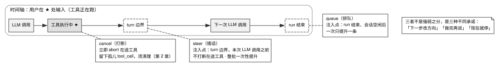

# 第 4 章 · 用户插话：steer、queue 与 cancel

---

## 4.1 一句插话，三种语义

当 Agent 在执行长任务过程中出现方向偏差时，用户往往希望实时介入纠偏（例如下达指令「暂停探索，优先检查配置文件」）。这条人工插话究竟应当在哪个精确的时钟切片注入上下文？

这绝非一个简单的消息排队问题，而是整个循环控制流中**少数几个由人机协同意图而非单纯底层 API 物理约束所决定的关键注入点**。上下文压缩由 Token 预算触发，权限拦截由安全策略驱动，而插话调度则直接映射了人类对非确定性 Agent 的实时控制权。

阅读本章前，建议先温习第 2 章 §2.4。本章判断标准二直接建立在 §2.4.4 失败模式四的基础之上；而 §2.4.3 失败模式三（Cancel 路径上的孤儿 `tool_call` 治理）则是取消语义在系统底层引发的直接并发问题。

用户的实时输入在语义层可严格拆解为三种互斥的模式，见表 4-1。

表 4-1：三种插话语义与注入点

| 交互语义 | 用户的真实业务意图 | 系统底层的物理注入切片 |
|---|---|---|
| **steer（动态插话）** | 「下一步立刻改换方向」 | 当前 Turn 的在途工具执行完毕之后、下一次模型流式请求组装之前 |
| **queue（排队追问）** | 「等你把当前手头的事彻底做完再说」 | 整个 Agent 任务自然停机、会话重归空闲状态之时 |
| **cancel（紧急打断）** | 「立刻停下当前全部操作」 | 立即向所有在途工具下发 Abort 信号强制中断 |

本章重点剖析 steer 与 queue 的架构实现。cancel 在此作为基准语义参与对照（其涉及的底层进程中止与孤儿清理机制已在第 2 章 §2.4.3 及第 5 章中详述）。

若在系统设计中混淆了这三种语义，将引发以下三类严重故障：

1. **将 queue 误实现为 steer**：用户原本打算追加后续任务，系统却在当前轮次强行插话，导致原本连贯的多步推理任务被迫腰斩；
2. **将 steer 误实现为 cancel**：粗暴中断正在执行的工具进程，在历史上下文中遗留无应答的孤儿 `tool_call`，直接诱发后续轮次全量 HTTP 400 崩溃（详见第 2 章 §2.4.3）；
3. **语义逻辑分离但状态标志未同步解耦**：系统在 queue 正常完成的路径上错误打上了「上一轮输出被中断」的误导标记，导致模型基于虚假的前提做出不必要的自我反思与重试（详见 §4.4 源码实证）。

---

## 4.2 源码对照：两个队列、一张表、一个配置项

### 4.2.1 pi-mono：双物理队列与解耦取数函数

pi-mono 在架构层将 steer 与 followUp（即 queue 语义）实现为两个完全隔离的物理队列：

```typescript
private readonly steeringQueue: PendingMessageQueue;
private readonly followUpQueue: PendingMessageQueue;
// ...
this.steeringQueue = new PendingMessageQueue(runtimeOptions.steeringMode ?? "one-at-a-time");
this.followUpQueue = new PendingMessageQueue(runtimeOptions.followUpMode ?? "one-at-a-time");
// ...
steer(message: AgentMessage): void { this.steeringQueue.enqueue(message); }
followUp(message: AgentMessage): void { this.followUpQueue.enqueue(message); }
```
> `pi-mono/packages/agent/src/agent.ts:176-177, 231-232, 283-290`

源码注释精准界定了两者的时序边界：`steer` 明确标注为「injected after the current assistant turn finishes」，而 `followUp` 则标注为「run only after the agent would otherwise stop」。

在向主循环暴露接口时，pi-mono 仅提供了 `getSteeringMessages` 与 `getFollowUpMessages` 两个纯粹的异步取数回调（对应第 2 章表 2-2 中的核心注入点）。**主循环内部完全不感知底层队列的物理形态与存储介质**——在云端分布式部署中，只需将这两个函数绑定至数据库的 Session Inbox 表，即可在零侵入循环核心的前提下平稳支持跨网络插话。

两个队列均支持可配置的 `QueueMode`（默认 `"one-at-a-time"`），用以精细控制单次出队的批量大小。

### 4.2.2 opencode V2：双序号 Inbox 模型与非对称提升逻辑

opencode V2 在持久化层设计了 `SessionInputTable`，通过两个单调递增的序号彻底解耦「消息物理写入」与「模型逻辑可见」：

- `admitted_seq`：用户输入落库时分配的物理接入序号；
- `promoted_seq`：消息真正被提升并注入模型上下文时分配的序号；值为 `NULL` 表示当前仍处于等待挂起状态。

对于 steer 与 queue 两种交付模式，opencode 在提升逻辑上展现了高度理性的**非对称设计**：

```typescript
export const promoteSteers = Effect.fn("SessionInput.promoteSteers")(function* (db, events, sessionID, cutoff) {
  const rows = yield* db.select().from(SessionInputTable)
    .where(and(
      eq(SessionInputTable.session_id, sessionID),
      isNull(SessionInputTable.promoted_seq),
      eq(SessionInputTable.delivery, "steer"),
      lte(SessionInputTable.admitted_seq, cutoff),
    ))
    .orderBy(asc(SessionInputTable.admitted_seq))
    .all()
  return yield* publish(db, events, sessionID, rows)
})

export const promoteNextQueued = Effect.fn("SessionInput.promoteNextQueued")(function* (db, events, sessionID) {
  const row = yield* db.select().from(SessionInputTable)
    .where(and(
      // ... same session_id and promoted_seq filters as above
      eq(SessionInputTable.delivery, "queue"),
    ))
    .orderBy(asc(SessionInputTable.admitted_seq))
    .limit(1)
    .get()
  return row === undefined ? false : yield* publish(db, events, sessionID, [row]).pipe(Effect.as(true))
})
```
> `opencode/packages/core/src/session/input.ts:245-289`（有省略：参数类型标注与两处 `.pipe(Effect.orDie)`，完整代码见仓库）

在对比这两个提升函数时，需要重点关注三个核心特征：`lte(admitted_seq, cutoff)` 确立安全截断水位、`.all()` 批量拉取与 `.limit(1)` 单条拉取。

**`.all()` 对比 `.limit(1)` 构成了非对称设计的灵魂**：steer 在下一个安全的 Turn 边界被**整批全量提升**；而 queue 在会话进入空闲时**严格一次仅提升一条**。

这一非对称性具备充分的系统论依据：用户在插话纠偏时往往连续输入多条短句（「不对」「先看配置」「在 config 目录下」），这些短句共同构成一个完整的纠偏意图，必须作为一个原子上下文整体交付给模型；而 queue 则代表用户追加的后续独立任务，必须严格按单任务隔离执行，确保每一项工作都能被完整推进。

`cutoff` 水位（取值自 `const cutoff = yield* EventV2.latestSequence(db, session.id)`）确保了并发事务的隔离性：提升操作严格截止于当前 Turn 开始时刻的快照，正在并发写入的新输入将被安全留存至下一个 Turn 边界处理。

### 4.2.3 craft-agents-oss：基于 Provider 能力的动态分流策略

craft-agents-oss 将插话决策抽象为系统配置项 `midStreamBehavior`，其默认值依据底层 Provider 特征进行智能适配：
- 对于 `anthropic` 系列连接 → 默认启用 `'queue'` 模式；
- 其余 providerType（含 `pi` / `pi_compat`）→ 默认启用 `'steer'` 模式；实现是一行三元式而不是逐 provider 的分支（`craft-agents-oss/packages/shared/src/config/llm-connections.ts:475-477`）。

项目架构文档制定了严格的调用准则：

> **Read everywhere via `resolveMidStreamBehavior(connection)`** — never branch on `providerType` directly for this decision; legacy connections without the field rely on the resolver's fallback.
>
> `craft-agents-oss/packages/shared/CLAUDE.md:48`

将配置推导逻辑完全封装在单一解析函数中，彻底杜绝了将 Provider 判定硬编码散落于系统各处的反模式。

更重要的是，这一分流调度**完全发生在 `SessionManager.sendMessage` 的中间层**。底层的 Agent 核心执行器完全保持纯净，`'queue'` 模式仅需跳过底层的重定向指令，等待当前 Turn 正常结束后再行动作重放。这再次验证了「窄接口」设计在复杂系统编排中的巨大价值。

### 4.2.4 业界其他实现的演进路径

表 4-2：其余三家的插话取舍

| 项目名称 | 核心实现方案 | 源码位置与出处 |
|---|---|---|
| Claude Code | 队列模式：运行中输入的消息先进入队列，在本轮工具结果回填之后才进入上下文；产品文档称之为消息排队（message queueing） | 闭源，无源码引用；依据 Claude Code 文档与本书观察 |
| Roomote | 优先走原生 steer；若 Provider 不支持则将排队消息置顶并下发 `CancelTask`，降级为 **Abort + Replay** 模式 | `Roomote/apps/worker/src/sandbox-server/lib/harness-manager.ts:368-431` |
| cloudflare-os | **V1 阶段显式舍弃**（「No steering/follow-up queues. Turn cap 30 via shouldStopAfterTurn.」），规划于 Phase 2 演进 | `cloudflare-os/plans/pi-impl.md:27` |

cloudflare-os 的取舍体现了极高的架构克制：在系统早期明确声明功能边界，远比隐式吞没用户消息更为安全。而 Roomote 采用的 `Abort + Replay` 降级方案则存在潜在副作用（详见 §4.4）。

---

## 4.3 判断标准：时序、批量与状态追踪

### 判断标准一：产品 UI 是否严格区隔三种交互语义

当用户在 Agent 推进过程中敲击回车时，系统必须向用户提供明确的确定性预期：
- **Steer（插话）**：「正在执行的单步会平稳收尾，下一步立即调整航向」；
- **Queue（排队）**：「当前任务全量推进，完毕后自动启动新指令」；
- **Cancel（终止）**：「当前操作立即阻断，现场可能发生回滚」。



图 4-1 展示了用户在工具执行途中介入时，三种交互语义的精确物理注入时序与拓扑映射。当用户在工具执行中途（★）输入时：Steer 语义等待当前正在执行的工具批次自然结束，并在紧邻的 Turn 边界安全注入，既不破坏在途工具的执行状态，又能即刻扭转下一轮推理方向；Queue 语义则将输入保持在挂起队列中，直至当前完整 Run 彻底结束且会话重归空闲状态后才行激活；Cancel 语义则立即向在途工具发送 Abort 信号强制中断，同时触发孤儿调用清理与状态重置。

### 判断标准二：插话注入点必须严格锁定在 Turn 边界

在物理组装网络请求时，必须确保：**上一批次的所有工具执行结果（`tool_result`）已经全量、合法地回填进历史数组**。

如第 2 章 §2.4.4 所述，Anthropic 等模型 API 明确规定：「Tool result blocks 必须紧随其对应的 tool use blocks 出现，严禁在二者之间插入任何常规消息」。违背此规则将导致网关层直接抛出 HTTP 400 或 422 结构校验错误。Steer 消息最早只能在当前 Turn 结束的缝隙中安全并入。

### 判断标准三：依据语义精准匹配批量提升策略

- **对于 Steer（意图纠偏）**：必须支持**整批原子提升（Batch Promotion）**，使模型能够在单轮推理中完整获取多条连续输入的整体意图；
- **对于 Queue（任务排队）**：必须维持**单条递进提升（Single-item Promotion）**，确保每个独立任务获得完整的规划生命周期。

### 判断标准四：中断状态标志必须严格源自真实的物理中断

系统状态中的 `wasInterrupted` 标志位，**当且仅当底层进程真正触发了 `forceAbort` 或硬中断时方可置位**。严禁仅根据代码分支逻辑进行推测性标记，防止模型接收到虚假的中断提示而产生混乱的自省行为。

---

## 4.4 反面证据与失败模式

### 失败模式一：在 Queue 路径上错误透传中断标记

craft-agents-oss 将此列为系统的最高严重级别不变量：

> `managed.wasInterrupted` is set **only** on the steer path (where an actual `forceAbort` happened) — pure `'queue'` mode must NOT set it, otherwise the replayed turn injects the "previous response was interrupted and may be incomplete" reminder for a turn that actually completed, confusing the model.
>
> `craft-agents-oss/packages/shared/CLAUDE.md:48`

若在顺畅执行完毕的 Queue 路径上误打了中断标志，系统将向模型注入虚假的提示词：「你上一次的回复已被用户打断，可能不完整」。模型据此会错误地重新执行已经落盘的代码，甚至对自身此前正确的输出产生怀疑。

### 失败模式二：仅在服务端重算时间戳导致前端乐观状态错位

在流式响应生成期间创建的插话消息，若直接采用客户端本地时间戳，其渲染顺序将错误地跃居正在生成的 Assistant 消息之前。

当服务端在重放时通过单调时钟重新打标后，**必须将权威的时间戳显式同步回前端已挂载的乐观消息实体上**，否则在用户刷新页面前后将出现视图剧烈跳变与因果乱序（详见第 14 章 §14.4）。

### 失败模式三：滥用 Abort + Replay 模拟 Steer 带来的副作用重放

当底层系统不支持原生的 Turn 边界 Steer 时，盲目采用「强行 Kill 掉在途任务并全量重跑」的方式，将导致已产生物理副作用的工具（如已执行的文件覆写、已发起的外部 HTTP 请求）在 Replay 过程中被重复触发，进而破坏工作区的确定性状态。

### 反面证据：在短任务场景中过度设计的插话复杂度

对于平均执行耗时在 10 秒以内的轻量级 Agent，引入复杂的双队列与持久化 Inbox 机制属于过度工程。合理的架构取舍应依据任务的平均耗时进行分级治理：短周期任务可直接采用静默等待策略，长周期自主 Agent 方需完备的插话控制面支持。

---

## 4.5 可以直接采用的最小实现

### 4.5.1 双序号持久化 Inbox 数据模型

```
SessionInput {
  id: string
  session_id: string
  delivery: "steer" | "queue"      // 入队时锁定的交付语义
  admitted_seq: integer            // 物理接入单调序列号
  promoted_seq: integer | NULL     // 逻辑提升序号（NULL 表示挂起中）
  content: string
  created_at: timestamp
}
```

### 4.5.2 核心提升与调度函数规范

```
// Steer 提升：在 Turn 边界执行，整批提升
promoteSteers(sessionId, cutoffSeq):
  rows = SELECT * FROM SessionInput
         WHERE session_id = sessionId 
           AND promoted_seq IS NULL 
           AND delivery = "steer" 
           AND admitted_seq <= cutoffSeq
         ORDER BY admitted_seq ASC
  标记 rows 的 promoted_seq 并发布至上下文
  若存在提升记录，重置当前 Step 步数计数器

// Queue 提升：在 Run 彻底结束时执行，单条提升
promoteNextQueued(sessionId):
  row = SELECT * FROM SessionInput
        WHERE session_id = sessionId 
          AND promoted_seq IS NULL 
          AND delivery = "queue"
        ORDER BY admitted_seq ASC
        LIMIT 1
  若存在记录则标记 promoted_seq 并触发新一轮 Run 调度
```

### 4.5.3 验收测试矩阵

在交付插话子系统前，必须通过以下五项基础测试：
1. **排队语义纯净性测试**：向队列提交 Queue 消息并等待 Run 自然结束，断言模型绝对不会收到「输出被中断」的伪提示；
2. **多条插话原子聚合测试**：在 Agent 执行期间连续提交 3 条 Steer 消息，断言在下一轮推理中模型单次感知到全部 3 条输入；
3. **任务排队隔离测试**：连续提交 3 条 Queue 消息，断言系统分 3 个独立的 Run 周期逐一推进；
4. **工具边界安全性测试**：在耗时较长的工具执行期间触发 Steer，断言在途工具平稳执行完毕，且插话严格注入在 `tool_result` 之后；
5. **乐观状态对账测试**：在流式生成中途插话并立即刷新页面，断言历史消息的时钟顺序与内存实时流完全一致。

---

## 4.6 版本与复核

### 本章基准

| 项 | 值 |
|---|---|
| 素材复核日期 | 2026-08-17 |
| 底稿 | `docs/cloud-agent/session-runtime-and-agent-loop.md` §4.4，本章行号已按当前代码重新核对并补充 craft-agents-oss 的不变量 |
| 项目 commit | pi-mono `ccfe79ed2` (08-27)、opencode `5f5ea53afb` (08-27)、craft-agents-oss `d7592c48` (08-27)、cloudflare-os `1411714` (08-26)、Roomote `49c97769` (08-27)、kimi-code `676e4d822` (08-27)（日期均为提交日期，用 `git -C projects/<repo> log -1 --format='%h %cs' <短哈希>` 取得，2026-08-27） |
| Claude Code | 闭源产品，本章没有它的源码引用。对它的描述依据 Anthropic 官方文档（Claude Code 文档、Prompt caching 文档）与工程博客，以及本书对其公开行为的观察；证据级别为厂商自述与本书观察，不是源码实证 |
| 外部规格基准 | 判断标准二依据的「消息不能插在 `tool_use` 与 `tool_result` 之间」，**在 Anthropic Messages API 上有官方文档明文**：《Handle tool calls》（`platform.claude.com/docs/en/agents-and-tools/tool-use/handle-tool-calls`，[核实于 2026-08-17]）写明 tool result 必须紧跟对应的 tool use、中间不得夹任何消息（该页给的 400 例子是另一种排错，见判断标准二）；第 2 章 §2.4.4 与之一致。**跨 provider 的适用范围本书只核实到一处一手证据**：kimi-code 的错误分类把「tool 调用与结果没有正确配对且相邻」列为同一族拒绝，注释点名 Anthropic（`tool_use`/`tool_result` 措辞）与 OpenAI、DeepSeek、vLLM、Qwen、Moonshot/Kimi（`tool_calls`/`role 'tool'`/`tool_call_id` 措辞），并写明「The validation runs before any generation, so the error is a non-retryable 4xx」；判定函数只认状态码 400 与 422（`kimi-code/packages/kosong/src/errors.ts:500-511` 注释、`:512-543` 模式表、`:545-551` 判定，kimi-code `44a6c70e66` (08-17)）[核实于 2026-08-17]。Gemini 与 OpenAI Responses API 不在这份名单里，本书未核实 |

### 哪些会过期，怎么自己复核

| 类别 | 保鲜期 | 复核方式 |
|---|---|---|
| 三种语义的划分 | 长 | 不需要 |
| 「注入点必须在 turn 边界」 | 长（Anthropic 与 OpenAI 兼容一族）/ **短**（Gemini、Responses API 等未核实名单） | Anthropic 侧有官方文档明文，跨 provider 侧的一手证据是 kimi-code 的错误分类，两者都见上面「外部规格基准」一行；尚未核实的那几家，复核方式是各发一次「在 `tool_use` 与 `tool_result` 之间插一条 user 消息」的请求，看状态码与错误文本。也可跑 `grep -n "TOOL_EXCHANGE_ADJACENCY_MESSAGE_PATTERNS" -A 32 kimi-code/packages/kosong/src/errors.ts` 看那张名单有没有增减 |
| 双序号 inbox 模型 | 中 | opencode V2 仍在演进；跑 `promoteSteers\|promoteNextQueued\|limit(1)` 那条 grep，看两个提升函数的过滤条件是否还是 `delivery` + `promoted_seq` |
| 各家的默认 `midStreamBehavior` | **短** | provider 能力在变；跑 `midStreamBehavior` 那条 grep，读 `defaultMidStreamBehavior` 的三元式（`llm-connections.ts:476`） |
| cloudflare-os「V1 不做」 | **短** | 已列为 Phase 2 |

```bash
cd projects   # 未克隆先见前言《怎么拿到这些项目的代码》
grep -n "promoteSteers\|promoteNextQueued\|limit(1)" opencode/packages/core/src/session/input.ts
grep -n "midStreamBehavior" craft-agents-oss/packages/shared/src/config/llm-connections.ts
```

复核 craft-agents-oss 时，除了源码还要读项目的 `CLAUDE.md`。本章的两条不变量来自这份文件；它记录了修复故障时确定的设计原因，而代码只能显示实现结果。
