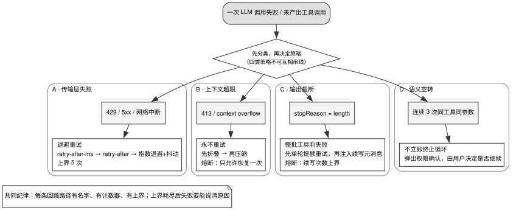

# 第 5 章 · 终止、熔断与恢复

---

## 5.1 四类失败，四种互不相同的处理

在 Agent 长期运行与自主探索过程中，系统必然会遭遇四类截然不同的运行故障：传输层网络抖动、上下文窗口物理溢出、模型单轮输出截断，以及模型陷入相同工具参数的空转死循环（Doom Loop）。本章逐一剖析这四类故障的自愈与熔断机制，对应第 2 章 §2.5.1 循环状态机中的分级恢复阶段（图 2-1 阶段 ⑧）。

这四类故障在物理成因与自愈路径上存在本质区别，**必须在系统架构层施加四套完全解耦的处理策略**，见表 5-1。

表 5-1：四类失败与四种互不相同的处理

| 故障类型 | 典型异常表现 | 最常见的架构反模式 | 工业级标准应对机制 |
|---|---|---|---|
| **传输层失败** | HTTP 429、5xx、TCP 连接重置 | 完全不做重试，丢失可自愈的机会 | 基于 `Retry-After` 头部的指数退避与抖动重试（上限 5 次） |
| **上下文超限** | Context Overflow、HTTP 413 | 机械盲目重试，白白消耗等待时间与配额 | 严禁重试，立即触发工具折叠与响应式压缩（单轮限 1 次） |
| **输出截断** | `stopReason: "length"` 触顶 | 误当成正常完成，执行残缺工具调用 | 整批工具标记失败，注入无道歉续写指令 |
| **语义空转** | 连续 3 次相同工具与完全一致参数 | 无限静默重试，直至烧尽 Token 预算 | 触发 Doom Loop 拦截，挂起并上报用户裁决或熔断停机 |

**将这些不同性质的故障混同处理，是自研 Agent 最容易踩中的系统性陷阱**：
- **混用重试逻辑**：面对确定性的上下文溢出（同样的 Payload 再次请求必然再次溢出），系统仍机械重试 5 次，纯粹浪费重试配额与计算资源；
- **共用恢复计数器**：由于前置网络波动消耗了通用恢复次数，导致后续合法的上下文压缩直接因配额耗尽而崩溃；
- **缺乏物理熔断上界**：导致 Agent 在非受控环境下整夜空转，反复执行数千次无效的压缩或重试，造成巨大的计算与费用灾难。Claude Code 的 hooks 文档专门提醒 Stop hook 要检查 `stop_hook_active` 标志，避免 hook 反复阻止停止而让模型无限续跑，说明这类事故在生产中真实发生过。

**核心设计原则：每一条会导致循环回跳的恢复路径，必须具备独立命名、独立计数器以及硬性物理上界**。

---

## 5.2 源码对照：归一化、重试、doom loop 与超时推导

### 5.2.1 opencode：异常归一化与分级重试调度

opencode 将所有来自不同模型 Provider 的原始异常统一收敛至 `fromError()` 归一化入口，输出一组强类型的核心错误实体：`AbortedError`（用户主动打断）、`AuthError`（凭证失效）、`ContextOverflowError`（上下文溢出）、`OutputLengthError`（输出截断）以及带有 `isRetryable` 标记的 `APIError`。

```typescript
export function fromError(
  e: unknown,
  ctx: { providerID: ProviderV2.ID; aborted?: boolean },
): NonNullable<Assistant["error"]> {
  switch (true) {
    // ...
    case OutputLengthError.isInstance(e):
      return e
    // ...
    case APICallError.isInstance(e):
      const parsed = ProviderError.parseAPICallError({
        providerID: ctx.providerID,
        error: e,
      })
      if (parsed.type === "context_overflow") {
        return new ContextOverflowError(
          {
            message: parsed.message,
            responseBody: parsed.responseBody,
          },
          { cause: e },
        ).toObject()
      }
      // ...
```
> `opencode/packages/opencode/src/session/message-v2.ts:606-734`

通过强类型的归一化拦截，系统在分发重试策略前即可精准锁定异常属性。

对于可重试的传输层异常，opencode 建立了标准的指数退避调度器：

```typescript
export const RETRY_MAX_DELAY = 2_147_483_647 // max 32-bit signed integer for setTimeout
export const RETRY_MAX_RETRIES = 5
```
> `opencode/packages/opencode/src/session/retry.ts:30-31`

在计算重试延迟时，调度器严格遵循以下优先级阶梯：
1. 服务端显式返回的 `retry-after-ms` 响应头（毫秒级高精度）；
2. 标准 HTTP `retry-after` 响应头（秒数或 RFC 格式日期）；
3. 客户端本地计算的指数退避时长加随机抖动。

**必须优先遵循服务端的流控指示**。若服务端明确要求休眠 30 秒，客户端绝不能自作主张在 2 秒后盲目发起重试。同时，重试的实时进度（如当前第几次尝试、预计下一次重试时间）会实时同步至客户端 UI，确保交互状态透明。

### 5.2.2 异构 Provider 错误分类的防御性设计

在对接多个模型网关时，各 Provider 的错误返回往往缺乏统一的结构化错误码。opencode 在 `retryable()` 中首要拦截 `ContextOverflowError` 并强制返回不可重试（注释明确标注 "context overflow errors should not be retried"）；随后在缺失结构化状态码的场景下，依托完备的正则表达式矩阵对报错信息进行正则后备归类：

```typescript
const RETRYABLE_MESSAGE_PATTERNS = [
  /429|500|502|503|504|524/i,
  /rate increased too quickly|rate limit|rate-limit|rate_limit|too many requests/i,
  // ...
  /terminated|fetch failed|failed to fetch|network[-_\s]error|upstream connect|connection error|connection refused|connection lost|socket connection was closed|socket hang up|reset before headers|getaddrinfo|enotfound|eai_again|econnrefused|econnreset|etimedout/i,
  /^timeout$|\b(?:request|response|connection|network|stream|read) (?:timeout|timed out|time out)\b/i,
  // ...
  /\btry again (?:later|in\b)|\b(?:currently|temporarily) at capacity\b/i,
]
```
> `opencode/packages/opencode/src/session/retry.ts:33-41`（2026-08-20 起新增最后一条，匹配 xAI 的「at capacity」类错误；08-21 把 `network error` 放宽为 `network[-_\s]error`）

这一设计展现了面向异构基础设施时的工程务实性：通过维护多组错误文本正则，系统能够抵御网关层丢失原始 HTTP 状态码的偶发异常。

### 5.2.3 opencode 的 Doom Loop 识别与人机协作裁决

**语义空转（Doom Loop）**是指大模型在遇到阻碍时，连续使用完全相同的参数反复调用同一工具。

opencode 对此设定了清晰直接的检测逻辑：

```typescript
const DOOM_LOOP_THRESHOLD = 3
// ...
const parts = yield* MessageV2.parts(ctx.assistantMessage.id).pipe(
  Effect.provideService(Database.Service, database),
)
const recentParts = parts.slice(-DOOM_LOOP_THRESHOLD)

if (
  recentParts.length !== DOOM_LOOP_THRESHOLD ||
  !recentParts.every(
    (part) =>
      part.type === "tool" &&
      part.tool === value.name &&
      part.state.status !== "pending" &&
      JSON.stringify(part.state.input) === JSON.stringify(input),
  )
) {
  return
}
// ...
yield* permission.ask({
  permission: "doom_loop",
  // ...
  ruleset: agent.permission,
})
```
> `opencode/packages/opencode/src/session/processor.ts:29, 353-379`

当检测到同一条消息中最近连续 3 个片段均为同名工具且参数 Payload 完全一致时，**系统坚决不直接粗暴杀死进程，而是弹出权限审批弹窗交由人类用户仲裁**。

这种设计的优势在于避免了对合法轮询（例如循环等待某个文件生成）的误杀。而在无人值守的后台自动化场景中，则可平滑替换为元消息引导提示（提示模型更换探索策略）并扣减总步数预算。

### 5.2.4 Roomote：基于各阶段预算的超时推导模型

在分布式沙箱与容器编排中，Roomote 展现了科学的超时设定范式——**从各细分阶段的最长物理允许时间严密推导出全局超时，严禁凭空硬编码常量**：

```typescript
export const SANDBOX_SPAWN_ATTEMPT_MAX_DURATION_MS =
  SANDBOX_CREATE_PHASE_MAX_DURATION_MS +
  SANDBOX_WRITE_PHASE_MAX_DURATION_MS +
  SANDBOX_INSTALL_TIMEOUT_MS +
  SANDBOX_MAX_WORKER_LAUNCH_TIMEOUT_MS;

export const SANDBOX_SPAWN_MAX_DURATION_MS =
  SANDBOX_SPAWN_MAX_ATTEMPTS * SANDBOX_SPAWN_ATTEMPT_MAX_DURATION_MS +
  (SANDBOX_SPAWN_MAX_ATTEMPTS - 1) * SANDBOX_SPAWN_RETRY_DELAY_MS;

// ...
export const ORPHANED_AFTER_DEQUEUE_THRESHOLD_MS =
  SANDBOX_SPAWN_MAX_DURATION_MS + SANDBOX_ORPHAN_SCAN_INTERVAL_MS;

export const STUCK_AFTER_DEQUEUE_THRESHOLD_MS =
  ORPHANED_AFTER_DEQUEUE_THRESHOLD_MS + SANDBOX_ORPHAN_SCAN_INTERVAL_MS;
```
> `Roomote/packages/types/src/sandbox-spawn.ts:62-77`

这套推导模型分为两个核心维度：
1. **执行预算累加**：单次尝试上限由创建、写盘、安装与拉起四个子阶段求和构成；总启动上限则根据最大尝试次数与重试间隔精确计算；
2. **观测补偿累加**：判定沙箱为孤儿的阈值，必须在总启动上限的基础上额外增加一个扫描周期（`SCAN_INTERVAL`），防止定时扫描任务因时间切片对齐而产生偶发误判。

同时，针对快速就绪环节专门剥离出独立的短超时：

```typescript
// Once infrastructure is ready, a healthy worker should claim its run within
// seconds. Keep this separate from the full spawn envelope so a dead worker
// does not leave the UI in "booting environment" until orphan recovery.
export const WORKER_BOOTSTRAP_CLAIM_TIMEOUT_MS = 2 * MINUTE;
```
> `Roomote/packages/types/src/sandbox-spawn.ts:30-33`

避免子环节的局部阻塞被大而化之的全局长超时所掩盖。

Roomote 这组常量的现状是：`packages/types/src/sandbox-spawn.ts` 里的三个阶段超时（创建 30 秒、写文件 60 秒、启动 20 秒）只被用来推导孤儿判定阈值，没有任何运行路径拿它们去中止一个阶段；真正交给 compute provider 的超时写在 `Roomote/apps/controller/src/compute-providers/timeouts.ts:22,29`（创建实例 10 分钟、bootstrap 2 分钟），两组常量彼此不引用。也就是说，「阶段超时」目前是用于事后对账的推导量，不是事中强制执行的上限（复核 2026-08-27）。

### 5.2.5 Claude Code：精细化分层恢复链

Claude Code 闭源，下面这条恢复链是本书从其公开文档（compaction、hooks、settings 三页）与可观察行为整理出来的，层次划分是本书的概括，内部实现未核实：

1. **上下文超限分支**：请求因上下文超限被拒时，先做自动压缩再重试，同一轮只重试一次，避免压缩本身进入循环；
2. **输出截断分支**：模型输出触到最大输出长度时，追加一条要求「直接续写、不要道歉和复述」的指令让模型接着写，续写次数有上限；
3. **API 致命错误短路**：鉴权失败或其他不可恢复的错误直接结束本轮，不再进入后面的 Stop hook，从源头切断死循环；
4. **Stop hook 介入**：用户配置的 Stop hook 可以返回「阻止停止」并附带理由，模型据此再跑一轮；hook 输入里带 `stop_hook_active` 标志，文档要求 hook 据此避免无限续跑。

这四层的顺序有意义：越靠前的分支代价越低、越确定；Stop hook 放在最后，是因为它执行的是用户代码，最不可控。

### 5.2.6 codebuff：步数耗尽时的确定性收敛

当所有自愈手段耗尽、步数计数器 `stepsRemaining` 归零时，codebuff 展现了极其克制的收敛策略：

```typescript
if (agentState.stepsRemaining <= 0) {
  // ...
  onResponseChunk(`${STEP_WARNING_MESSAGE}\n\n`)

  // Update message history to include the warning
  agentState = {
    ...agentState,
    messageHistory: [
      ...expireMessages(agentState.messageHistory, 'userPrompt'),
      userMessage(
        withSystemTags(
          `The assistant has responded too many times in a row. The assistant's turn has automatically been ended. The maximum number of responses can be configured via maxAgentSteps.`,
        ),
      ),
    ],
  }
  return {
    agentState,
    fullResponse: STEP_WARNING_MESSAGE,
    shouldEndTurn: true,
    messageId: null,
  }
}
```
> `codebuff/packages/agent-runtime/src/run-agent-step.ts:262-287`

系统不再盲目发起额外的模型调用去生成总结，而是直接向用户输出确定性的停机提示文案（`STEP_WARNING_MESSAGE`），并在对话历史中写入带有系统标签的解释消息，确保后续会话能够准确理解上一轮被熔断的上下文背景。

---

## 5.3 判断标准：构建自愈型系统的五条准则



图 5-1 展示了工业级 Agent 系统面对四类典型故障的分级恢复与熔断拓扑。系统首先通过统一的错误归一化拦截层对底层异常实施精准分类：传输层失败走指数退避与带抖动重试（严格遵循服务端的 Retry-After 头部）；上下文超限严禁盲目重试，强制触发工具结果折叠与上下文响应式压缩（单轮硬限制恢复 1 次）；输出截断则判定整批工具失败并注入续写指令；语义空转（Doom Loop）则阻断静默重试并上报人工裁决或扣减总预算。每条恢复分支均挂载独立的计数器，杜绝错误级联与容错额度交叉污染。

### 判断标准一：异常归一化是且仅是策略分发的前提

系统中所有的 `if (error.status === 429)` 或错误码判定逻辑必须收敛于统一的归一化函数中，严禁在业务逻辑中散落特例判定。

### 判断标准二：每一条回跳路径必须具备独立命名、独立计数与硬性上界

表 5-2 总结了成熟项目中各回跳路径的标准参数配置。

表 5-2：各家的回跳路径计数器与上界

| 项目名称 | 恢复路径与计数器标识 | 熔断阈值上限 | 源码精准位置 |
|---|---|---|---|
| Claude Code | 上下文超限后的自动压缩重试 | 单轮 1 次（本书观察，厂商未公布常量） | 闭源，无源码引用 |
| opencode | 溢出后响应式压缩 | 1 次 | `opencode/packages/core/src/session/runner/llm.ts:368` |
| opencode | `RETRY_MAX_RETRIES` | 5 次 | `opencode/packages/opencode/src/session/retry.ts:31` |
| opencode | `DOOM_LOOP_THRESHOLD` | 连续 3 次相同调用触发人机仲裁 | `opencode/packages/opencode/src/session/processor.ts:29` |
| Roomote | 沙箱 Bootstrap 重启 | 1 次（基于历史事件防重） | `Roomote/apps/controller/src/BaseController.ts:850-861` |
| codebuff | `stepsRemaining` 步数耗尽 | 达到预设值即刻终止回合 | `codebuff/packages/agent-runtime/src/run-agent-step.ts:262` |

### 判断标准三：熔断停机必须回填结构化原因

当任何物理计数器耗尽触发系统停机时，系统必须向用户与模型回填清晰的结构化停机说明，严禁仅返回苍白的「任务失败」。

### 判断标准四：超时常量必须具备数学推导关系

全局孤儿判定与卡死阈值必须基于细分子阶段的实际最坏耗时加扫描周期进行公式推导，确保修改任一底层参数时上层阈值自动联动。

### 判断标准五：关键快路径必须设置独立短超时

对于预期在数秒内响应的子任务（如 Worker 抢占任务），必须配置独立的短超时，防止局部故障被全局长超时掩盖。

---

## 5.4 反面证据与失败模式

### 失败模式一：对确定性的上下文超限盲目重试

如 §5.1 所述，上下文溢出属于确定性物理故障。盲目对其发起多轮重试不仅毫无成功可能，更会白白耗尽系统的重试配额并拖垮用户体验。

### 失败模式二：多故障类型共享全局重试计数器

若将网络超时、认证失败与上下文压缩全部绑定至同一个 `recoveryAttempts` 变量，前置的网络抖动将挤占关键的压缩自愈机会，诱发不合理的级联崩溃。

### 失败模式三：Doom Loop 判定对合法长轮询的误杀

简单的三连同参判定极易误杀正在等待外部任务生成的合法轮询。在无人值守系统中，应优先采用元消息引导与总预算熔断，而非简单粗暴地切断进程。

### 失败模式四：在主循环内部嵌套重试控制

若将重试逻辑深嵌在主循环中，将导致 Turn 计数模糊、状态混淆且极难进行单元测试。重试逻辑必须完全下沉至底层的流传输函数内部自包含。

---

## 5.5 可以直接采用的最小实现

### 5.5.1 生产级错误归一化规范

```
normalizeError(raw):
  | AbortedError                             // 用户主动打断
  | AuthError                                // 认证鉴权失败，需人工介入
  | ContextOverflowError                     // 上下文物理超限，严禁重试
  | OutputLengthError                        // 输出被 max_tokens 截断，走续写流程
  | APIError { isRetryable, retryAfterMs? }   // 传输层异常，走退避重试
```

### 5.5.2 标准指数退避重试策略

```
MAX_RETRIES             = 5
BASE_DELAY_MS           = 2000
BACKOFF_FACTOR          = 2
JITTER_FACTOR           = 0.25
MAX_DELAY_NO_HEADERS_MS = 30_000

delay(attempt, error):
  if error.headers["retry-after-ms"]: return error.headers["retry-after-ms"]
  if error.headers["retry-after"]:    return parseRetryAfter(error.headers["retry-after"])
  base = BASE_DELAY_MS * (BACKOFF_FACTOR ^ (attempt - 1))
  return min(base + base * JITTER_FACTOR * random(), MAX_DELAY_NO_HEADERS_MS)
```

### 5.5.3 验收测试矩阵

在交付恢复子系统前，必须通过以下六项基础验证：
1. **溢出零重试测试**：Mock 返回 `ContextOverflowError`，断言系统绝对不发起二次请求，直接进入压缩分支；
2. **头部优先退避测试**：Mock 返回带 `retry-after: 30` 的 429 响应，断言系统精确休眠 30 秒；
3. **计数器隔离测试**：人为制造 2 次网络重试后触发上下文溢出，断言压缩恢复的配额完全未被消耗；
4. **单轮压缩熔断测试**：连续两次模拟压缩后依然超限，断言系统在第二次时坚决触发熔断停机；
5. **空转检测拦截测试**：连续下发 3 次完全相同的工具调用，断言系统触发 Doom Loop 拦截逻辑；
6. **步数耗尽收敛测试**：将 `stepsRemaining` 减至 0，断言系统生成结构化告警文案并平稳结束会话。

---

## 5.6 版本与复核

### 本章基准

| 项 | 值 |
|---|---|
| 素材复核日期 | 2026-08-17 |
| 底稿 | `docs/cloud-agent/session-runtime-and-agent-loop.md` §0、§4.1，本章的 opencode 与 Roomote 常量为本次新查 |
| 项目 commit | opencode `5f5ea53afb` (08-27)、codebuff `6e4f6d642` (08-27)、Roomote `49c97769` (08-27)（三个日期均为提交日期，用 `git -C projects/<repo> log -1 --format='%h %cs' <短哈希>` 取得，2026-08-27） |
| Claude Code | 闭源产品，本章没有它的源码引用。对它的描述依据 Anthropic 官方文档（Claude Code 文档、Prompt caching 文档）与工程博客，以及本书对其公开行为的观察；证据级别为厂商自述与本书观察，不是源码实证 |
| 外部规格基准 | §5.2.1 的重试延迟优先级依赖 HTTP `Retry-After` 语义（RFC 9110 §10.2.3）；`retry-after-ms`（毫秒精度）是厂商扩展头，不在该 RFC 内。本书的直接依据是 opencode 的解析代码（`retry.ts:47-78`），**各 provider 是否都返回这两个头、是否都按 RFC 的日期格式返回，本书未逐家核实** |

### 哪些会过期，怎么自己复核

| 类别 | 保鲜期 | 复核方式 |
|---|---|---|
| 四类失败的划分 | 长 | 不需要 |
| 「超时要推导不要硬编码」 | 长 | 不需要 |
| `RETRY_MAX_RETRIES = 5` 等具体数值 | 中 | 各家会调 |
| 错误文本正则表 | **短** | 每接一个 provider 就变 |
| Claude Code 恢复链的四层（§5.2.5） | **短** | 闭源，只能按 Claude Code 文档的 compaction、hooks 两页与 changelog 复核；文档改了就重新概括 |
| doom loop 阈值 3 | 中 | 经验值，未见实验依据 |
| 「Roomote 的阶段超时没有被强制执行」（§5.2.4） | **短** | 两组常量随时可能被接上。对 `Roomote` 全仓库重新 grep 那几个 `SANDBOX_*_TIMEOUT_MS` 常量：如果命中在 `packages/types/` 之外出现了消费方，本节的结论要重写 |

```bash
cd projects   # 未克隆先见前言《怎么拿到这些项目的代码》
grep -n "Post-compaction provider attempt" opencode/packages/core/src/session/runner/llm.ts
grep -rn --include='*.ts' "SANDBOX_CREATE_ATTEMPT_TIMEOUT_MS\|SANDBOX_WRITE_FILES_TIMEOUT_MS\|SANDBOX_WORKER_LAUNCH_TIMEOUT_MS" Roomote | grep -v node_modules
```

§5.2.4 所述的两组超时常量不一致，始于提交 `46282f2747`（2026-08-03，PR #1026）。`git -C projects/Roomote show 46282f2747 --stat` 可确认该提交新建了 `apps/controller/src/compute-providers/timeouts.ts`（创建实例 10 分钟、bootstrap 2 分钟）并改写五个 `spawn-*-worker.ts` 读它，没有修改 `packages/types/`。

最后一条命令用于复核 §5.2.4 所述的超时常量未被运行路径读取。如果命中只出现在 `Roomote/packages/types/src/sandbox-spawn.ts`，阶段超时仍没有消费方；如果 `apps/` 或 `packages/compute-providers/` 下出现命中，说明控制器或 provider 已开始读取这些常量，§5.2.4 就需要按新实现重写。

Roomote 的超时常量会随版本变化。复核时应检查孤儿阈值是否仍由 `SPAWN_MAX + SCAN_INTERVAL` 推导，不必要求分钟数与书中相同。只要推导关系保留，各阶段超时变化后，孤儿阈值就能同步更新。
