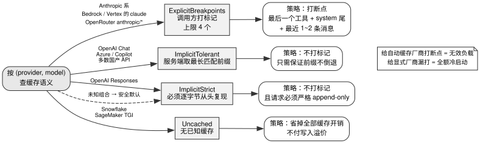
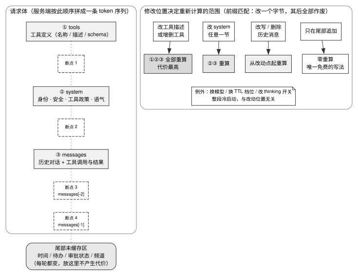

# 第 6 章 · KV cache 是第一约束

---

## 6.1 缓存的核心约束：按前缀匹配

在大语言模型的自回归生成中，每一个 token 的计算都依赖此前全部历史 token 的注意力上下文。在底层实现上，推理引擎为了避免每生成一个 token 都从头重新计算历史注意力张量，会将历史计算出的 Key 和 Value 张量驻留在 GPU 显存中（现代推理引擎如 vLLM 借助 PagedAttention 进行分页管理）。这份驻留的中间张量状态，便是 **KV cache（键值缓存）**。

Transformer 推理分为两个阶段：预填充（prefill，将输入整段并行计算并生成历史 KV 张量）与解码（decode，逐词自回归生成）。模型厂商所称的 Prompt 缓存（Prompt Caching），本质上就是允许跨请求复用预填充阶段已经计算好的 KV cache。

这一底层机制为上层 Agent 执行框架带来了最严苛的一项硬约束：**缓存严格按前缀匹配（prefix matching）。在前缀的 token 序列中，任何一个字节的变动，都会导致从该字节开始向后的所有显存缓存全部失效并触发全量重算。**

在交互式 Coding Agent 的典型工作流中，系统每一轮都需要将当前执行动作与工具返回结果追加到上下文末尾，随后将完整上下文重新发送给服务端。输入上下文随着轮次持续单调膨胀，而单轮输出通常仅为一个结构化的工具调用。Manus 一文给出的生产实测数据显示（厂商自述），其端到端输入输出 Token 比约为 **100:1**——这意味着系统的计费成本与推理延迟几乎全部消耗在输入前缀的预填充阶段。

在前缀几乎全量命中、缓存读取享受厂商主流一折优惠（0.1 倍）的基准假设下，单轮完全不命中缓存的费用约为全量命中时的 **9.2 倍**（推导模型详见 §6.6）。当缓存未命中时，Token 费用暴增近十倍，同时首 Token 延迟（TTFT）会因为 GPU 必须重新预填充数万乃至数十万 Token 的历史上下文而显著飙升。

将 KV cache 列为上下文篇的开篇第一章，是因为后续所有涉及历史压缩、长期记忆沉淀与代码检索的架构设计，本质上都在动态改写发送给模型的上下文内容。而**每一次改写的位置与触发时机，都受制于前缀匹配的物理约束**。脱离了这一约束，任何看似巧妙的上下文治理策略在生产账单面前都会失去可行性。

---

## 6.2 源码对照：语义分类、断点位置与字节稳定要求

### 6.2.1 第一步是分清厂商语义，不是急着打标记

各模型厂商在「由谁决定缓存切分点」的协议设计上分裂为两大阵营。**显式断点派**（以 Anthropic 为代表，包括 Bedrock 与 Vertex 上的 Claude，以及 kimi-code）要求客户端在请求体中显式标记断点（cache breakpoint）位置；**自动隐式派**（OpenAI、Gemini、DeepSeek、Qwen、Moonshot 等）则完全由服务端在内存中自动维护最长公共前缀树。两大阵营在底层均遵循前缀匹配不变量，但对客户端代码的构建提出了完全不同的契约要求。

goose 对这一差异给出了最高抽象密度的工程解法。它在重构中引入了 `cache_semantics.rs` 模块，将原本分散在各个 Provider 内部的断点逻辑，收敛为基于 `(provider, model)` 元组判定的**四类缓存语义**：

```rust
pub enum CacheSemantics {
    /// Caller places markers; reuse needs an exact match of the marked bytes.
    ExplicitBreakpoints { max_breakpoints: usize },
    /// The longest matching stored prefix is reused implicitly.
    ImplicitTolerant,
    /// Only extends a prompt reproduced byte-for-byte from the start.
    ImplicitStrict,
    /// No known prompt cache.
    Uncached,
}
```
> `goose/crates/goose-provider-types/src/cache_semantics.rs:9-18`

这段枚举定义体现了两项极具实战价值的默认策略：

**第一，对于未知的模型组合，系统默认回退为 `ImplicitStrict`，而非 `Uncached`。** 源码注释对此做出了明确说明：「Unknown pairs default to `ImplicitStrict`, which is safe for every cache」。在面临不确定性时，假定最严苛的前缀字节一致性对所有缓存实现都是安全的；而若草率假设「不存在缓存」，则会使系统主动放弃本来可以享受的计费折扣。这是典型的防御性设计：在未定义状态下选择**约束最强**的策略。

**第二，即使出自同一厂商，不同 API 端点的缓存语义也可能截然不同。** 例如 OpenAI 的 Chat Completions 遵循 `ImplicitTolerant`，而其最新的 Responses API 则要求 `ImplicitStrict`。因此，仅凭厂商名称无法做出决策，必须精确绑定到具体的通信端点与线格式。



图 6-1 梳理了四类缓存语义与其对应的客户端决策路径。在构造请求时，系统必须根据 (provider, model) 精确查表：向自动隐式缓存的模型发送断点标记属于无效开销，而向显式断点模型漏发标记则会导致整段请求退化为全额冷启动。对于未知的新增模型组合，系统应默认回退至最严苛的隐式严格模式。

其他项目则采用了更为轻量的静态过滤方案。kilocode 维护了一份协议白名单，对于非白名单协议直接跳过所有断点策略计算：

```typescript
// Protocols whose wire format ignores inline cache markers (OpenAI's implicit
// prefix caching, Gemini's implicit + out-of-band CachedContent). Skip the
// whole policy pass for these — emitting hints would be harmless but pointless.
const RESPECTS_INLINE_HINTS = new Set(["anthropic-messages", "bedrock-converse"])
```
> `kilocode/packages/llm/src/cache-policy.ts:39-42`

MiMo-Code 则通过映射表根据 SDK 命名空间匹配标记格式。但这种单纯依赖模型名称匹配的做法存在隐患：**当调用部署在反向代理背后的 Claude 模型时，虽然名称命中，但若传输协议被降级，显式标记会被服务端静默丢弃**。因此，判断缓存语义既要核实模型名称，也要校验底层实际生效的传输协议。

### 6.2.2 断点位置：主要实现已趋同，细节决定成败

针对显式断点阵营，本书比对了三个项目构造断点的源码——goose、kilocode、MiMo-Code——并把 Claude Code 的公开行为放在一起对照。Claude Code 闭源，对它的描述依据 Anthropic 的 Prompt caching 文档与本书对其请求的观察（证据级别见本章基准），不是源码实证。

由于 kilocode 与 MiMo-Code 均派生自 opencode，其实际分属**三条独立谱系**：goose、opencode 谱系以及 Claude Code。三条谱系在经过长期迭代后，最终收敛于同一种标准断点拓扑：**最后一个工具定义 + 系统提示词末尾 + 最近 1–2 条历史消息**。

这一布局充分利用了 Anthropic 规定的 4 个断点上限（goose 在类型系统中将其显式定义为 `ExplicitBreakpoints { max_breakpoints: 4 }`），同时紧密贴合了计费的数学期望。kilocode 在源码中清晰记录了这一默认策略的推导逻辑：

```typescript
const AUTO: CachePolicyObject = {
  tools: true,
  system: true,
  messages: "latest-user-message",
}

// ...

// Resolution rules:
//   - undefined   → "auto" — caching is on by default. The math favors it:
//                   Anthropic 5m-cache write is 1.25x base, read is 0.1x,
//                   so a single reuse within 5 minutes already wins.
//   - "auto"      → tools + system + latest user msg.
//   - "none"      → no auto placement; manual `CacheHint`s still flow.
//   - object form → exactly what the caller asked for.
```
> `kilocode/packages/llm/src/cache-policy.ts:18-32`（有省略：`:24` 的 `NONE` 常量，完整代码见仓库）

其数学依据极其清晰：「只要复用一次即实现正收益」——首次写入付出 1.25 倍基础费用，第二次读取仅需 0.1 倍，两次调用综合成本为 $1.25 + 0.1 = 1.35$，显著低于无缓存两次全额调用的 $2.0$。

各实现的核心分歧在于**历史消息侧分配几个断点**：

- **主流方案采用 2 个断点（滚动双缓冲）**：MiMo-Code 的注释剖析了其容灾机理——当最后一条消息由于工具重试、用户手动打断（Ctrl-C）或编辑撤销而被弹出时，末尾断点随之消失；但倒数第二条消息处的断点依然存在，从而将最坏情况下的重算代价从「整段历史冷启动」限制在「仅重算被弹出的那一条消息」。此外，当单轮返回的 Content Block 过多导致超出服务端回看窗口（MiMo-Code 估算约为 20 个 Block）时，双断点亦能有效托底。
- **Claude Code 在消息侧只打 1 个断点**（本书观察）：在顺序推进的单线程对话里，多打的历史断点会让服务端多保留一段前缀，但后续请求不会从中间历史重新分叉，多出来的断点只增加服务端的缓存驻留，不带来命中收益。

**工程决策标准**：在无法深入掌握模型服务端显存调度机制时，应默认采用 2 个滚动断点的双缓冲方案；只有在完全掌握端到端推理链路时，才建议缩减为单断点以追求极致的端侧开销。

### 6.2.3 三类必须消灭的易变字节

在前缀缓存系统中，任何导致字节非幂等变动的因素都属于系统性缺陷。工业级项目通过严密的代码设计消灭了以下三类易变字节：

**（a）时间戳与时效信息。** 时间是破坏前缀稳定性的首要元凶，因为开发者往往下意识将其注入提示词。各项目的治理方案见表 6-1。

表 6-1：时间戳如何避免破坏前缀

| 项目 | 治理手段 | 源码出处 |
|---|---|---|
| hermes-agent | 时间戳粗化至「天」，保证全天 24 小时内提示词字节完全冻结（「byte-stable for the full day」） | `hermes-agent/agent/system_prompt.py:856-860` |
| openclaw | 将当前日期与时区移至缓存边界**之后**的可变区域；精确时间彻底移出 Prompt，引导模型通过 `session_status` 工具按需查询 | `openclaw/src/agents/system-prompt.ts:429-446, 1459-1473` |
| oh-my-pi | 工作区目录树展示绝对 UTC 时间，严禁使用「9 分钟前」等相对时间字符串 | `oh-my-pi/packages/coding-agent/src/workspace-tree.ts:105-108` |
| Claude Code | 会话开始时的日期写进前缀后整个会话**不再刷新**；跨越午夜后的日期变化通过末尾追加的动态提示告知模型（本书观察） | 闭源，无源码引用 |

跨零点不做隔离的代价可以直接算出来：前缀里的日期一变，下一轮请求就退化为整段前缀的 `cache_creation`；对过夜运行的长任务，这意味着把已经累积的几十万 token 上下文全部重新预填充一次。

**（b）非确定性序列化。** 逻辑内容完全相同、但序列化后字节排列不一致，是线上最隐蔽的失效根源：

- **JSON 键序扰动**：OpenMinis 在网络出口强制使用 `JSONSerialization.sortedKeys` 对 Payload 进行键序归一化（`OpenMinis/src/ios/Providers/Gemini/GeminiProvider.swift:421-423`）。许多主流语言的 JSON 序列化库在默认情况下不保证 Key 的输出顺序。
- **随机 UUID 污染**：hermes-agent 坚决摒弃随机会话 UUID，改用基于内容哈希与确定性递增后缀（`<id>_d<n>`）生成工具调用 ID，并在注释中警示：「随机 UUID 会使每次调用的前缀发生不可逆突变」（`hermes-agent/agent/message_sanitization.py:622-623, 648`）。codex 在 2026-08 也做了同样的事：Responses Lite 模式下前缀项的 id 用 UUID v5 从工具 JSON 与指令文本派生，而不是随机生成（`codex/codex-rs/core/src/client.rs:917-932`）。
- **枚举顺序漂移**：openclaw 强制对 MCP 协议暴露的工具列表按名称进行字典序排序。codex 曾记录过一次严重事故：由于将 MCP Server 存储在无序的 `HashMap` 中，导致工具清单在各轮对话间随机洗牌，作者自述该周会话的缓存命中率暴跌至 1% 以下。如今其代码库中依然保留着基于工具全限定标识符的强制排序逻辑。

**（c）运行期开关与头部标记抖动。** Claude Code 对 fast mode 等会改变请求头的模式做会话级锁存（本书观察）：一旦某个 beta 请求头在会话首轮出现，整个会话持续透传，防止用户中途切换模式破坏已建立的前缀。同理，是否使用 1 小时 TTL 也在会话首次判定后固定下来——Prompt caching 文档写明缓存条目按 TTL 分别计，TTL 不同的请求不能互相命中。

---

## 6.3 判断标准：改在哪里，改在何时

基于真实代码库的沉淀，我们可以确立四条可直接执行的架构准则。图 6-2 展示了请求体内各组件的物理拼装顺序与缓存失效的级联关系。



图 6-2 展现了一次模型请求中各组件的拼接顺序、断点分布与缓存失效的级联关系。在服务端，请求体按 tools → system → messages 的顺序被拼装为连续的 token 序列。改动在序列中的位置越靠前，向后扩散的失效代价越大：修改工具定义将导致全量缓存彻底作废，改动系统提示词会连带作废所有历史消息，而在消息序列末尾追加则能维持前缀完全命中。需要指出的是，切换基座模型、调整 TTL 档位或变更 thinking 深度属于全局性配置变更，无论改动发生在何处，都将引发整段请求的重新预填充。

### 判断标准一：静态配置前置，动态变量后置

每轮对话中发生变动的任何信息，必须无条件放置在所有缓存断点之后。

不同项目的代码实现虽然各异，但架构意图高度一致：openclaw 在 System Prompt 中引入了显式边界标记 `<!-- OPENCLAW_CACHE_BOUNDARY -->`，将静态指令与动态注入完全切开；如果插件 Hook 注入的内容未声明边界，系统会自动将其追加至未缓存的动态后缀区：

```typescript
export const SYSTEM_PROMPT_CACHE_BOUNDARY = "\n<!-- OPENCLAW_CACHE_BOUNDARY -->\n";

// ...

// Append the cache boundary when a prompt has none (e.g. a hook systemPrompt override),
// so dynamic additions route into an uncached suffix instead of the cached prefix (#85203).
export function ensureSystemPromptCacheBoundary(systemPrompt: string): string {
  // ...
}
```
> `openclaw/packages/ai/src/utils/system-prompt-cache-boundary.ts:8-23`（有省略：`:10-12` 的 `stripSystemPromptCacheBoundary` 与 `:17-22` 的函数体，完整代码见仓库）

Claude Code 的做法更进一步（本书观察，内部实现未核实）：system prompt 按段注册，默认一段只计算一次、整个会话缓存，直到用户清空或压缩上下文；必须每轮重算的段落要单独登记并写明理由，实际这样登记的只有 MCP 服务器带来的动态指令——服务器在两轮之间可能连接或断开。

同一思路下还有一个可以直接借用的技巧——**通过调整提示词措辞把动态条件变成静态文本**。假设某段提示词只在用户设定了 token 预算时才注入，按条件拼接就意味着每次预算开关都会让前缀失效。把它改写成带前置条件的从句（「When the user specifies a token target...」），没有预算时这段话在语义上等价于空操作，于是可以无条件放进静态前缀。每省下一个条件分支，就少一种前缀组合。其核心启示在于：**在 Prompt 边界之前，每增加一个动态条件分支，全局前缀的可能组合数就会按 $2^N$ 发生指数级分裂**。

### 判断标准二：历史消息严格保持只追加（Append-Only）

当系统配置或上下文发生变化时，应向消息队列末尾追加一条说明，绝不能回头修改历史消息。

codex 将该原则固化为一套显式契约。运行环境、工具权限与指令策略等顶层状态被拆解为独立的 World State 切片。当状态变更时，系统仅将增量差异渲染为一条新的 User 消息追加至末尾，历史消息保持原样。

在请求发送端，系统实施了严格的前缀验证：通过 WebSocket 发送增量 Payload 时，唯有非 Input 字段完全一致、且新的 Input 为旧 Input 加上返回结果的**严格单调扩展**时，才允许发送增量包；一旦校验失败，立即回退至全量重发。

在 API 层面，Anthropic 官方推出了两套专门用于维护前缀稳定的协议机制：
- **会话中途系统消息（Mid-conversation System Message）**：允许将系统级指令作为一条特殊的 `role: "system"` 消息追加进 `messages` 数组末尾，从而避免改动处于前缀顶层的 `system` 字段。
- **会话中途工具增删（Mid-conversation Tool Changes）**：在初始请求中全量声明工具集，后续通过在消息流中追加 `tool_addition` 与 `tool_removal` 差分块来动态切换工具可用性，使最顶层的 `tools` 数组保持完全静态。

Anthropic 官方文档对该设计的阐述直接印证了本章的逻辑：「`tools` 数组在哈希序列中甚至先于顶层 `system` 字段，直接修改它将导致整个会话的前缀缓存瞬间归零」。

### 判断标准三：上下文重构前，优先判定缓存热度

改写历史上下文的代价，等同于改动点之后全部 Token 的重新预填充开销；**这一成本唯有在服务端缓存依然处于「温热（Warm）」状态时才会真正发生**。

各项目在缓存失效窗口的处理上体现了深厚的工程权衡，见表 6-2。

表 6-2：缓存还热时各家如何推迟改上下文

| 策略模式 | 代表项目 | 治理机制与阈值 | 源码出处 |
|---|---|---|---|
| TTL 保护期内严格静默 | openclaw | 采用 `cache-ttl` 模式：距离上次写入未达到 TTL（默认 5 分钟）时跳过任何裁剪；真正发生改写后才重置时钟 | `openclaw/src/agents/embedded-agent-runner/tool-result-truncation.ts:55-66`、`:179-185`，`openclaw/src/agents/embedded-agent-runner/run/attempt-setup.ts:347-349` |
| 充分冷却后批量重构 | oh-my-pi | 仅当改写影响的后缀 ≤8K Token，或会话空闲超过 **90 分钟**时才触发重写——明确要求阈值必须覆盖 Anthropic 最长的 1 小时 TTL | `oh-my-pi/packages/coding-agent/src/session/session-maintenance.ts:173-180`、`:182-188` |
| 借冷启动契机顺手压缩 | Claude Code | 以 1 小时 TTL 为界：距上一条消息超过 1 小时的会话，缓存必然已经过期，此时做一次小幅压缩不会额外制造失效（本书观察） | 闭源，无源码引用 |
| 保守对齐过期时间 | codebuff | 距离上次请求超过 **30 分钟**执行无额外缓存成本的重构；宁可多保留温热缓存，也绝不提前破坏有效前缀 | `codebuff/packages/agent-runtime/src/compact-history.ts:74-83` |

codebuff 在源码中对 30 分钟阈值给出了极具穿透力的解释：

```typescript
/**
 * Idle gap after which the prompt cache is assumed cold, so compacting is free.
 *
 * 30 minutes is what base2 has shipped to the context-pruner in prod. The
 * pruner's own default is 5 minutes (Anthropic's ephemeral TTL), but the two
 * errors are not symmetric: too long only means missing a free compaction,
 * while too short throws away a cache entry that was still warm. Prefer the
 * conservative number.
 */
export const DEFAULT_CACHE_EXPIRY_MS = 30 * 60 * 1000
```
> `codebuff/packages/agent-runtime/src/compact-history.ts:74-83`

这两类工程失误的代价是完全不对称的：**空闲阈值设置过长，仅仅是错失了一次顺带清理历史的机会；而阈值设置过短，则会亲手将原本处于温热状态的高价值缓存前缀彻底破坏**。

### 判断标准四：TTL 档位与心跳保温依据真实交互模式抉择

Anthropic 提供了 5 分钟与 1 小时两种 TTL 档位，其首次写入费用分别为 1.25 倍与 2.0 倍基准单价。

**工程基准建议**：系统默认应采用 5 分钟档位；唯有线上真实请求日志证实同一个前缀在跨越 5 分钟后仍具有极高复用概率、且省下的重复写入费用足以抵消 0.75 倍的写入溢价时，才允许切换至 1 小时档位。

对于空闲心跳保温（Keep-Alive）机制，aider 与 OpenMinis 均将其作为可选配置。aider 默认关闭心跳，只有显式开启后才会在 4 分 55 秒发送极小请求进行续期；OpenMinis 则在最后一次调用 4 分钟后发送探测包，且每个空闲周期严格限制最多触发 2 次。

goose 在反向优化上做到了极致：引入 `prompt_cache_disabled` 标志，对于标题生成、单次总结等确定不会触发第二轮交互的单次轻量调用，**全链路主动剥离所有缓存标记**，绝不支付 1.25 倍的无效写入溢价：

```rust
    if options.prompt_cache_disabled {
        return anthropic_messages;
    }
```
> `goose/crates/goose-provider-types/src/formats/anthropic.rs:443-445`（messages 侧；tools 侧与 system 侧的同款早返回在 `:497-499`、`:515-520`）

**核心结论**：缓存并非可以不加节制开启的工具。对于确定只执行单次的孤立请求，开启缓存属于净亏损——你支付了 1.25 倍的写入成本，却永远等不来 0.1 倍的读取收益。

---

## 6.4 反面证据与失败模式

### 失败模式一：动态发现引入无序抖动

openclaw 曾遭遇过插件加载顺序不确定导致的缓存持续穿透。在动态插件系统中，System Prompt 中的功能描述往往跟随本地文件扫描或异步 RPC 结果动态生成。若未施加显式排序，不同进程启动后生成的 Prompt 字节序列将完全失序。

治理方案是建立**强制性的规范字典序**，所有动态发现的扩展能力必须在排序归一化后挂载在静态列表之后：

```typescript
  const externalChannels = normalizePromptCapabilityIds(listDeliverableMessageChannels()).filter(
    (channelId) => !CHANNEL_IDS.includes(channelId),
  );
  const deliverableChannels: readonly string[] = [...CHANNEL_IDS, ...externalChannels];
```
> `openclaw/src/agents/system-prompt.ts:674-677`（所在函数 `buildMessageChannelOptions` 为 `:673-685`）

所有进入 Prompt 的集合（工具列表、MCP 服务、上下文通道等）必须在序列化前完成确定性排序，任何依赖哈希表遍历或文件系统自然顺序的逻辑均属于严重缺陷。

### 失败模式二：为追求字节绝对稳定而牺牲业务正确性

将时间戳粗化至「天」与真实业务逻辑的正确性之间存在客观张力。hermes-agent 在注释中完整还原了这一工程博弈：

```python
# Date-only (not minute-precision) so the system prompt is byte-stable for the full day.
# ...
# Zone and UTC offset ARE included: tools that accept instants reject naive
# datetimes and require an explicit offset, and with the bare date the model
# has to infer EST vs EDT on its own (a coin-flip near a DST boundary, and a
# wrong guess silently writes the record onto the wrong day).  Both values
# are constant for the whole day -- they shift only at a DST transition --
# so the byte-stability the comment above depends on is preserved.
```
> `hermes-agent/agent/system_prompt.py:856-868`

若提示词仅包含粗略日期而隐去时区与 UTC 偏移量，模型在面对依赖绝对时间的工具时不得不自行猜测时区；在夏令时切换期间，这种猜测会导致模型**静默地将关键业务记录持久化到前一天或后一天**。正确的解法是引入在 24 小时内保持静态的时区缩写与 UTC 偏移量，在守住字节稳定性的同时消除语义歧义。

### 失败模式三：将所有缓存穿透归咎于客户端缺陷

Claude Code 的做法是在客户端做缓存穿透归因（本书观察）：发请求前记下 system prompt、工具 schema、模型、beta 请求头与 TTL 的快照；收到响应后，若缓存读取 token 相比上一轮明显下跌，就对照快照找出是哪一项变了。

这套归因能区分两类穿透：客户端自己改了前缀（最常见的是工具描述文本的细微改动，而不是工具增删），与客户端什么都没改、请求间隔也小于 TTL 但仍未命中——后者只能归因于服务端路由或缓存驱逐。排查线上缓存穿透时，必须先建立这条度量边界，不要把服务端不可控的漂移误判为客户端代码 bug。

### 反面证据一：显式断点并非越多越安全

如 §6.2.2 所述，Claude Code 在消息侧只保留 1 个断点（本书观察）。理由在 §6.2.2 已经说过：顺序单线程交互中，后续请求不会从中间历史重新分叉，多打断点只增加服务端的缓存驻留，不增加命中。

### 反面证据二：缓存命中率在多数项目中处于观测盲区

在全书调研的 21 个开源项目中，绝大多数只在 Usage 统计里解析缓存字段以核算账单；**把命中率作为常驻展示指标的只有两家**（2026-08-27 重扫）：openclaw 的 `status` 命令在会话表里常驻显示命中百分比（`openclaw/src/status/status-message.ts:404-409`），OpenMinis 的用量面板显示 Cache Hit Rate（`OpenMinis/src/ios/Views/Chat/UsageStatsView.swift:204-205`）；cindy 算了命中率但只写诊断日志，其余 18 家没有把它当指标看。Manus 将缓存命中率列为衡量自主 Agent 系统工程成熟度的第一指标（厂商自述），这一反差揭示了工业界在该领域的巨大盲区。

---

## 6.5 可以直接采用的最小实现

本节提供了开箱即用的缓存语义映射表、前缀不变性自动化测试套件、四级可观测性指标体系以及生产发布检查清单。

### 6.5.1 缓存语义路由表

基于 §6.2.1 的四类缓存语义，系统必须建立集中的语义判定路由。**所有向 Provider 发起的请求必须强制通过该路由解析缓存策略**，严禁在业务逻辑中散落硬编码的断点标记。

以下伪代码给出了核心路由的控制流与默认回退规范：

```
语义 = 枚举 { 显式断点(最大断点数), 隐式宽容, 隐式严格, 不缓存 }

表项 = { provider, model 匹配式, 语义 }

查表(provider, model) -> 语义:
    对表项按声明顺序取第一个匹配的，返回它的语义
    没有匹配的 -> 隐式严格          // 默认选择约束最强的那一档

初值三行示例：
    ("anthropic", "*")            -> 显式断点(4)
    ("openai",    "chat")         -> 隐式宽容
    ("openai",    "responses")    -> 隐式严格
```

### 6.5.2 前缀不变性回归测试套件

goose 在重构中构建了一套极为严密的前缀不变性测试（`prefix_invariance.rs`），这是保障 Harness 健壮性的核心基线：

```rust
//! Across the consecutive requests of a session, the cache-relevant bytes a
//! provider has already seen must never change.
//!
//! Implicit caches require request N to be a verbatim item-prefix of request
//! N+1; explicit-breakpoint caches require the bytes up to the last
//! breakpoint to recur at the same positions, modulo the markers themselves.
```
> `goose/crates/goose-provider-types/tests/prefix_invariance.rs:1-6`

该测试的核心精髓包含四个防御性细节：
1. **反空转断言（Anti-vacuous Assertion）**：在校验前先执行 `assert_ne!(requests[0], requests[1])`，确保两个测试请求确实存在真实的增量推进，防止测试因输入完全相同而虚假通过；
2. **线格式全覆盖**：针对 Anthropic、OpenAI Chat、OpenAI Responses 等格式分别建立独立用例；
3. **注入种子回归测试**：在测试套件中故意注入易变字节（如未隔离的 Turn Context）与尾部重定位错误，断言测试套件能 100% 精准报错捕获；
4. **全真实流水线驱动**：测试对象直接调用生产环境的请求投影与上下文组装流水线，杜绝使用简化 Mock。

### 6.5.3 四阶可观测性建设路径

团队应按照表 6-3 规划缓存可观测性的实施演进阶段。

表 6-3：可观测性四阶

| 阶段 | 核心度量动作 | 参考实现路径 |
|---|---|---|
| 1 · 基础命中率 | 计算公式 `cache_read / (cache_read + cache_write + uncached_input)`，全零时安全返回空值 | `cindy/packages/maker-core/src/agents/shared/usage-tracker.ts:90-104` |
| 2 · 实时穿透告警 | 当「上轮读取 ≥2048 Token 热前缀 + 本轮读取归零 + 本轮产生新写入」三者同时满足时触发告警 | `oh-my-pi/packages/coding-agent/src/modes/components/cache-invalidation-marker.ts:49-66` |
| 3 · 损失金额归因 | 逐轮统计「应命中而未命中的 Token 规模」，按实时单价折算为实际资金损失（美元） | `pi-mono/packages/coding-agent/src/core/cache-stats.ts` |
| 4 · 全自动根因定位 | 请求前后对 System Prompt、工具 Schema 与请求头全量快照，穿透时自动归因 | Claude Code（闭源，本书观察，见 §6.4 失败模式三） |

在实现第 1 阶段时，务必警惕 Usage 口径陷阱：**Anthropic 返回的 `input_tokens` 仅代表最后一个断点之后的未缓存增量，并非请求的总输入 Token**。完整的输入规模计算公式必须为：

$$\text{总输入 Token} = \text{input\_tokens} + \text{cache\_read\_input\_tokens} + \text{cache\_creation\_input\_tokens}$$

误将 `input_tokens` 视作总量，会导致运营看板上的 Token 成本统计发生严重的系统性缩水。

### 6.5.4 生产发布自检清单

**底层稳定性防护（任何一项遗漏均会导致前缀缓存大面积穿透）**
- [ ] System Prompt 彻底剔除动态时间戳、随机 UUID、当前用户名及易变状态；
- [ ] 所有暴露给模型的集合（工具集、MCP Server、外部 Channel）均已配置确定性字典序排序；
- [ ] 网络出口强制对 JSON 序列化键进行排序，工具调用 ID 采用确定性哈希生成；
- [ ] 对话历史严格遵守 Append-Only 准则，配置变更一律通过追加消息表达；
- [ ] 运行期 Feature Flags 与实验性请求头一旦启用，在会话生命周期内全程锁存。

**断点策略与 TTL 调优（显式断点阵营）**
- [ ] 构造请求前强制校验 Provider 语义表，确认当前模型确实支持并需要显式断点；
- [ ] 断点严格限制在 4 个以内：最后一个工具定义 + System Prompt 末尾 + 最近 2 条消息；
- [ ] 断点避开 thinking 与 redacted_thinking 块（oh-my-pi `packages/ai/src/providers/anthropic.ts:3181-3193`，hermes-agent `agent/anthropic_adapter.py:2654-2658`）；
- [ ] 当单轮消息块较多时，通过滚动双断点防止回看窗口溢出（MiMo-Code `packages/opencode/src/provider/transform.ts:557-559`（整段注释 `:557-582`））；
- [ ] 若在同一请求中混合使用 1 小时与 5 分钟 TTL，**长 TTL 断点必须严格排在短 TTL 之前**；
- [ ] 针对单次完成的轻量任务强制开启 `prompt_cache_disabled`，拒绝支付写入溢价。

**生命周期与时机调度**
- [ ] 执行历史压缩与上下文清理前，必须先评估缓存热度：热则推迟，冷则顺带清理；
- [ ] 衍生子 Agent 与 Fork 会话必须明确显式继承关系，杜绝无意义的重复冷启动。

**工程验证与指标看板**
- [ ] 建立前缀不变性自动化回归测试，且包含反空转断言与种子缺陷校验；
- [ ] 缓存命中率与穿透告警接入监控看板；
- [ ] 统一修正 Token 统计口径：$\text{总输入} = \text{input} + \text{cache\_read} + \text{cache\_creation}$。

---

## 6.6 版本与复核

### 本章基准

| 项 | 值 |
|---|---|
| 素材复核日期 | 2026-08-17（§6.2.1、§6.2.3、§6.3 判断标准二与判断标准四、§6.4、§6.5.2、§6.5.4 六处的提交编号、Anthropic 会话中途机制与 TTL 排序规则于 2026-08-18 补证；§6.5.3 的 usage 口径于 2026-08-19 补证） |
| 底稿 | `docs/harness-engineering/kv-cache-and-context-management.md`（2026-07-29 成文），本章已按当前代码修订 |
| 项目 commit | goose `caf59517c` (08-27)、openclaw `9bd50c803cc` (08-27)、pi-mono `ccfe79ed2` (08-27)、hermes-agent `5fc308a707` (08-27)、MiMo-Code `35bb2636` (08-27)、kilocode `156fb64fdb` (08-27)、oh-my-pi `17675a7c1b` (08-27)、codex `694edc23b2` (08-27)、codebuff `6e4f6d642` (08-27)、cindy `193e9c0c2` (08-27)、OpenMinis `09fc199` (08-19)、aider `5dc9490bb` (05-22) |
| Claude Code | 闭源产品，本章没有它的源码引用。对它的描述依据 Anthropic 官方文档（Claude Code 文档、Prompt caching 文档）与工程博客，以及本书对其公开行为的观察；证据级别为厂商自述与本书观察，不是源码实证 |
| 外部规格基准 | 各厂商官方文档 2026-07 版本。§6.3 判断标准二引的「中途改 system / 工具」文档与 §6.5.4 引的 TTL 排序规则取自 Anthropic 官方文档站（2026-08-18）；§6.5.3 的 usage 口径取自《Prompt caching》「Tracking cache performance」一节（2026-08-19）。本章的断点上限、TTL 档位与回看窗口以 Anthropic Messages API 为准；Bedrock / Vertex / OpenRouter 等转售通道是否同口径，本书未逐家核实。Manus 的两条数据是厂商自述、通用 agent，不是本书测量 |

### 哪些会过期，怎么自己复核

本章 6 类事实的保鲜期不同：

| 类别 | 保鲜期 | 复核方式 |
|---|---|---|
| 原理（前缀匹配、prefill/decode） | 长 | 不需要 |
| 价格与倍率（1.25× / 2× / 0.1×） | **短** | 查厂商定价页 |
| 限额（4 个断点、约 20 块回看窗口） | **短** | 查官方 API 文档；回看窗口只有项目注释里的约数，官方文档未见确定值 |
| 各项目实现（本章全部 `file:line`） | 中 | 按各处出处行直接核对；重点读注释而不只看行号是否命中。其中 §6.2.2「两条独立谱系采用同一基本结构，opencode 谱系的两个 fork 也保留该结构」属普查型断言，一个反例即可推翻 |
| 判断标准与失败模式 | 长 | 不需要 |
| 普查型断言（§6.4 反面证据二的 21 个项目普查） | **短** | 按本节判定方法重新横扫一遍；一个反例就能推翻 |

**「十倍左右」的推算链。** 设单轮输出为 1 份 token、输入为 100 份（沿用 Manus 文的 100:1；厂商自述、通用 agent 数据，本书未在 coding agent 上复现），且前缀几乎全部命中、缓存读取价按 2026-07 价差为一折（0.30 美元 vs 3.00 美元 / 百万 token）、输出价两侧按同价计（实际输出单价更高，比值会略低），则无缓存成本 ∝ 100×3 + 3、有缓存成本 ∝ 100×0.3 + 3，比值 = 303/33 ≈ 9.2 倍。前提是命中率足够高：命中率不足时比值向 1 回落（本书没有真实会话的命中率数据），所以「十倍左右」是上界方向的量级，不是实测值。

**21 家普查的判定方法。** 日期 2026-07-29。底稿 `docs/harness-engineering/kv-cache-and-context-management.md`，21 个仓库名逐一列在该文末尾的「主要来源」一节。与第 7 章 §7.2.1 的 21 个是同一批项目——两份底稿的名单逐项比对完全一致，区别只在读的是哪部分代码：那一轮读 prompt 构造代码，这一轮读缓存相关代码。判定方法两条：「读取缓存字段」看的是源码里有没有解析响应 usage 中的缓存读/写 token 并计入成本；「常驻监控指标」看的是有没有把命中率写进 dashboard 或周期性日志——只在单次响应里打印一行不算。21 / 23 / 28 三个数不能互换：28 是调研池，23 是正文实际留下引用的项目，21 是这一轮专项普查覆盖的项目。21 是 28 的子集，池里没进这一轮的 7 个是 buzz、cloudflare-os、deepseek-harness、flue、herdr、loopx、prime-agent。

复核项目实现的命令：

```bash
# 下面的 projects/ 相对路径要在仓库根目录跑；未克隆先见后记 D.1。
# 1. 本章引的四个 PR / issue 编号，各自对应哪一个提交（应分别命中一条）
git -C projects/goose    log --grep="#11022"  --format='%h %cs %s'
git -C projects/goose    log --grep="#11179"  --format='%h %cs %s'
git -C projects/openclaw log --grep="#123543" --format='%h %cs %s'
git -C projects/codex    log --grep="(#2611)" --format='%h %cs %s'

# 2. 成文之后有无新机制
git -C projects/goose    log --since=2026-08-17 --oneline -- crates/goose-provider-types/src/cache_semantics.rs
git -C projects/openclaw log --since=2026-08-17 --oneline --grep=cache -i
```

这类工程细节不会隔夜作废，但会持续被补全。复核时也不能只看 `file:line` 是否命中——**结论是否还成立，必须重读代码才能判断，不能只跑 grep**。
