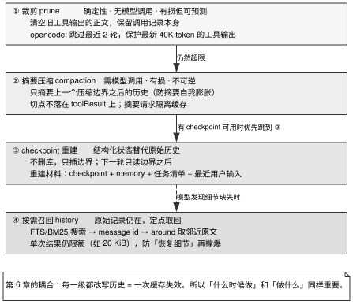

# 第 8 章 · 压缩、checkpoint 与「无限上下文」

---

## 8.1 「无限上下文」的真实含义

任何大语言模型的上下文窗口均存在物理硬上限。随着自主 Agent 在长任务中持续交互与探索，输入 Payload 终将逼近甚至击穿该物理边界。

除了硬性容量瓶颈外，上下文膨胀还会引发两大核心系统退化：
1. **Context Rot（上下文衰减效应）与中段信息遗忘（*Lost in the Middle*）**：过长且稀疏的上下文会直接导致模型召回精确率出现断崖式下跌。Chroma 针对 4 家主流厂商 18 款模型的实测报告表明，输入长度增加会引发显著的注意力衰减；而 *Lost in the Middle*（TACL 2024）研究进一步揭示，模型极易忽略处于上下文中段的关键约束。即便窗口仍有余量，盲目堆砌历史信息也会损害推理质量；
2. **KV Cache 缓存击穿与成本失控**（第 6 章）：对历史上下文的每一次改写，均等价于修改点之后所有 Token 缓存的物理失效。因此，上下文压缩不仅是模型理解能力的保障机制，更是系统吞吐与算力成本的核心调度面。

本书所界定的「无限上下文」，是指会话能够在固定大小的模型物理窗口内实现长期、持续且低衰减的自主运行。MiMo-Code 的核心工程架构可概括为：

> 持久化原始轨迹 + Checkpoint 状态重建 + 摘要压缩 + 按需历史检索。

这一架构的基石在于**真相源（Source of Truth）与读模型（Read Model）的彻底解耦**：底层数据库中的全量原始历史记录永不因压缩而物理删除，所有有损裁剪与摘要生成仅作用于投递给模型的有效读模型切片之上。

在上下文压缩设计中，最常出现的三类系统性陷阱如下：

- **过度依赖单纯的摘要压缩**：导致细粒度技术细节不可逆丢失，模型反复追问已明确交代过的环境前提；
- **全量无边界摘要递归**：将此前的摘要连同新历史全量再次送入压缩，导致摘要体积无限膨胀并迅速反噬窗口；
- **忽视缓存失效代价的盲目压缩**：在收益极微小的情况下频繁修改上下文，导致前缀缓存不断击穿，系统开销暴增。

---

## 8.2 源码对照：四个上下文处理级别

### 8.2.1 四级上下文治理阶梯

综合业界成熟实现，上下文治理在物理开销与实现复杂度上呈现清晰的四级递进阶梯，见图 8-1。



图 8-1 展示了工业级 Agent 系统中上下文分级治理的四层递进阶梯拓扑：由轻至重依次为轻量裁剪（Prune，纯确定性规则截断，无额外模型调用开销）、摘要压缩（Summary Compaction，调用模型生成结构化阶段摘要，有损压缩）、Checkpoint 重建（基于快照状态全量重构读模型）以及按需历史召回（依托底层向量/全文检索按需回溯原始轨迹）。系统应当严格按代价由低到高逐级调度，并在每一次上下文改写中精准权衡 Token 节省收益与前缀缓存失效代价。

### 8.2.2 第一级 · 裁剪（Pruning）：零模型开销的确定性剔除

opencode 的 `prune` 机制展现了纯规则驱动的轻量级裁剪范式：

```typescript
export const PRUNE_MINIMUM = 20_000
export const PRUNE_PROTECT = 40_000
const TOOL_OUTPUT_MAX_CHARS = 2_000
const PRUNE_PROTECTED_TOOLS = ["skill"]
```
> `opencode/packages/opencode/src/session/compaction.ts:28-31`

其逆向遍历与多重前置校验逻辑如下：

```typescript
// goes backwards through parts until there are PRUNE_PROTECT tokens worth of tool
// calls, then erases output of older tool calls to free context space
loop: for (let msgIndex = msgs.length - 1; msgIndex >= 0; msgIndex--) {
    const msg = msgs[msgIndex]
    if (msg.info.role === "user") turns++
    if (turns < 2) continue                                    // ① 跳过最近 2 轮
    if (msg.info.role === "assistant" && msg.info.summary) break loop   // ② 到上个摘要就停
    for (...) {
        if (part.type !== "tool") continue
        if (part.state.status !== "completed") continue         // ③ 只动已完成的
        if (PRUNE_PROTECTED_TOOLS.includes(part.tool)) continue // ④ 白名单保护
        if (part.state.time.compacted) break loop               // ⑤ 已裁过的就停
        total += estimate
        if (total <= PRUNE_PROTECT) continue                    // ⑥ 保护最新 40K
        pruned += estimate
        toPrune.push(part)
    }
}
if (pruned > PRUNE_MINIMUM) { /* 真正执行 */ }                   // ⑦ 收益不够就不做
```
> `opencode/packages/opencode/src/session/compaction.ts:271-317`

表 8-1 拆解了这七项防御性检查的系统工程意图。

表 8-1：opencode 裁剪前的七项检查

| 检查条件 | 防御的底层物理故障与系统风险 |
|---|---|
| ① 跳过最近 2 轮 | 严格保护模型正在使用的短期工作记忆 |
| ② 遇到前序摘要立即终止 | 避免对已被结构化归档的历史区域进行二次冗余扫描 |
| ③ 仅处理已完成状态工具 | 杜绝修改在途异步工具的动态输出 |
| ④ 工具白名单保护（`skill` 等） | 保护长期有效的指令型与规则型输出不被误删 |
| ⑤ 遇到已裁剪标记即刻停机 | 保证多轮裁剪操作的幂等性 |
| ⑥ 锁定保护最新 40K Token 工具输出 | 为近期推理留足高保真度的技术上下文 |
| ⑦ **预计节省量低于 20K Token 则放弃裁剪** | **核心经济学准则：微小的空间释放不足以补偿前缀缓存失效带来的重算成本** |

被裁剪的输出正文统一替换为占位符 `"[Old tool result content cleared]"`。**必须完整保留工具调用本身的签名与参数，仅清空冗长返回值**，确保模型清楚知晓自身历史操作轨迹。

### 8.2.3 第二级 · 摘要压缩：三条核心不变量

**不变量 A：严格基于上一压缩边界截断输入**

MiMo-Code 在压缩时强制锁定上一压缩断点：

```typescript
// Truncate history at the previous compaction boundary so a repeat
// compaction summarizes [previous summary + messages since], not the full raw
// history (which would grow unboundedly and overflow the compaction model).
// Only compaction boundaries are used — checkpoint boundaries inject a
// lossy rebuild and compaction benefits from seeing the full window since
// the last compaction (including any checkpoint rebuild text in between).
const boundaryIdx = input.messages.findLastIndex(
  (m, i) =>
    i < parentIdx &&
    m.info.role === "user" &&
    m.parts.some((p) => p.type === "compaction"),
)
const scoped = boundaryIdx >= 0 ? input.messages.slice(boundaryIdx) : input.messages
```
> `MiMo-Code/packages/opencode/src/session/compaction.ts:258-270`

避免将历史摘要反复嵌套递归，遏制摘要本身的发散膨胀。

**不变量 B：切分点严禁落在 `tool_use` 与 `tool_result` 之间**

pi-mono 通过 `findValidCutPoints` 枚举合法切点，确保截断严格发生在安全的轮次边界：

```typescript
export function findCutPoint(entries, startIndex, endIndex, keepRecentTokens): CutPointResult {
    const cutPoints = findValidCutPoints(entries, startIndex, endIndex);
    if (cutPoints.length === 0) {
        return { firstKeptEntryIndex: startIndex, turnStartIndex: -1, isSplitTurn: false };
    }
    let accumulatedTokens = 0;
    let cutIndex = cutPoints[0];          // 默认值：至少落在第一个合法切点上
    for (let i = endIndex - 1; i >= startIndex; i--) {
        // ...
        accumulatedTokens += messageTokens;
        if (accumulatedTokens >= keepRecentTokens) {
            for (let c = 0; c < cutPoints.length; c++) {
                if (cutPoints[c] >= i) { cutIndex = cutPoints[c]; break; }
            }
            break;
        }
    }
    // ...
}
```
> `pi-mono/packages/agent/src/harness/compaction/compaction.ts:374-402`

防止产生孤儿工具调用引发后续 API 校验崩溃（400 Bad Request）。

**不变量 C：摘要生成请求必须实施缓存隔离**

```typescript
// Summaries are standalone requests, so isolate routing and avoid cache writes that cannot be reused.
const requestOptions: SimpleStreamOptions = {
    ...options,
    cacheRetention: "none",
    sessionId: uuidv7(),          // ← 全新会话 ID
};
```
> `pi-mono/packages/agent/src/harness/compaction/compaction.ts:110-115`

单次摘要请求属于一次性瞬态计算，显式声明 `cacheRetention: "none"` 可避免为永远不会复用的缓存前缀支付溢价。

### 8.2.4 第三级 · Checkpoint 状态重建：以结构化快照替代原始历史

MiMo-Code 展现了跳脱文本摘要的创新思路——**利用结构化系统快照直接重构读模型**：

1. **自适应后台 Checkpoint 固化**：依据上下文窗口大小分档自适应写入快照（窗口小于 25K 关闭；25K–200K 在 20%、40%、60%、80% 各写一次；200K–500K 每 10% 一次；大于 500K 每 5% 一次；`MiMo-Code/packages/opencode/src/session/prune.ts:44-52`）；
2. **插入重构边界（Rebuild Boundary）**：主 Agent 超限时插入重构边界，底层数据库物理消息保持完好；
3. **高密度重构 Payload 组装**：由 Checkpoint + 项目 Memory + 任务待办清单 + 活动 Actor 状态 + 最近 User 输入共同构成全新读模型；
4. **多 Agent 状态隔离**：子 Agent 拥有专属的 `(sessionID, agentID)` 独立压缩上下文，严禁与主 Agent 混合。

### 8.2.5 第四级 · 按需精准回溯（On-demand Retrieval）

当模型在压缩后需要回溯被折叠的细节时，MiMo-Code 提供了基于 SQLite BM25 检索与 `history` 工具的定点取回通道：
- 在截断处保留带有 `message_id` 的占位引用；
- 模型通过 `history(operation="search", query=...)` 定位目标消息，并通过 `history(operation="around", message_id=..., radius=...)` 仅拉取该消息周边的上下文片段；
- 单次拉取严格受限于 $20\text{ KiB}$（`AROUND_MAX_BYTES`），杜绝回溯操作引发二次溢出。

### 8.2.6 压缩在主循环中的编排位置

表 8-2：压缩放在循环的什么位置

| 编排架构 | 核心调用流与机制 | 代表项目 | 源码出处 |
|---|---|---|---|
| **外层驱动编排** | 在 `agent_end` 后由外层 Session 驱动，优先级为：重试 → 压缩 → 队列处理 | pi-mono | `pi-mono/packages/coding-agent/src/core/agent-session.ts:1089` |
| **消息任务化调度** | 触发时向队列注入带有 `CompactionPart` 的 User 消息，交由主循环下一轮作为标准任务处理 | opencode | `opencode/packages/opencode/src/session/compaction.ts:559-582` |

opencode 将压缩转化为标准循环任务的设计，赋予了压缩过程天然继承中断、退避重试与事务持久化的能力。

---

## 8.3 判断标准：构建自适应上下文治理体系的四项准则

### 判断标准一：严格遵循由低至高的治理成本阶梯

发生上下文超限时，系统必须优先尝试零模型调用的确定性裁剪；仅在裁剪无法释放充足空间时方可升级至摘要压缩或 Checkpoint 重建。

### 判断标准二：释放空间收益必须严格超越缓存重算成本

每次裁剪或改写上下文所释放的 Token 空间，必须显著大于由此引发的 KV Cache 缓存失效重写量（$\Delta\text{Tokens}_{\text{Saved}} > \text{Threshold}$）。若缓存处于温热状态，优先推迟改写；若缓存已冷，则合并批量处理。

### 判断标准三：压缩后的上下文必须包含明确的角色定性前缀

注入压缩摘要时，必须附带标准前缀（如 `[CONTEXT COMPACTION — REFERENCE ONLY]`），明确告知模型「该摘要仅为历史背景，绝非新的行动工单」，并在 System Prompt 中预先声明「摘要仅保留最终结论，不反映实时工具状态」，杜绝模型陷入对过往工单的重复执行。

### 判断标准四：真相源与读模型必须物理隔离

底层存储必须保持全量追加写，严禁因上下文窗口限制直接 DELETE 历史数据，为高阶的按需检索与可观测审计提供物理支撑。

---

## 8.4 反面证据与失败模式

### 失败模式一：裁剪时物理抹除工具调用元数据

若将工具调用记录连同正文一并删除，模型将丢失「自己曾执行过何种操作」的状态感知，进而引发具有外部副作用工具的重复调用。

### 失败模式二：递归摘要引发的上下文发散

未设立边界截断的摘要逻辑，会导致历史摘要被不断反复打包，最终摘要本身反客为主挤占整个窗口。

### 失败模式三：采用固定百分比作为全局压缩阈值

在大模型物理窗口跨越 $200\text{K}\sim 1\text{M}$ 的演进中，固定百分比会导致可用安全余量剧烈失真。应采用「物理窗口 $-$ 摘要预留 $-$ 安全缓冲」的绝对阈值计算模型。

---

## 8.5 可以直接采用的最小实现

### 8.5.1 确定性裁剪伪代码实现

```
PRUNE_PROTECT   = 40_000      // 锁定保护最近 40K Token 工具输出
PRUNE_MINIMUM   = 20_000      // 节省量低于 20K Token 放弃本次执行
PROTECTED_TOOLS = ["skill"]   // 规则型与指令型工具输出免裁剪

prune(messages):
  candidates = []; turns = 0; total = 0
  逆向遍历 messages:
    遇到 user 消息: turns++
    turns < 2: 继续跳过（保护最近 2 轮）
    遇到已存在摘要: 立即终止
    非 tool part / 未完成 / 属于白名单: 跳过
    遇到已裁剪标记: 立即终止
    total += 估算 Token
    total <= PRUNE_PROTECT: 跳过
    candidates.push(part)
  
  if 估算节省总量 > PRUNE_MINIMUM:
    将 candidates 的输出正文替换为 "[Old tool result content cleared]"
    完整保留工具调用参数与签名
```

### 8.5.2 标准上下文压缩模板

```
[CONTEXT COMPACTION — REFERENCE ONLY]
以下为此前任务执行的历史摘要，仅作为背景参考，绝非新的执行工单。
摘要仅保留阶段性结论与核心发现，不代表实时的环境工具状态；如需最新信息请调用工具从当前工作区确认。
```

### 8.5.3 验收测试矩阵

在交付上下文压缩子系统前，必须通过以下六项基础验证：
1. **递归膨胀防御测试**：连续模拟触发 3 次压缩，断言第 3 次生成的摘要体积未突破预设上限；
2. **切分点安全性测试**：构造处于 `tool_use` 与 `tool_result` 之间的截断场景，断言切分算法自动回退至最近的安全轮次；
3. **签名完整性测试**：执行轻量裁剪，断言历史消息中的 `tool_name` 与参数完全保留，仅正文被占位符替换；
4. **经济收益熔断测试**：模拟释放量低于 20K Token 的裁剪请求，断言系统跳过执行且不产生任何上下文改写；
5. **摘要请求缓存隔离测试**：断言发送摘要压缩请求时，网络层显式配置了 `cacheRetention: "none"` 与独立 Session ID；
6. **按需回溯定点拉取测试**：在上下文压缩后使用 `history` 工具拉取历史特定 Message ID 的上下文，断言能够精准召回且单次体积严格受控于 20 KiB。

---

## 8.6 版本与复核

### 本章基准

| 项 | 值 |
|---|---|
| 素材复核日期 | 2026-08-17 |
| 底稿 | `docs/mimo-code-infinite-context.md`、`docs/rag/prime-agent/01-context-compaction.md`、`docs/cloud-agent/session-runtime-and-agent-loop.md` §4.5；本章代码引文为本次重新核对 |
| 项目 commit | opencode `5f5ea53afb` (08-27)、MiMo-Code `35bb2636` (08-27)、pi-mono `ccfe79ed2` (08-27)、oh-my-pi `17675a7c1b` (08-27)、kilocode `156fb64fdb` (08-27)、hermes-agent `5fc308a707` (08-27)、kimi-code `676e4d822` (08-27)、OpenMinis `09fc199` (08-19)、codex `694edc23b2` (08-27)、openclaw `9bd50c803cc` (08-27) |
| Claude Code | 闭源产品，本章没有它的源码引用。对它的描述依据 Anthropic 官方文档（Claude Code 文档、Prompt caching 文档）与工程博客，以及本书对其公开行为的观察；证据级别为厂商自述与本书观察，不是源码实证 |
| 外部规格基准 | 不适用（本章不依赖厂商 API 规格；缓存计价见第 6 章） |

### 哪些会过期，怎么自己复核

| 类别 | 保鲜期 | 复核方式 |
|---|---|---|
| 四个上下文处理级别 | 长 | 不需要 |
| 三条压缩不变量 | 长 | 不需要；只有当厂商放宽了 `tool_use` / `tool_result` 的配对约束时，不变量 B 才要重新核实 |
| 真相源与读模型分离 | 长 | 不需要 |
| `PRUNE_PROTECT` 等常量 | **短** | 随模型窗口变化 |
| checkpoint 密度的百分比 | **短** | 同上 |
| 压缩触发阈值 | **短** | 应实测，本书不给数字 |
| 「context rot」的具体劣化点 | 中 | 随模型换代变化 |

```bash
cd projects   # 未克隆先见前言《怎么拿到这些项目的代码》
cat codex/codex-rs/prompts/templates/compact/summary_prefix.md
grep -rn "Old tool result content cleared" --include="*.ts" . | grep -v test
```

本章引用的常量会过期。复核 opencode 的 prune 时，应逐条确认七个 `continue` / `break` 对应的边界条件是否仍被处理；某个分支消失时，要继续查它是被遗漏了，还是换成了新的处理方法。

**两处 grep 口径。** `insertRebuildBoundary` 的注释在源码里折成两行（`:1658` 行末是 `tool_use`，`:1659` 是 `is preserved — LLM still sees what action was taken`），整句连起来 grep 不到。codex 的 8 份 system prompt 名单是 `codex/codex-rs/core/gpt*prompt*.md` 五份、`codex/codex-rs/core/prompt_with_apply_patch_instructions.md`、`codex/codex-rs/protocol/src/prompts/base_instructions/default.md`、`codex/codex-rs/core/templates/model_instructions/gpt-5.2-codex_instructions_template.md`；文件名下划线与连字符两种写法都有，通配符写窄了会数不到 8 份。
