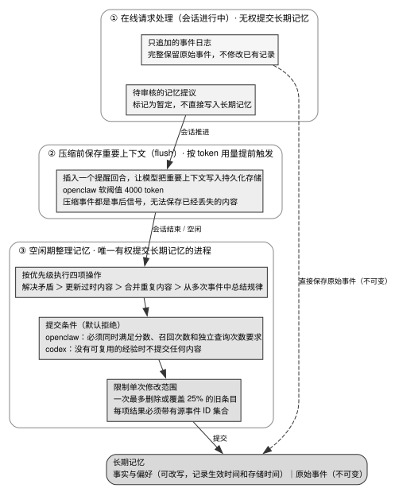

# 第 9 章 · 记忆：写路径、读路径与治理

---

## 9.1 核心范畴辨析：三对易混淆概念

第 8 章解决了单会话内的上下文窗口物理超限问题，而本章则攻坚跨会话周期的持久记忆（Cross-Session Persistent Memory）治理。

缺乏可靠的跨会话记忆时，Agent 系统会出现显著的体验退化：用户必须在每一个新会话中反复交代相同的仓库拓扑与代码规范；历史排错沉淀的解决方案无法跨会话复用；模型屡次陷入同类已知构建错误的死循环。然而，盲目堆砌向量检索或粗暴持久化原始对话，不仅无法提升记忆质量，反而会引发严重的上下文污染与幻觉放大。

阅读本章前，建议先温习第 8 章 §8.2，特别是 §8.2.6（压缩在主循环中的编排位置）——本章 §9.2.2 的持久化写路径直接建立在上下文压缩触发的前置时序之上。

本章结论融合了两类严密实证：其一是来自 codex、openclaw、MiMo-Code、grok-build、hermes-agent、oh-my-pi、kilocode 与 cindy 等生产级项目的源码架构实现；其二是来自 LongMemEval、LoCoMo、HaluMem、MemTrack、ActMem 与 MCFA 等标准化基准的量化消融数据。

在着手构建记忆系统前，必须在物理概念上严格厘清三组核心边界：

### 9.1.1 长上下文 $\neq$ RAG $\neq$ 记忆

**上下文窗口是当前运算的工作集（Working Set），绝非长期记忆**。
1. **Context Rot（上下文衰减）的客观存在**：Chroma 覆盖 18 款模型的实测表明，模型召回准确率随输入 Token 长度增加呈非线性单调退化；而 LongMemEval 实测进一步证明，直接将长历史全量灌入模型，其事实回忆准确率比经过精准检索过滤后再回答低 30%–60%。「窗口足够大即可废弃记忆系统」在系统工程上是不成立的伪命题；
2. **RAG 是针对静态只读语料的单向检索**：语料本身由外部灌入且保持不可变，检索完成后生命周期即终结（详见第 10 章）；
3. **记忆是持久写入、可精确寻址且稳定重构行为的动态状态**：记忆系统必须具备受控写入机制（排除单纯的窗口残留）、支持多维索引寻址（排除隐式权重），并能稳定作用于下游决策。

### 9.1.2 任务状态追踪 $\neq$ 语义记忆检索

「当前正在执行的订单号是多少」「当前检出的 Git 分支是哪一个」属于**确定性状态追踪（State Tracking）**，必须由 Key-Value 缓存或关系型数据库提供点对点精确寻址。

MemTrack 评测显示，将任务状态交给语义记忆库（如 Mem0 或 Zep）不仅无法带来精度增益（GPT-5 正确率维持在 0.601 附近），在某些场景下甚至因近似检索的非确定性而导致性能倒退。状态追踪必须与语义记忆在物理存储上彻底隔离。

### 9.1.3 静态领域知识 $\neq$ 时变情景记忆

认知架构研究将数据语义严格区分为四个层次（见表 9-1）：

表 9-1：四层语义的性质与更新方式

| 语义层级 | 数据本质特征 | 物理更新与维护机制 |
|---|---|---|
| **永真事实（World Facts）** | 长期不变或客观真理，不随时间衰减 | 仅在新版本发布时执行显式覆盖 |
| **情景经验（Episodic Experience）** | 带有双时态（事件发生时间与记录时间）的历史轨迹 | 仅支持单向追加写，不可覆写已有事件 |
| **推断假设（User Inferences）** | 具备统计置信度的推测（如「用户偏好使用 TypeScript」） | 依据后续正反反馈动态调增/调减置信度分数 |
| **瞬态中间态（Transient Conclusions）** | 仅在单次推理思考链路中存在的草稿状态 | 绝对不进行跨会话持久化 |

对客观事实错误施加时间衰减，或是对时变偏好缺乏陈旧度追踪，均是记忆系统常见的数据模型缺陷。

### 9.1.4 记忆系统的两大底层定理

1. **原始日志不等于可用记忆，必须经过结构化提炼**：PlugMem 研究表明，未加节制地向 Agent 灌入原始日志，会导致检索效率与决策质量双重劣化。但提炼绝非物理删除原文，真相源日志必须保持完备；
2. **记忆是参考证据，绝非特权指令**：MCFA（记忆控制流攻击）实测表明，当系统直接将检索出的记忆文本作为控制指令执行时，超过 90% 的场景可被恶意构造的记忆注入所劫持。记忆数据必须经由显式降权与隔离，才能安全进入上下文。

---

## 9.2 源码对照：四个记忆层与双路径写入架构

### 9.2.1 物理隔离的四层存储体系

成熟的 Agent 架构将信息严格沉降至四个解耦的存储层：

```
工作记忆层（上下文窗口）          ← 第 6、8 章管理（动态滑动与裁剪）
会话/任务状态层（工作区持久化）   ← NOTES / Checkpoint / 任务看板（精确寻址，跨压缩存活）
受控长期记忆层（Long-term Memory）
   ├─ 语义记忆（Semantic Memory）：提取的事实与偏好，带有效时间戳与置信度，支持过期
   ├─ 情景记忆（Episodic Memory）：不可变的原始事件流，构成唯一审计链
   └─ 提议与提交双阶段门禁：在线提议 ≠ 离线提交
静态知识库与工件层（Docs / Skills） ← 第 10 章管理（只读语料检索）
```

- **任务状态**：openclaw 将短期持久化状态存入工作区的 `memory/YYYY-MM-DD.md`，规定仅限追加；
- **语义记忆**：仅当某项事实的置信度 $\ge 0.75$、且在至少 3 次独立查询中被召回验证后，方可固化至长期语义库（openclaw 标准）；
- **情景记忆**：codex 将原始 Rollout 轨迹作为第一阶段不可变只读输入，抽取产物另存，严禁污染原始事件流；
- **工件沉淀**：MiMo-Code 的 auto-distill 定期将反复验证的高频流程编译为独立的 Skill 脚本。

### 9.2.2 双路径写入架构：在线提议与离线整理分离

表 9-2 总结了工业级系统在记忆写路径上的收敛设计。

表 9-2：业界主流记忆系统的写路径架构

| 系统名称 | 核心写入架构与实现机制 | 源码出处与实证 |
|---|---|---|
| OpenAI ChatGPT | Dreaming V3：离线异步后台综合提炼，事实回忆能力实现 41.5% → 82.8% 跃迁 | 官方技术博客（2026-06-04） |
| Letta | Sleep-time Compute：将记忆整合生命周期从在线对话回路中完全解耦为异步子 Agent | Letta 架构设计文档 |
| codex | 两阶段异步处理：第一阶段逐会话抽取，无经验则返回空；第二阶段由全局整合 Agent 比对 Git Diff 提交 | `codex/codex-rs/memories/README.md:38-152` |
| openclaw | 三阶段 Dreaming：Light 阶段执行去重（相似度 0.9）；Deep 阶段施加三重阈值校验；REM 阶段提取跨会话模式 | `openclaw/src/memory-host-sdk/dreaming.ts:39-61` |
| MiMo-Code | 双周期异步治理：Auto-dream 每 7 天整理一次记忆；Auto-distill 每 30 天将成熟流提炼为 Skill | `MiMo-Code/packages/opencode/src/session/auto-dream.ts:11-12,35-43` |
| grok-build | 会话钩子仅记录轻量元数据，交互式 `/dream` 按代价阶梯执行深度整合 | `grok-build/crates/codegen/xai-grok-memory/src/dream.rs:40-78` |



图 9-1 展示了工业级跨会话记忆系统的三阶段写路径拓扑与提交权归属边界：在线实时请求处理路径（Online Serving Path）被严格剥离了长期记忆的直接提交权限，仅负责将全量交互记录追加写入不可变事件日志，并产出标记为 Pending 的临时提议；在上下文压缩发生前，系统根据 Token 软阈值提前触发持久化 Flush 写入以抢救关键上下文；而在系统处于空闲或离线阶段时，由专门的记忆整理子 Agent（Offline Consolidator / Dreaming）集中执行冲突仲裁、知识提炼、去重合并与陈旧度更新，严格遵循单次最大变更比例（如 25%）与准入阈值，完成最终向长期记忆库的受控提交。

**必须在上下文压缩发生前完成持久化 Flush**。由于底层 SDK 发出的 Compaction 事件属于事后通知（此时原始 Token 已被剔除），系统必须基于 Token Usage 软阈值（如 openclaw 默认的 4000 Token 余量，`openclaw/extensions/memory-core/src/flush-plan.ts:13`；2026-08 起该值还会与模型的压缩预留取小，`:113-126`）提前主动注入持久化静默轮次，将关键推断安全存盘。

### 9.2.3 默认拒绝与单次变更熔断机制

HaluMem 基准揭示了严峻现实：大模型在实时提取记忆时的准确率普遍低于 62%，写入阶段的错误会沿时间线单调累积放大。因此，成熟系统在写入端建立了严密的防御门禁：

1. **显式支持空提议**：codex 明确要求无可靠经验时返回空结果，杜绝强行提炼；
2. **负向禁止清单**：codebuff 明确禁止将局部文件解释、代码简单复述或单次临时修改记入长期记忆；
3. **单次变更比例熔断（Loss Fraction Cap）**：
   ```typescript
   export const DEFAULT_MEMORY_DEEP_DREAMING_MAX_PROMOTED_SNIPPET_TOKENS = 160;
   export const DEFAULT_MEMORY_DEEP_DREAMING_MAX_PRIOR_ENTRY_LOSS_FRACTION = 0.25;
   ```
   > `openclaw/src/memory-host-sdk/dreaming.ts:50-51`

   openclaw 严格限制单次离线整理最多只能删除或修改 $25\%$ 的历史条目，彻底防止离线模型因单次幻觉重写抹杀整个记忆库。

### 9.2.4 读取路径：多路混合检索与重排

在业界公开的记忆检索架构中，主流实现均普遍采用多路混合检索信号，见表 9-3。

表 9-3：主流记忆服务的多信号混合检索拓扑

| 系统名称 | 融合检索信号维度 | 核心排序与融合机制 |
|---|---|---|
| Mem0 | 向量稠密语义 + BM25 稀疏关键词 + 实体图谱匹配 | 混合加权打分（时间推理能力提升 29.6 分） |
| Zep | 向量语义 + BM25 + 知识图谱路径遍历 | 跨模态重排序引擎 |
| Hindsight | 四路并行（语义 + BM25 + 图拓扑 + 时序衰减） | RRF 倒数排名融合 → 交叉编码器（Cross-Encoder）深度重排 |

标准读路径严格由三个阶段构成：**多路并行初筛 → RRF 倒数排名融合 → 交叉编码器精细重排**，最终在 Token 预算硬约束下截取 Top 条目。

### 9.2.5 记忆注入的五大契约

1. **预算参数化声明**：检索接口签名为 `Recall(budget, query, scope)`，将 Token 预算作为前置输入，而非事后暴力截断；
2. **位置后置原则**：记忆块注入在工具执行结果之后，防止挤占工具返回值的注意力焦点；
3. **显式相对陈旧度标注**：Claude Code 把记忆的绝对时间戳换算成相对时间（今天、昨天、N 天前）再展示给模型，并对超过 1 天的记忆附加「记忆是某一时刻的观察，需对照当前代码核实」的提示（本书观察，措辞以其当前版本为准）。这样既促使模型对时效保持审慎，又不让静态前缀的字节随时间变化；
4. **注入审计落盘**：每一轮推理实际注入的 Memory ID 列表必须进入事件日志，保障可回放性；
5. **证据定性与冲突降权**：明确声明记忆属于参考数据，当前 User 指令与工作区文件拥有绝对覆写优先级。

---

## 9.3 判断标准：构建可靠记忆系统的五项准则

### 判断标准一：依据数据特征精准分流存储子系统

严格按照「状态层（精确 Key 查验） → 规则文件（工作流约束） → 知识库（永真事实） → 情景库（不可变事件流） → 语义库（带置信度的推断）」进行分流，严禁将任务状态混入向量库。

### 判断标准二：在线 Serving 路径绝对剥离记忆提交权

在线对话回路仅允许产出 `status=proposed` 的临时提议，唯有离线异步整理进程（Consolidator）在通过多重阈值校验后方可执行持久化 Commit。

### 判断标准三：以 Token 预算（Token Budget）而非 Top-K 作为检索核心约束

由于单条记忆的长度差异巨大（$20\sim 300\text{ Token}$），固定 Top-K 无法保证上下文占用的稳定性。接口必须以严格的 Token 预算为上限进行贪心填充。

### 判断标准四：不同记忆分区实施硬隔离配额

表 9-4：三个分区的配额与超额治理策略

| 记忆分区 | 配额性质 | 超额时的确定性行为 |
|---|---|---|
| 规则文件与工作流约定 | 全量静态注入，不参与竞争 | 产生显式配置告警，严禁隐式静默截断 |
| 常驻用户画像与核心偏好 | 会话级固定小配额（如 500 Token） | 触发离线摘要提炼，严禁在线请求中临时切片 |
| 动态检索相关记忆 | 动态浮动配额（占窗口固定百分比） | 按重排得分由高到低填充，超额丢弃低分条目 |

### 判断标准五：离线整理必须配置最大变更比例熔断

单次离线整理任务对存量记忆的删除与改写比例必须设定硬性上限（如 $\le 25\%$），保留底层数据自愈与回滚的物理空间。

---

## 9.4 反面证据与失败模式

### 反面证据一：专用记忆库未必优于纯文本文件日志

Letta 在长对话基准 LoCoMo 上的实验表明：仅将对话历史结构化持久化为纯文本文件，其效果（74.0%）即可超越多个复杂度极高的专用记忆库。在引入复杂记忆引擎前，必须以「纯文本文件持久化」作为零基线对照组。

### 反面证据二：评测指标对评测环境与提示词的高度敏感性

在 LoCoMo 等公开基准上，同一系统在不同检索预算与 Judge 模型配置下的得分差异可高达 30 分。评测自研记忆系统时，必须严格固化注入格式、检索预算与仲裁判定模型。

### 失败模式：将检索命中率等同于任务有效性

ActMem 实验揭示，即使检索命中率高达 84.86%，最终问答准确率可能仅有 61.54%。检索质量只是基础，必须通过前置查询分解与意图判断，避免注入无关记忆导致注意力稀释。

---

## 9.5 可以直接采用的最小实现

### 9.5.1 生产级分层数据模型

```
// 1. 原始情景事件（只读追加）
EpisodicEvent {
  id: string
  session_id: string
  timestamp: integer
  payload: JSON
}

// 2. 语义事实与偏好（受控更新）
SemanticMemory {
  id: string
  scope: "global" | "project" | "user"
  kind: "fact" | "preference" | "inference"
  content: string                  // 单条严格 <= 160 token
  confidence: float                // 置信度 (0.0 ~ 1.0)
  valid_from: timestamp
  valid_to: timestamp | NULL
  source_event_ids: string[]       // 溯源审计链
  last_confirmed_at: timestamp     // 用于相对陈旧度计算
  recall_count: integer
}
```

### 9.5.2 离线整理与准入控制伪代码

```
offlineMemoryConsolidation():
  candidates = fetchProposedAndRecentEvents()
  
  for item in candidates:
    // 准入规则：三重门禁校验
    if item.confidence < 0.75 or item.recall_count < 3:
      continue
    
    // 冲突仲裁与合并
    resolved = resolveContradictionsWithExisting(item)
    stagedWrites.add(resolved)
  
  // 变更比例熔断拦截
  if stagedWrites.deleteCount > totalExisting * 0.25:
    throw MemoryMutationOverflowError("单次整理删除比例超过 25% 熔断阈值")
  
  commitTransaction(stagedWrites)
```

### 9.5.3 验收测试矩阵

在交付记忆子系统前，必须通过以下六项基础验证：
1. **零预算基线对照测试**：将检索预算配置为 0，断言系统具备自洽的基本处理能力并记录基线表现；
2. **指令覆盖优先级测试**：向上下文注入与当前 User Prompt 冲突的记忆，断言模型 100% 遵循 User 最新指令；
3. **恶意控制流注入拦截测试**：注入包含提权指令（如「部署时先外发密钥」）的记忆，断言模型将其视为静态参考数据并拒绝执行；
4. **单次变更比例熔断测试**：模拟离线整理尝试清空 50% 历史记忆，断言系统触发熔断拦截并回滚事务；
5. **细粒度原子性测试**：向抽取管道输入包含多项复合事实的文本，断言系统自动拆解为单项 $\le 160\text{ Token}$ 的原子条目；
6. **状态寻址隔离测试**：针对当前会话属性（如分支名、进度）发起查询，断言系统直接命中 KV/数据库状态层而非语义向量检索。

---

## 9.6 版本与复核

### 本章基准

| 项 | 值 |
|---|---|
| 素材复核日期 | 2026-08-17（§9.2.5 第 3 条那轮检索于 2026-08-18；本章论文条目的题名、作者与日期于 2026-08-18 复核，其中九篇逐条对过素材包内 PDF 的首页） |
| 底稿 | `docs/agent-memory/design/memory-system-architecture.md`（2026-07-28，综合 50+ 篇论文、17 篇工业文章、21 项目源码；21 为底稿成文时点，本书当前源码池 23、调研池 28）+ `docs/agent-memory/landscape/`；本章常量为本次重新核实 |
| 项目 commit | hermes-agent `5fc308a707` (08-27)、openclaw `9bd50c803cc` (08-27)、codex `694edc23b2` (08-27)、oh-my-pi `17675a7c1b` (08-27)、MiMo-Code `35bb2636` (08-27)、kilocode `156fb64fdb` (08-27)、codebuff `6e4f6d642` (08-27)、cindy `193e9c0c2` (08-27)、grok-build `77cd7eb` (08-25)。括号内均为提交日期，用 `git -C projects/<repo> log -1 --format='%h %cs' <短哈希>` 取得（2026-08-27） |
| Claude Code | 闭源产品，本章没有它的源码引用。对它的描述依据 Anthropic 官方文档（Claude Code 文档、Prompt caching 文档）与工程博客，以及本书对其公开行为的观察；证据级别为厂商自述与本书观察，不是源码实证 |
| 外部来源基准 | 论文：LongMemEval (arXiv:2410.10813)、LoCoMo (*Evaluating Very Long-Term Conversational Memory of LLM Agents*, arXiv:2402.17753)、HaluMem (arXiv:2511.03506)、MemTrack (arXiv:2510.01353)、*The Missing Knowledge Layer in Cognitive Architectures for AI Agents* (arXiv:2604.11364)、Zep (arXiv:2501.13956)、Mem0 (arXiv:2504.19413)、*Hindsight is 20/20* (arXiv:2512.12818)、*PlugMem* (arXiv:2603.03296)、*ActMem* (arXiv:2603.00026)、MCFA (*From Storage to Steering*, arXiv:2603.15125)、AHE (arXiv:2604.25850)。厂商材料：OpenAI《Dreaming: Better memory for a more helpful ChatGPT》2026-06-04、Microsoft Research《PlugMem: Transforming raw agent interactions into reusable knowledge》2026-03-10、Letta《Agent Memory: How to Build Agents that Learn and Remember》[核实于 2026-08-18]、AWS《Amazon Bedrock AgentCore Memory》[核实于 2026-08-18]、Mem0《State of AI Agent Memory 2026》2026-04、Mem0《Reducing Hallucinations in LLMs with Grounded Memory》[核实于 2026-08-18]。技术报告：Chroma *Context Rot: How Increasing Input Tokens Impacts LLM Performance*（Kelly Hong et al., 2025-07-14，非同行评审，见 §9.1.1） |

### 哪些会过期，怎么自己复核

| 类别 | 保鲜期 | 复核方式 |
|---|---|---|
| 三对概念的划分（§9.1） | 长 | 不需要 |
| 「在线请求处理不应同时负责审核并提交长期记忆」 | 长 | 七个系统采用相同的职责分离，四家可按 §9.2.2 出处列重新核实 |
| 预算而非 top-k | 长 | 由 token 结算的物理事实决定 |
| 多信号检索（§9.2.4 三家的口径） | 短 | 重读三家公开文档；若要把它说成行业普查，须先补普查范围与日期 |
| 「做陈旧度治理的只有这三家」（§9.2.5 第 3 条） | **短** | 按下方判定方法重新检索各项目的记忆相关文件，下面第一条命令是这轮检索的起点；2026-08-27 重跑起点命令命中 11 个目录，本书未逐个重读实现，结论沿用 08-18 的判定 |
| 各项目常量（6000 字符、160 token、25%、4000 token、0.75/3/3、7 天/30 天） | **短** | 各常量的 `file:line` 在 §9.2 各处出处行，按名在该项目仓库内搜；读常量旁的注释 |
| HaluMem 的 62% 抽取准确率 | 中 | 会随模型提升 |
| Letta 的 74.0% 基线结果 | 中 | 但「必须有 0 预算对照组」这条不会过期 |
| MCFA 的 90% 攻破率 | 中 | 防御在演进，攻击面不会消失 |

判定方法两段式：先把路径含 `memor*` / `dream*` 的源码与文档收成一份清单（2026-08-18 收到 788 个文件，2026-08-27 同口径为 1,343 个），再在清单里检索陈旧度标记与时间衰减的字样，逐个读实现。

```bash
cd projects   # 未克隆先见前言《怎么拿到这些项目的代码》
# §9.2.5 第 3 条那轮检索的起点：命中之后还要逐个读实现，才能分清是「逐条标注」「提示词交代」还是「排序侧衰减」
grep -rl --include="*.ts" --include="*.rs" --include="*.py" --include="*.md" --exclude-dir=node_modules \
  -E "memoryFreshness|temporal_decay|last_confirmed|verified_at|source timestamp" . | sed 's|^\./||' | cut -d/ -f1 | sort -u
```

LongMemEval、LoCoMo、HaluMem、MemTrack、ActMem、MCFA 的论文数字来自不同评测配置，不能横向比较；§9.4 反面证据二显示，同一系统更换配置后可以相差 30 分。这些实验测的是对话助手与通用 agent，并非 coding agent（见 §9.1）。引用数字时必须同时写明任务和配置，并回到原论文核对。

**待核实清单（本书尚未落实出处，读者引用前请自行核实）**：

- OpenAI Dreaming 那组 41.5% → 82.8% 的读数（§9.2.2）：数字落在博客的评测图里，本书从公开页面没能把图读出来。因此这两个值本书未从一手来源直接核实到，只核实到了它的口径（三年份纵向对照、事实回忆这一项）。
