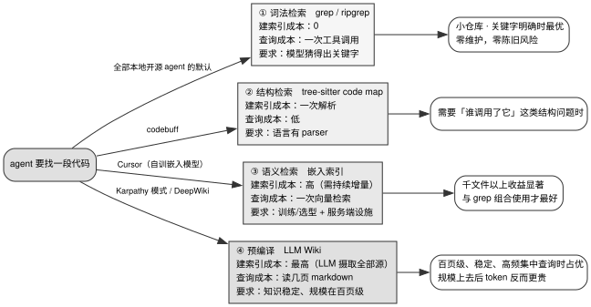

# 第 10 章 · 代码库检索：为什么 grep 赢了

> **本章为何归入上下文管理篇，而非工具篇**：在工程实现层面，代码检索确实主要依赖 grep、glob、read 等文件系统工具（其工具契约定义与错误返回规范已在第 3 章详述）。然而，决定检索架构取舍的核心约束是**上下文预算的物理分配**——单次检索向上下文窗口注入多少 Token、这些内容是否值得消耗宝贵的窗口预算，以及注入后为后续推理轮次留下了多少生存空间。因此，本章作为上下文治理的关键一环，与第 6–9 章共同构成上下文管理体系。阅读本章前，建议先温习第 3 章 §3.2.3（工具数量与渐进披露）与第 6 章（前缀缓存约束）。

---

## 10.1 一次普查：12 个工业级项目中仅 1 个内置语义索引，且默认关闭

第 9 章探讨了跨会话的记忆持久化机制；本章则聚焦于 Agent 在多文件工程场景下的代码定位问题。在 Agent 着手修改代码之前，首先必须精确定位目标上下文。

在 2023–2024 年大模型技术兴起初期，工程界曾一度将「代码切块 + 向量嵌入（Embedding）+ 向量数据库 + 语义检索」视为 AI 编程助手的标配架构。当时绝大多数技术方案的架构拓扑图中，几乎都显式挂载着一个向量数据库。

然而，当我们深入工业级 Coding Agent 的真实代码库进行系统性普查时，却发现了一个截然相反的事实。

本书对调研池中的 12 个开源 Coding Agent 进行了全面普查，核查其是否对**本地仓库代码**构建向量索引（这 12 个项目覆盖了当前主流实现：opencode、MiMo-Code、oh-my-pi、kimi-code、openclaw、codebuff、pi-mono、cline、kilocode、aider、goose 以及 crush）。

普查结果呈现出高度的一致性：**12 个项目中仅有 1 个构建了仓库代码向量索引，且该模块在默认配置下处于关闭状态；其余 11 个项目完全依靠 `ripgrep + glob + read`（以及基于 AST 语法树的结构化 Repo Map）作为代码检索的基石**。

需要说明的是，这一普查结论经历了严密的复核修正。在第一版自动化扫描脚本中，由于默认截断了搜索行数且仅过滤了 TypeScript、Python 与 Rust 文件，导致遗漏了 kilocode 的独立索引包，同时也漏掉了使用 Go 语言编写的 crush 项目。在彻底消除截断限制、补齐全语言扫描并逐一通读命中上下文后，才最终确立了上述精准数字。

在全部 12 个项目中，唯一内置仓库向量索引的是 kilocode，其实现封装在独立的 `packages/kilo-indexing` 模块中。其流水线各环节的实现见表 10-1。

表 10-1：kilocode 语义索引包的各环节做法

| 核心环节 | kilocode 的具体实现 | 源码出处 |
|---|---|---|
| 代码切块 | 优先借助 web-tree-sitter 解析 AST 后按语法块切分；解析器不可用时降级为按行切块 | `kilocode/packages/kilo-indexing/src/indexing/processors/parser.ts:4-7`（降级逻辑见 `:43`） |
| 索引构建 | 由 `DirectoryScanner` 统一调度嵌入器、向量存储、AST 解析器与本地缓存，遍历工作区并写入向量库 | `kilocode/packages/kilo-indexing/src/indexing/processors/scanner.ts:35-56` |
| 后端适配 | 兼容 10 家嵌入 Provider（kilo、openai、ollama、openai-compatible、gemini、mistral、vercel-ai-gateway、bedrock、openrouter、voyage），内置 lancedb 与 qdrant 两款向量存储 | `kilocode/packages/kilo-indexing/src/config.ts:11-23` |
| 查询执行 | 将用户检索词实时向量化后执行 `vectorStore.search(vector, prefix, minScore, maxResults)` | `kilocode/packages/kilo-indexing/src/indexing/search-service.ts:46-55` |
| 增量同步 | 基于 chokidar 监听工作区文件变动，通过批处理与防抖机制对修改文件执行增量重新嵌入 | `kilocode/packages/kilo-indexing/src/indexing/processors/file-watcher.ts:47-53` |
| 工具暴露 | 向模型暴露 `semantic_search` 工具，返回文件路径、起止行号、代码切片与相似度分数 | `kilocode/packages/opencode/src/kilocode/tool/semantic-search.ts:31-32`、`:58-78` |

尤为关键的是，该模块的默认配置为显式关闭：`enabled: cfg?.enabled ?? false`。用户唯有手动修改配置并配置对应的 Embedding Provider 凭证后，语义检索才会生效。作为 opencode 的衍生分支，kilocode 虽然额外扩充了这套语义索引套件，但依然选择将其设为可选插件，而非系统默认的主力检索路径。

**其余 11 个项目均未对仓库代码建立向量索引**。在这些代码库中扫描到的 `embedding` 关键词主要属于以下三类非代码检索场景：
- **Provider SDK 胶水代码与模型目录元数据**：opencode 与 MiMo-Code 中仅在注释里提及 Copilot Provider 的 `embeddingModel` 字段；codebuff 内部封装了 OpenAI 兼容的嵌入模型适配层，但仅在 Provider 包内部使用，未被外部检索逻辑调用；goose 中命中的是模型清单 JSON 中的 `text-embedding-3-large` 字符串及硬编码的 `Qwen/Qwen3-Embedding-*` 模型名称（goose 完全没有针对代码检索的向量化实现）。
- **长效记忆模块的语义向量召回**：openclaw 与 oh-my-pi 在跨会话记忆库中使用了向量召回（详见第 9 章 §9.2.4），其检索对象为历史经验总结，而非项目源码。
- **帮助文档站点的离线检索**：aider 使用 `llama_index` 的 `VectorStoreIndex` 对自身的官方文档（`aider.website`）构建了索引，仅用于 `/help` 命令回答「如何使用 aider 本身」，索引对象并非用户的工作区代码。

此外，部分代码命中仅为英文词汇重合（如 crush 中 Go 结构体嵌入特性的注释、pi-mono 关于「将 Agent 嵌入宿主系统」的架构说明），与数学向量毫无关联。

在绝大多数真实场景中，这些项目均收敛于 **ripgrep + glob + read** 的轻量级组合。唯一的例外是 aider：它并未向模型提供交互式的检索工具，而是利用 tree-sitter 解析全仓生成结构化 Repo Map，将其作为一条系统级上下文直接注入请求。

本章将深入解答两个核心工程命题：第一，为何面向真实工程的 Coding Agent 普遍舍弃了高复杂度的向量检索，转而坚守 grep；第二，在何种仓库规模与查询模式下，语义检索的收益才足以覆盖其昂贵的索引构建与增量维护成本。

---

## 10.2 源码对照：四条检索方法

### 10.2.1 全景：成本发生时点的转移



图 10-1 概括了四种代码检索架构的核心计算分布与适用边界。词法检索（grep）的建索引成本为零，查询成本仅为一次工具调用，但要求模型能够准确推测搜索关键字；结构检索（tree-sitter）通过单次轻量语法解析，提供针对符号引用与调用关系的精确查询；语义检索（向量嵌入）则需要持续承担索引构建与监听维护开销，适合在千文件以上大型仓库中配合词法检索作为补充；预编译方案（LLM Wiki）将大部分计算前置到素材摄取阶段，适合百页级规模的稳定知识库。

### 10.2.2 方法一 · 词法检索：工业级 Agent 的默认基准

codebuff 的代码搜索工具命名极为直接——`code-search`，其底层实现如下：

```typescript
import { spawn } from 'child_process'
// ...
import { getBundledRgPath } from '../native/ripgrep'
```
> `codebuff/sdk/src/tools/code-search.ts:1-6`

其核心引擎正是 **ripgrep**，甚至在分发包中直接打包了编译好的二进制可执行文件。

这并非 codebuff 的孤例。表 10-2 对比了四家主流 Agent 的词法检索实现，它们均遵循相同的核心原则：**在查询发生前，不做任何耗时的预索引**。

表 10-2：四家词法检索工具的实现与出处

| 项目 | 检索工具的具体实现机制 | 源码出处 |
|---|---|---|
| codebuff | 工具 `code-search` 直接 spawn 进程拉起内置的 ripgrep 二进制 | `codebuff/sdk/src/tools/code-search.ts:1-6` |
| opencode | `grep` 工具从依赖注入容器中动态获取 Ripgrep 服务实例执行搜索 | `opencode/packages/core/src/tool/grep.ts:11`、`:57`、`:97` |
| cline | 优先探测并调用系统 `rg` 命令，若环境缺失则自动降级为纯正则文本流扫描 | `cline/sdk/packages/core/src/extensions/tools/executors/search.ts:4`、`:141`、`:387` |
| goose | 不封装专属检索工具，而在平台扩展指令中明确引导模型调用 `rg`：`When you need to search, prefer rg which correctly respects gitignored content` | `goose/crates/goose/src/agents/platform_extensions/developer/mod.rs:66-68` |

在 codebuff 的实现中，包含一个极为深刻的工程细节：

```typescript
// Hidden directories to include in code search by default.
// These are searched in addition to '.' to ensure important config/workflow files are discoverable.
const INCLUDED_HIDDEN_DIRS = [
  '.agents', // Codebuff agent definitions
  '.claude', // Claude settings
  '.github', // GitHub Actions, workflows, issue templates
  '.gitlab', // GitLab CI configuration
  '.circleci', // CircleCI configuration
  '.husky', // Git hooks
]
```
> `codebuff/sdk/src/tools/code-search.ts:11-20`

在默认行为下，ripgrep 会自动忽略所有以 `.` 开头的隐藏目录。然而在现代软件工程中，**Agent 赖以生存的核心配置与规范恰恰全部驻留在隐藏目录中**——如 `.github/workflows`、`.claude/settings.json`、`.agents/` 以及 `.husky/`。若未在检索参数中显式将这些隐藏目录拉回白名单，Agent 将在物理上对自身的 CI 流程与安全规范产生不可逆的「视觉盲区」。

这一细节深刻揭示了词法检索的工程本质：**其核心工作量不在于搭建复杂的索引管线，而在于将基础工具的默认行为精细调校至完全契合 Agent 的作业特征**。

### 10.2.3 方法二 · 结构检索：基于 AST 的全景代码拓扑

codebuff 抽离了专门的 `packages/code-map` 子包，借助 **tree-sitter** 对项目源码进行结构化语法解析：

```bash
codebuff/packages/code-map/src/
├── index.ts
├── init-node.ts
├── languages.ts
├── parse.ts
├── tree-sitter-queries/   # 11 份 .scm 语法查询规则与 1 份 readme
├── types.ts
└── utils.ts
```
> `codebuff/packages/code-map/src/`（目录清单，`ls` 于 2026-08-17）

其解析核心直接基于 `web-tree-sitter` 实现，能够精准回答纯文本 grep 无法解析的高阶语义问题——例如「该接口被哪些模块引用」「指定结构体在何处定义」以及「当前模块的导出签名是什么」。

该方案的成本处于折中位置：语法解析的计算开销远低于向量模型推理，却能换取高度精确的代码拓扑表达；其主要工程代价在于需要为每种编程语言维护对应的语法查询规则（`.scm`）。

aider 与 codebuff 均采用了结构化 AST 映射机制，但两者在上下文组装与预算熔断策略上展现了截然不同的取舍：
- **上下文注入载体**：aider 将 Repo Map 包装为一条 `role="user"` 的初始化消息；codebuff 则将其作为独立章节固定挂载在 System Prompt 的 `# Project file tree` 区域中。
- **超出 Token 预算时的降级阶梯**：codebuff 采取两段式信息削减策略——优先保留完整的目录树拓扑，仅自底向上批量剔除低权重符号（函数名、类名与变量名），并在提示词中显式告知模型：`Selected function, class, and variable names in source files have been removed from the file tree to fit within token limits.`；若精简符号后依然超标，再由深至浅逐步剔除文件节点。aider 则基于 Tag 排序列表执行二分截断，在达到默认 1,024 Token 上限时直接丢弃低优先级符号。
- **动态按需下钻能力**：codebuff 配套提供了 `read_subtree` 工具，允许模型在需要时动态展开指定子目录的细粒度符号；aider 则不提供交互工具，完全由 Harness 在后续轮次根据最新提及的文件名与标识符全量重算。

### 10.2.4 方法三 · 语义检索：Cursor 的工业级实证

Cursor 团队在自建嵌入模型与语义索引流水线方面进行了深度探索。根据其官方公开的技术报告（《Improving agent with semantic search》，厂商自述），语义检索在真实编码场景中展现了可量化的收益：

**离线基准评测（基于自有评测集 Cursor Context Bench）**：
- 引入语义检索后，模型回答复杂编码问题的准确率平均提升了 **12.5%**（在不同基座模型上增益区间为 6.5%–23.5%）；
- 该提升在全部参评模型（涵盖主流前沿编码模型）中均表现出正向增益。

**线上生产环境 A/B 对照测试**：
- **代码留存率（Code Retention）**：全量用户总体提升 **+0.3%**；而在**包含 1000 个文件以上的大型代码库中，留存率提升显著放大至 +2.6%**；
- 在关闭语义检索的对照组中，由于检索未命中导致的用户负向追问增加了 **2.2%**。

Cursor 训练专用代码嵌入模型的创新之处在于**将 Agent 的实际执行轨迹转化为监督信号**：Agent 在排查问题时往往需要历经多轮检索与文件浏览才能定位最终修改点；通过事后回溯这条成功的探索路径，即可精准反推「在第一步推理时最应当呈现的上下文片段」，进而引导嵌入模型将语义相似度排序与 Agent 的实际注意力分布深度对齐。

然而，Cursor 官方技术报告中的最终结论极具清醒的工程洞见（着重为本书所加）：

> Our agent makes heavy use of **grep as well as** semantic search, and the combination of these two leads to the best outcomes.

Cursor 的工程结论非常明确：**语义检索并非用于取代 grep，而是与 grep 形成互补的联合检索体系**。

### 10.2.5 方法四 · 预编译知识库：LLM Wiki

第四条技术路径由 Andrej Karpathy 提出（以公开 Idea File 形式）：**利用大模型将原始文档预编译为持久化、自互链的 Markdown Wiki**，从而终结「每次提问均从海量碎块中临时暴力检索」的低效模式。

该架构分为三层：不可变的原始素材源（Raw Sources） → 由 LLM 动态维护的互链 Wiki 层 → 面向 Agent 的结构化约束规约（Schema）；配套三项核心操作：素材摄取（Ingest）、知识查询（Query）与健康巡检（Lint）。

其核心思想在于**计算时点的彻底前移**——将昂贵的理解与关联计算在数据写入时一次性完成。微信团队关于 LLM-Wiki 的研究成果表明，在多跳关联问答任务中，该模式显著超越了标准 RAG、GraphRAG 与 LightRAG 等基线方案。

然而，消融实验同样揭示了关键边界：**系统的主要增益源自 Agent 对关联文档的多跳遍历能力，而非 Wiki 拓扑本身**。

---

## 10.3 判断标准：何时坚守 grep，何时升级架构

### 判断标准一：模型能否推导出明确的搜索关键字

工程师在选型前应首先评估核心问题：「针对目标代码，模型能否构造出具备高区分度、且不致引发结果泛滥的正则表达式？」

- **能推导明确标识**（查找特定函数定义、报错信息片段、配置键名） → **坚决采用 grep**，其执行速度与准确度均显著占优；
- **属于模糊语义定位**（如「系统在何处处理用户权限鉴权」） → 启动语义检索进行广度召回。

这一标准直接解释了普查中绝大多数本地 Agent 的架构选择：日常编码任务中的绝大部分操作均指向具体的符号名或错误堆栈，精准的文本匹配足以解决绝大多数场景。

### 判断标准二：代码库规模与多仓复杂度

Cursor 的实测数据揭示了一条明确的规模分界线：语义检索在总体仓库上的收益仅为 +0.3%，但在 **1000 个文件以上的大型工程中，收益跃升至 +2.6%**。

据此可建立清晰的规模分级：
- **单仓库、千文件以下** → 坚决维持 `grep + glob + read` 组合，严禁引入向量数据库；
- **千文件以上大型工程或跨多仓库检索** → 语义检索的精度增益开始足以覆盖索引维护开销，建议通过离线评测集验证后再行接入。

### 判断标准三：查询目标是否具备语法结构依赖

当查询聚焦于代码文本本身（如查找某字符串出现的全部位置）时，grep 是唯一解；当查询涉及代码结构拓扑（如追溯调用链路、继承关系与导出清单）时，必须依靠 tree-sitter 或接入 LSP（Language Server Protocol），此时向量嵌入无法理解代码调用图。

### 判断标准四：知识变更频率与资产规模

对于预编译 LLM Wiki 方案，其工程适用窗口极其狭窄，各关键约束见表 10-3。

表 10-3：LLM Wiki 与标准 RAG 的适用边界

| 核心维度 | LLM Wiki 优势区间 | 标准 RAG 优势区间 |
|---|---|---|
| 语料规模 | 百页级 / 40 万词以内 | 企业级海量非结构化资产 |
| 变更频率 | 相对低频、高稳定性知识 | 持续高频变动的动态数据 |
| 查询分布 | 高频、核心聚拢型业务查询 | 低频、长尾发散型偶发查询 |
| Token 经济性 | 长期查询可摊薄摄取成本（节省 53–85% Token） | 低频单次查询无需支付高额预编译开销 |

### 判断标准五：参数调优前必须建立基准评测集

在调整任何检索参数之前，必须构建包含至少 30 条真实案例的基准评测集。因为端到端召回损失是由四个阶段**连乘**决定的：

$$\text{最终成功率} = \text{索引覆盖率} \times \text{算法召回率} \times \text{查询表达质量} \times \text{模型利用率}$$

若未建立分层度量，任何单点的参数微调都无法准确评估其实际收益。

---

## 10.4 反面证据与失败模式

### 反面证据一：单仓场景下的成本收益不对称

普查中 12 个开源项目基本不建索引的现状，并不意味着向量技术本身存在缺陷，而是因为**本地单仓库 Agent 处于向量收益曲线的最低端，却必须由用户本地环境承担全额的索引构建与文件监听开销**。成本收益比的不对称性决定了本地 Agent 的架构选型。

### 反面证据二：预编译收益过度依赖 Agent 的自主遍历

LLM-Wiki 的消融分析证实：若剥离 Agent 的自主多跳浏览逻辑，纯粹静态的 Wiki 结构并不能带来实质增益。这意味着，赋予 Agent 在普通 Markdown 文档间自由跳转与分步探索的能力，往往能够以更低的成本收获相似的效果。

### 反面证据三：增量维护开销缺乏公开度量

学术界与工业界的技术报告大多聚焦于查询阶段的效率对比，却普遍隐去了持续增量同步的真实代价。在动态变更的代码库中，如何精准失效陈旧索引、清理失效互链并保证知识时效性，是一笔巨大的隐性工程开销。

### 反面证据四：基座模型推理能力进化对专用检索的压缩效应

随着基座模型推理能力的增强，模型编写复杂正则表达式、执行多步分解检索与从错误结果中逆向推断修正的能力显著提升。这种「推理弥补工具」的趋势在客观上进一步压缩了专用向量检索的相对优势空间。

### 失败模式一：检索命中与模型有效利用脱节

ActMem 的实测数据揭示了严重的利用断层：**当检索模块的 Top-K 命中率达到 84.86% 时，下游任务的最终问答正确率仅为 61.54%**。导致这一断层的核心原因在于：
1. 检索结果注入在上下文腰部，遭受大模型注意力衰减（Context Rot，详见第 8 章 §8.1）；
2. 结果包含过多无关噪音，掩盖了关键代码；
3. 返回格式缺失精确的文件路径与行号区间。

治理方案必须集中在上下文组装侧：严格控制注入条目、将其放置在最新工具返回之后，并为每条结果显式标注行号范围。

### 失败模式二：隐藏工程目录静默丢失

如 §10.2.2 所述，ripgrep 与 glob 工具在默认情况下会静默跳过所有以点号开头的目录。这会导致 Agent 在排查 CI 故障或配置问题时，直接得出「仓库中不存在工作流定义」的错误断言。

### 失败模式三：陈旧索引引发模型幻觉固化

向量索引依赖异步增量同步。一旦文件监听器发生漏报或延迟，检索接口将向模型返回**在物理磁盘上已被删除或重构的代码片段**。这种陈旧信息会导致模型基于虚假的前提进行推理，其危害远大于单次检索落空。相比之下，grep 直接扫描实时文件系统的机制天然具备零陈旧的物理保障。

---

## 10.5 可以直接采用的最小实现

### 10.5.1 生产基准：grep + glob + read 的标准调优配置

绝大多数工程项目应直接基于该基准构建检索层：

```
grep(pattern, path?, glob?, -A/-B/-C?)  // 调用内置或系统 ripgrep
glob(pattern)                           // 文件名快速通配
read(path, offset?, limit?)             // 实施分块与行数截断（详见第 3 章）
```

必须配置的三项关键调整：
1. **显式拉回隐藏目录**：强制将 `.github`、`.gitlab`、`.circleci`、`.claude`、`.agents`、`.husky` 纳入扫描白名单；
2. **严格实施输出预算熔断**：建议对标 codebuff 的默认防护阈值——**单文件上限 15 条、全局上限 250 条、Payload 总长上限 20,000 字符、单次执行超时 10 秒**，并在截断时明确返回省略提示；
3. **在工具描述中植入最佳实践引导**：显式提示模型使用 `rg --files` 列举文件、使用 `rg` 精准检索内容，并结合分段读取工具避免全量加载。

### 10.5.2 零结果场景的防御性设计

当 grep 检索命中为 0 时，严禁仅返回空字符串或抛出系统异常，而必须回填结构化诊断引导：

```
当 grep 命中 0 条结果时，工具响应体应包含：
  1. 当前实际执行的正则模式与搜索路径范围；
  2. 当前生效的过滤标志（大小写敏感性、gitignore 规则、隐藏目录覆盖状态）；
  3. 改进建议：提示模型可尝试放宽为词干、移除路径限定或搜索同义符号。
```

同时必须满足三项设计准则：
- **零结果属于正常业务分支**，严禁触发错误拦截通道，防止模型误判工具发生崩溃；
- **Harness 严禁盲目自动改写查询**，保持语义控制权在模型手中；
- **为多轮尝试预留充足的上下文预算**，单次搜索的输出上限需为后续重试预留空间。

### 10.5.3 结果注入规范

无论采用何种检索方式，注入上下文的 Payload 必须遵循统一样式：

```
每条检索切片必须显式包含：绝对/相对路径 + 起止行号 + 适量上下文代码行
物理注入位置：严格挂载在对应工具调用的结果槽位之后
截断策略：依据 Token 预算动态筛选高价值片段，严禁无脑全量注入
```

### 10.5.4 验收测试矩阵

在交付代码检索模块前，必须通过以下六项基础验证：
1. **隐藏目录穿透测试**：检索仅存于 `.github/workflows/` 中的特征字段，断言必须能够稳定命中；
2. **海量匹配熔断测试**：检索在仓库中出现数千次的高频词，断言结果被严格截断且返回总数提示；
3. **实时一致性测试**：在磁盘上修改某文件后立即检索，断言结果 100% 呈现最新字节；
4. **Token 预算控制测试**：当检索结果超过 20 条时，断言系统按预算动态选择条目而非静态 Top-K 截断；
5. **零结果诊断测试**：检索随机不存在的字符串，断言返回结构化诊断提示而非空串或报错；
6. **基线对照测试**：在关闭所有高阶索引的纯 grep 模式下，记录系统的基线任务通过率。

---

## 10.6 版本与复核

### 本章基准

| 项 | 值 |
|---|---|
| 素材复核日期 | 2026-08-17；§10.1 的 kilocode 一节、§10.2.2 的横向对照表、Cursor 那篇的出处与作者，于 2026-08-18 逐条再次核实 |
| 底稿 | `docs/rag/architecture/`、`docs/rag/recall-optimization-deep-dive.md`、`docs/rag/llm-wiki/`；本章的项目普查为本次新做 |
| 项目 commit | 普查覆盖的 12 个项目全部列出：codebuff `6e4f6d642` (08-27)、MiMo-Code `35bb2636` (08-27)、opencode `5f5ea53afb` (08-27)、oh-my-pi `17675a7c1b` (08-27)、kilocode `156fb64fdb` (08-27)、openclaw `9bd50c803cc` (08-27)、kimi-code `676e4d822` (08-27)、pi-mono `ccfe79ed2` (08-27)、cline `1d5d3b005` (08-26)、aider `5dc9490bb` (05-22)、goose `caf59517c` (08-27)、crush `6d14dd93` (08-26) |
| 外部来源基准 | 论文：*Retrieval as Reasoning: Self-Evolving Agent-Native Retrieval via LLM-Wiki*（Ming et al.，arXiv:2605.25480，v1 2026-05-25）、*Knowledge Compounding*（Wen 与 Ku，arXiv:2604.11243）、Cochran 预注册对照研究（arXiv:2605.18490）——后两篇的英文正式标题见待核实清单第 4 项。厂商文章：Cursor《Improving agent with semantic search》（Heule、Jia、Jain，2025-11-06，厂商自述，本仓库存档 `docs/issue-driven-automation/industry-articles/cursor_semsearch.md`，快照 2026-08-04）。公开 idea file：Andrej Karpathy《LLM Wiki》gist（2026-04-04） |

### 哪些会过期，怎么自己复核

| 类别 | 保鲜期 | 复核方式 |
|---|---|---|
| 四条方法的划分 | 长 | 不需要（原理性划分，不随版本变化） |
| 「本地 agent 基本不建向量索引（12 之 1，默认关闭）」 | **短** | 跑下面第 1、2、4 条命令；这是本章最可能变的结论 |
| 「grep 与语义检索是叠加不是替代」 | 中 | 重访 Cursor 那篇与它的后续更新（出处见基准块外部来源行） |
| Cursor 的具体百分比 | 中 | 同上，重访该文与它的后续更新（厂商自述，单一来源，随模型变化） |
| LLM Wiki 的规模边界（百页 / 40 万词） | 中 | 重访 Karpathy 的 gist 与 §10.3 判断标准四表列的两篇论文（作者自述与社区经验，非实验结论） |
| 「模型变强会压缩语义检索的相对收益」 | **短** | 换基座模型后复跑一遍 §10.5.6 的评测集，比较四层各自的变化（方向不确定，是本章最值得持续观察的一条） |

下面四条命令对应四件事。第 1 条找「有没有一个独立的索引包、语义检索工具或向量库客户端」，这是最强的信号，只看路径不看内容；第 2 条按目录汇总每个项目中 `embedding` 的命中数，**不截断、不按语言过滤**——截断和语言过滤正是本章前一版把 kilocode 与 crush 一起漏掉的原因；第 3 条定位词法与结构两种方法的源码；第 4 条读那一个索引包的默认开关。

第 1 条的预期输出：只有 kilocode 与 aider 两家有输出。kilocode 是一大批——`kilocode/packages/kilo-indexing/` 整包（路径里带 `indexing/`）、工具本体 `kilocode/packages/opencode/src/kilocode/tool/semantic-search.ts` 与它的测试、几页文档，以及 VS Code 包里从 continuedev 带来的 `kilocode/packages/kilo-vscode/src/services/autocomplete/continuedev/core/indexing/`；aider 只冒出一行 `aider/aider/website/examples/semantic-search-replace.md`，那是文档里的示例文件名撞词，不是检索实现。其余十个项目应当没有输出。

第 2 条的预期输出：`kilocode/packages/kilo-indexing/` 的计数最大（约 45 个文件，全仓一百多个文件出现过这个词）；goose 有 8 个文件（2026-08-27）：3 份模型目录 JSON、1 处 Databricks provider 里过滤名字含 embedding 的模型的代码、1 个测试用代理脚本、3 处文档，没有一处是对代码库做向量化；crush 只有三个，唯一的代码文件包含 Go 结构体嵌入注释；aider 会打印两个 Python 文件：`aider/aider/help.py`（为自己的文档站建立索引）与 `aider/scripts/30k-image.py`（`# Font embedding`，指把字体嵌入 SVG，与向量无关）。

```bash
cd projects   # 未克隆先见前言《怎么拿到这些项目的代码》

# 0. 先确认 12 个项目都在：少一个，下面两条的结论就会偏向「没有」。
#    名单直接写进 for，不放进 PROJECTS="…" 变量——zsh 默认不做词分割，
#    for p in $PROJECTS 只迭代一次、$p 是整个字符串，输出会全空。
#    下面两条保留 2>/dev/null，用于隐藏逐文件的无关错误；项目是否缺失由这一行 ls 检查。
ls -d opencode MiMo-Code oh-my-pi kimi-code openclaw codebuff pi-mono cline kilocode aider goose crush

# 1. 有没有独立的索引包 / 语义检索工具 / 向量库客户端——最强信号
for p in opencode MiMo-Code oh-my-pi kimi-code openclaw codebuff pi-mono cline kilocode aider goose crush; do
  echo "--- $p ---"
  find "$p" \( -name node_modules -o -name target -o -name .git \) -prune -o -type f -print 2>/dev/null \
    | grep -Ei 'indexing/|semantic.?search|vector.?store'
done

# 2. 逐个看 embedding 的用途：按目录汇总命中数，不加 head、不加语言过滤。
#    crush 是 Go 写的，加 --include='*.ts' 会让它恒等于零输出；
#    加 head 会让命中多的项目只露出前几条，目标索引包可能正好排在后面。
#    这一条区分大小写。本书的普查不区分大小写；要复现相同口径，
#    把下面的 grep -rl 改成 grep -ril 再跑一遍即可：goose 会从 8 个文件变成 11 个，
#    多出来的两个都在 goose 下——crates/goose/src/providers/huggingface.rs
#    与 documentation/docs/guides/tanzu-ai-services.md。
for p in opencode MiMo-Code oh-my-pi kimi-code openclaw codebuff pi-mono cline kilocode aider goose crush; do
  echo "--- $p ---"
  grep -rl "embedding" "$p" 2>/dev/null \
    | grep -Ev 'node_modules|/i18n/' \
    | sed 's|^\([^/]*/[^/]*/[^/]*\)/.*|\1/|' | sort | uniq -c | sort -rn
done

# 3. 词法检索与结构检索的实现位置
grep -n "getBundledRgPath\|INCLUDED_HIDDEN_DIRS" codebuff/sdk/src/tools/code-search.ts
grep -n "prefer rg" goose/crates/goose/src/agents/platform_extensions/developer/mod.rs
ls codebuff/packages/code-map/src/

# 4. 唯一那一家的默认值——这一行读出 false，才说明它默认是关着的
grep -n "enabled: cfg?.enabled" kilocode/packages/kilo-indexing/src/config.ts
```

复核时必须逐个判断 `embedding` 的用途，只统计命中数会同时产生多算和漏算。openclaw 与 oh-my-pi 的命中属于记忆系统的向量召回；goose 的 8 个文件则是模型目录数据、provider 里按名字过滤 embedding 模型的代码、测试脚本与文档里的普通英文用法，不能算成代码索引。本书上一版的命令带 `| head -5`，且只扫描 `.ts`、`.py`、`.rs`，因此漏掉了 kilocode 的 `packages/kilo-indexing/` 和用 Go 编写的 crush。另一个漏算来自大小写：对 goose 使用 `grep -ri` 会从 5 个文件变成 7 个，其中 `crates/goose/src/providers/huggingface.rs` 里的 `Qwen/Qwen3-Embedding-*` 仍是模型名，并非检索代码。这个结论的保鲜期很短，采用前需要阅读命中位置，不能只跑 grep。

**待核实清单（本书尚未落实出处，读者引用前请自行核实）**：

1. **Cursor 那篇的 URL 与发布日期未联网复核。** `https://cursor.com/blog/semsearch` 与 2025-11-06 取自本仓库存档的文件头，正文、作者署名与五个数字本书已逐字核对过该存档；页面是否仍在原址、是否已更新，未做核实（§10.2.4）。
2. **Cursor 公布的五个百分比是绝对百分点还是相对变化，未确认。** 原文一律写 `%`，没有区分，本书照原文写 `%`（§10.2.4）。因此不能把「+2.6%」换算成绝对增量；正文只比较原文中不同仓库规模区间的结果。
3. **Karpathy《LLM Wiki》gist 的 URL 与 2026-04-04 这个日期取自本仓库底稿记录，未联网复核**；「the wiki is a persistent, compounding artifact」一句底稿标为逐字原文，本书未回到 gist 原页面比对（§10.2.5）。
4. **arXiv:2604.11243 与 arXiv:2605.18490 两篇的英文正式标题未取到。** 正文用的「Knowledge Compounding」与「Cochran 的预注册对照研究」是底稿里的简称，可能是论文里那套方法的名字而不是标题（§10.3 判断标准四）。作者姓已取到：前者 Shuide Wen 与 Beier Ku，后者 Theodore O. Cochran。
5. ~~kilocode 的 `packages/kilo-indexing/` 是哪一天进的仓库~~——已查明：`git -C projects/kilocode log --diff-filter=A --format='%h %cs' -- packages/kilo-indexing | tail -1` 给出 `f74d54c431` (2026-04-27)，早于本书第一版扫描，所以 §10.1 说的漏检是扫描脚本的问题，不是这个包后来才有。
