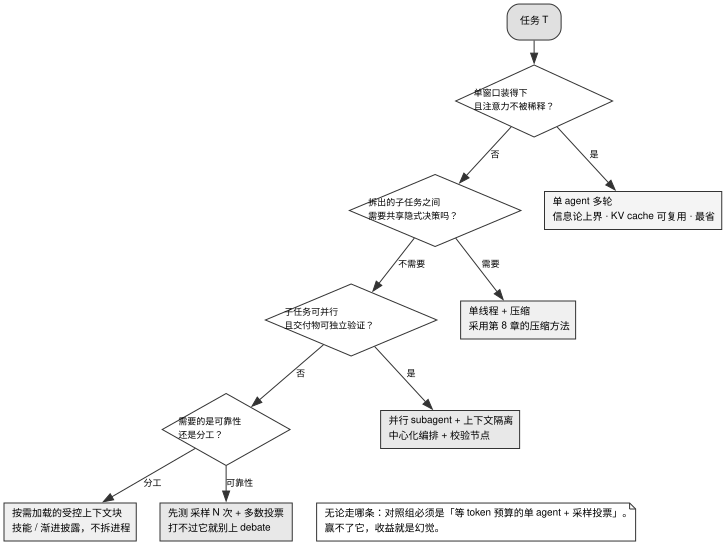

# 第 12 章 · 要不要拆 agent

> **本章与其他章的口径差异。** 本书大部分章节讲「怎么做对」，这一章的默认建议是：先不要拆成多个 agent，除非任务满足 §12.3 的条件。这个判断来自 64 篇论文与 24 篇公司工程文章的调研（本书普查）；**正文实际引用其中 9 篇论文与 6 篇厂商或实践者材料**。本书在此给出明确的工程基准建议，避免在关键架构选型上流于两可之词。§12.4 也列出了拆分确实成立的场景。

---

## 12.1 一场伪对立：隔离与压缩的上下文工程之争

在复杂的长程工程任务中，当单 Agent 的上下文窗口或推理能力逼近极限时，直觉上的第一反应往往是将其拆分为多个协同的子 Agent（Multi-Agent Subagents）。然而，在系统工程与信息论的严密审视下，盲目的多 Agent 拆分往往不仅无法提升任务成功率，反而会引入巨大的通信损耗、一致性崩溃与算力浪费。

2025 年 6 月中旬，业界掀起了一场针对多 Agent 架构的著名论战：
- **Anthropic 官方研究（2025-06-13）**：在广度优先的研究检索评估中，采用 Claude Opus 4 作为主协调 Agent、Claude Sonnet 4 作为子检索 Agent 的多 Agent 架构，取得了比单 Agent Opus 4 高出 **90.2%** 的优异表现（厂商自述基准）；
- **Cognition（Devin 团队，2025-06-12）**：发布《Don't Build Multi-Agents》，公开主张坚守单线程线性执行流，极力反对将编码任务盲目拆分为多个并行 Agent。

深入两份材料的技术底座便会发现，**这场争论在本质上属于伪对立**：
1. **任务特性的根本分歧**：Anthropic 的增益建立在「广度优先的开放式文献检索」之上——子任务之间完全解耦、高度可并行且读多写少；而 Cognition 的灾难性失败则发生在「高度依赖全局语义一致性的复杂软件工程构建」中；
2. **Anthropic 的明确声明**：其原文已明确承认，在真实软件编码任务中，真正具备强并行性的工作流极其稀少；
3. **技术路线的本质映射**：两者解决的均是上下文窗口容量瓶颈。LangChain 将上下文治理提炼为写入、选择、压缩与隔离四种原语；Cognition 选择的是单线程下的**有损摘要压缩（Compress）**，而 Anthropic 选择的是多窗口并行下的**上下文物理隔离（Isolate）**。

因此，多 Agent 绝非通往通用智能的必然架构进阶，而是一种在特定解耦场景下以通信损耗为代价换取上下文空间与墙钟延迟的工程取舍。

---

## 12.2 五条独立的论证链：为何单 Agent 往往更优

在建立选型决策流之前，必须从信息论与系统吞吐底层拆解「多 Agent 天然更强」的认知误区。

### 12.2.1 信息论硬约束：数据处理不等式（DPI）与消息转述损耗

信息论中的经典定理**数据处理不等式（Data Processing Inequality, DPI）**从物理上限制了消息传递的上限：

> 任何信息经过加工、转述或摘要处理后，其互信息量只会单调递减或保持不变，绝不可能凭空增加。

```
任务环境 T → Agent A 的完整观测 → 压缩后的转述消息 → Agent B 的输入
由 DPI 定理可知：I(T ; Agent B 的输入) ≤ I(T ; Agent A 的完整观测)
```

在多跳推理与复杂协作中，子 Agent 之间的每一次消息序列化与摘要转述，均是一次不可逆的信息有损压缩。实证研究（覆盖 Qwen3、DeepSeek-R1、Gemini 等主流模型）表明：**在严格控制 Thinking Token 预算完全对齐的前提下，单 Agent 凭借保留在自身上下文中的完整推理链，在多跳推理准确率上全面持平甚至超越各类多 Agent 架构**。

### 12.2.2 物理缓存屏障：同构 Agent 拆分等价于主动放弃 KV Cache

单 Agent 工作流论文（OneFlow）在涵盖代码、数学、推理等 7 大基准上的实测揭示了算力维度的核心规律：**同构单 Agent 多轮对话能够完全复现同构 Multi-Agent 的表现，并享有巨大的 KV Cache 物理复用优势**。

```
同一基座模型 + 统一 Prompt 前缀 → 共享单一递增的前缀 KV Cache（高吞吐、低延迟）
拆分为多个同构独立子 Agent      → 物理前缀割裂，每个子 Agent 均需独立预填冷启动（算力成本激增）
```

当所有 Agent 采用同一模型与前缀时，拆分独立进程等同于主动放弃前缀缓存；唯有在引入异构基座模型时，拆分才不会带来额外的缓存复用惩罚。

### 12.2.3 边际收益递减：同构复制的快速饱和与异构多样性价值

多样性缩放研究（Diversity Scaling）表明，多 Agent 系统的性能受限于任务固有的认知信道多样性，而非 Agent 数量本身。**同构 Agent 之间的高度认知相关性会导致系统在数量增加时极快陷入收益饱和**。

其实测核心结论极为鲜明：**2 个经过精心选型的异构 Agent，在协作性能上即可轻松匹敌或超越 16 个同构 Agent 的简单堆叠**。将算力预算花在更换模型家族、调整工具拓扑与优化 Prompt 路径上，其收益远超复制同构 Agent 副本。

### 12.2.4 任务与架构匹配度：从 +80.8% 到 −70.0% 的断崖分布

大规模受控对照研究（覆盖 260 组配置、6 大基准及 5 种架构形态）揭示了架构与任务失配带来的严峻后果：
- **可高度解耦的金融信息抽取**：中心化多 Agent 相对单 Agent 带来 **+80.8%** 的显著跃升；
- **强时序依赖的复杂规划任务**：独立多 Agent 相对单 Agent 出现 **−70.0%** 的断崖式溃败；
- **在 SWE-bench Verified 软件工程基准上**：所有多 Agent 架构的表现均低于单 Agent 基线（下降幅度介于 −2.1% 至 −14.9% 之间）。

实证进一步总结出三条规律：单 Agent 基线准确率超过 45% 时多 Agent 协作收益普遍转负；工具密集型任务极易被多 Agent 间的协调开销拖垮；缺乏中心化校验节点的去中心化拓扑会将局部轨迹错误放大 17.2 倍。

### 12.2.5 复杂编排基线：Debate 架构难以稳定战胜 Self-Consistency 多数投票

针对多智能体辩论（Multi-Agent Debate）的严格受控实验表明，在消耗同等甚至更多算力的情况下，复杂的辩论拓扑在多数逻辑任务中的表现普遍弱于简单的 **Self-Consistency 采样加多数投票（More Agents / Agent Forest）**。群体共识压力往往会压制少数正确的独立纠错路径。

任何复杂的多 Agent 编排，在投入生产前必须首先战胜「单 Agent 多次采样 + 多数投票」这一坚固的低成本基线。

---

## 12.3 判断标准：决定是否拆分 Agent 的核心准则



图 12-1 展示了长程任务中是否拆分子 Agent 的严密决策流程树拓扑：决策由四个核心守门条件递进展开——若单窗口足以承载且无严重注意力衰减，坚决采用单 Agent 多轮对话以最大化 KV Cache 复用并杜绝信息传递损耗；若窗口超限但子任务间存在隐式决策耦合，坚决采用单线程状态机结合上下文压缩；唯有在子任务高度解耦、可并行探索且交付物能够被独立程序化验证的严格前提下，方可引入并行子 Agent，并强制配备中心化校验节点。若子任务无法并行，系统应优先探索多次采样投票或渐进披露式上下文块，而非盲目拆分独立进程。

### 判断标准一：子任务之间是否存在强隐式决策耦合

「子任务 A 在技术选型、接口定义或数据结构上的局部决策，是否会直接制约子任务 B 的实现路径？」
若答案为「是」，则严禁拆分。强行拆分将导致子 Agent 在各自孤岛中产出风格冲突、接口错位的碎片产物，最终迫使主 Agent 陷入低效的错误修补循环。

### 判断标准二：七维工程量化评分准则

表 12-1 汇总了决定 Agent 拆分与否的七维量化评估维度。

表 12-1：子 Agent 拆分决策的七维工程评估矩阵

| 评估维度 | 推荐拆分为子 Agent 的特征 | 强烈建议坚守单 Agent 的特征 |
|---|---|---|
| **子任务耦合度** | 弱耦合，彼此不共享隐式决策 | 强耦合，局部决策决定全局实现 |
| **读写操作比** | 读多写少（大范围扫描、检索、调研） | 写多（密集代码修改、强一致性重构） |
| **时序可并行性** | 高度并行，追求降低墙钟时延 | 严格串行，后序步骤强依赖前序中间状态 |
| **交付物可验证性** | 局部产出具备独立程序化验证断言 | 仅整体产出可测，局部无法独立评判 |
| **上下文物理体量** | 单物理窗口绝对无法容纳全量信息 | 单物理窗口留有充足余量 |
| **基座模型异构性** | 明确需要跨不同厂商/能力的异构模型 | 全链路使用同一模型与同一套 Prompt 前缀 |
| **工具调用密度** | 工具调用稀疏，或工具权限可完全解耦 | 工具调用极密集，高频依赖大体积输出 |

**若在上表的「强烈建议坚守单 Agent」列命中 $\ge 3$ 项，系统应当坚决放弃拆分。**

### 判断标准三：严格以「等 Token 预算下的单 Agent」为唯一有效对照组

评估多 Agent 方案的有效性时，基线组必须配置为消耗完全等量 Token 预算的「单 Agent 多轮执行」或「单 Agent 多次采样投票」。脱离算力对齐的性能对比在科学与工程上均无参考价值。

### 判断标准四：并行子 Agent 架构必须配备中心化校验节点（Orchestrator）

必须由中心协调节点统一负责子任务产物的契约核验与打回仲裁，严禁放任未经校验的子 Agent 产出在去中心化网络中自由级联，遏制错误传播放大。

### 判断标准五：单 Agent 专业化能力的黄金替代路径——按需加载上下文块

在判定无需拆分独立进程的前提下，若系统需要支持多样化的领域专业能力，应当优先采用**按需动态加载的受控上下文块（Context Blocks / Dynamic Skills）**，实现单线程一致性与专业知识扩展的最佳平衡。

---

## 12.4 反面证据与失败模式：拆分成立的四大硬核场景

### 正面场景一：广度优先的只读信息检索与代码库全景扫描

当任务目标为在庞大的代码仓或外部网络中进行多源并行探索（读多写少、互不干扰、结果可独立结构化提取）时，拆分子 Agent 能够有效规避主上下文污染，充分发挥并行吞吐优势。

### 正面场景二：基于异构模型的认知互补协同

当且仅当主协调者与执行者采用不同模型架构（例如使用强推理模型做中心规划，使用轻量快模型做并行代码检索）时，系统能够有效突破单模型认知盲区，且无 KV Cache 共享损失。

### 正面场景三：以消除垃圾信息为目标的上下文硬隔离（Context Isolation）

当子任务需要执行大量产出海量瞬态噪声的操作（如编译数百个包、遍历百万行日志）时，将该子任务隔离于独立 Agent 中运行，仅向主会话回传提炼后的最终摘要，此时信息丢弃反而成为保护主上下文的关键手段。

### 正面场景四：对墙钟延迟（Wall-clock Time）具备极致要求的关键链路

在 Token 预算充裕且用户对即时响应时间极为敏感的场景下，通过并行子 Agent 将串行耗时压缩至三分之一具备明确的业务价值。

---

## 12.5 可以直接采用的最小实现

### 12.5.1 生产级拆分决策状态机

```
1. 评估物理窗口与注意力稀释:
   若单窗口足以支撑且无衰减 → 坚守单 Agent 多轮对话; 终止决策.

2. 评估子任务决策耦合度:
   若存在强隐式决策依赖 → 坚守单线程状态机 + 上下文压缩; 终止决策.

3. 对照七维工程评估矩阵打分:
   若「坚守单 Agent」维度命中 >= 3 → 放弃拆分, 采用按需加载 Skill 上下文块; 终止决策.

4. 校验模型异构性与前缀缓存:
   若全部采用同构模型与相同前缀 → 默认视为可编译回单 Agent, 除非具备明确的时延实测增益.

5. 确定最终拆分架构:
   仅当子任务满足「高度解耦 + 强并行 + 局部可验证」时方可拆分;
   且系统架构必须强制引入中心化 Orchestrator 校验节点与隔离压缩机制.
```

### 12.5.2 严密的等预算对照实验配置

```
基线组（Baseline）: 单 Agent + N 次采样多数投票 (N 从 5 起步, 预算严格限定为 B)
实验组（Treatment）: 待评估的多 Agent 方案 (预算严格限定为同一数值 B)

核心监控指标:
  - 任务端到端成功率 (Task Success Rate)
  - 真实墙钟端到端耗时 (Wall-clock Latency)
  - 实际物理消耗 Token 总量 (严格校验预算对齐真实性)
  - 错误归因分布 (通信丢包 / 接口冲突 / 推理错误)
```

### 12.5.3 算力预算追加的黄金优先级

表 12-2：系统资源追加与扩容的投入优先级

| 投入优先级 | 资源投入方向 | 系统工程依据 |
|---|---|---|
| **优先级 1** | **升级单基座模型能力** | 能力饱和定理：单体基线越强，整体质量上限越高 |
| **优先级 2** | **引入异构基座模型协同** | 异构多样性增益远超同构扩展 |
| **优先级 3** | **扩充外部检索信道与工具库** | 从根本上拓宽系统的有效输入信息熵 |
| **优先级 4** | **增加单 Agent 采样次数并实施多数投票** | 随采样数 N 呈稳健正相关，实现与维护成本最低 |
| **优先级 5** | **复制同构子 Agent 进行简单堆叠** | 极度不推荐，边际收益极快陷入饱和并带来严重缓存浪费 |

---

## 12.6 版本与复核

### 本章基准

| 项 | 值 |
|---|---|
| 素材复核日期 | 2026-08-17 |
| 底稿 | `docs/multi-agent/landscape/01`（决策框架与 token 经济学）、`docs/multi-agent/README.md`（跨来源十条结论）；原始素材调研日期 2026-07-22 |
| 项目 commit | 本章正文不引用项目源码；§12.5.3 回指的两条结论，其 commit 见第 8、11 章的基准块 |
| 主证据清单 | 论文：九篇，书目按 arXiv 与本仓库归档 PDF 逐条核对 [核实于 2026-08-17]：*Single-Agent LLMs Outperform Multi-Agent Systems on Multi-Hop Reasoning Under Equal Thinking Token Budgets*（Tran 与 Kiela，arXiv:2604.02460v2，2026-04-11）；*Rethinking the Value of Multi-Agent Workflow: A Strong Single Agent Baseline*（Xu et al.，arXiv:2601.12307v1，2026-01-18）；*Understanding Agent Scaling in LLM-Based Multi-Agent Systems via Diversity*（Yang et al.，arXiv:2602.03794v1，2026-02-03）；*Scaling Behavior of Single LLM-Driven Multi-Agent Systems*（Li et al.，arXiv:2606.00655v1，2026-05-30）；*Towards a Science of Scaling Agent Systems*（Kim et al.，arXiv:2512.08296v3，2026-04-08，v1 2025-12-09）；*Stop Overvaluing Multi-Agent Debate — We Must Rethink Evaluation and Embrace Model Heterogeneity*（Zhang et al.，arXiv:2502.08788v3，2025-06-21）；*Can LLM Agents Really Debate? A Controlled Study of Multi-Agent Debate in Logical Reasoning*（Wu et al.，arXiv:2511.07784v1，2025-11-11）；*More Agents Is All You Need*（Li et al.，arXiv:2402.05120v2，2024-10-11，TMLR）；*Scaling Large Language Model-based Multi-Agent Collaboration*（Qian et al.，arXiv:2406.07155v3，2025-03-17，ICLR 2025，系统名 MacNet）。厂商与实践者材料：Anthropic《How we built our multi-agent research system》2025-06-13；Cognition《Don't Build Multi-Agents》（Walden Yan）2025-06-12；LangChain《Context Engineering for Agents》2025-07-02；Sierra《Context engineering: the key to great agents》（Neil Rahilly）2026-05-05；Anthropic《Equipping agents for the real world with Agent Skills》2025-10-16；LangChain 官方文档《Multi-agent architectures》（页面无发布日期，抓取 2026-07-22）。理论著作：Thomas M. Cover 与 Joy A. Thomas, *Elements of Information Theory*, 1991 初版 |
| 已知过时项 | 本书引用的 5 篇协议论文（4 篇综述与威胁建模、1 篇 Agora 协议论文）**全部过时**，篇名与 arXiv 号见第 13 章 §13.6 基准块；其中 3 篇仍把已归档的 IBM ACP 当作独立存活的协议（第 13 章 §13.4 失败模式三点名）。另：AutoGen 与 Semantic Kernel Agent Framework 已被 Microsoft Agent Framework 取代；本章不依赖任何外部 API 规格或协议版本，协议部分见第 13 章 |

**多 agent 普查的判定方法。** 2026-07-22 那轮调研收了 64 篇论文与 24 篇公司工程文章（本书普查），判定方法是读原文、不采信二手综述。正文实际引用其中 9 篇论文与 6 篇厂商/实践者材料，其余素材只用来确认「五条论证链指向同一方向」这个分布判断。

### 哪些会过期，怎么自己复核

| 类别 | 保鲜期 | 复核方式 |
|---|---|---|
| DPI 论证 | 长 | 信息论定理，不会变 |
| KV cache 分界线 | 长 | 由缓存的物理性质决定 |
| 判定流程与七维表 | 中 | 结构稳定，权重可能变 |
| 「等预算下单 agent 常常更好」 | **中** | 随模型能力变化；模型越强，这条越成立（能力饱和） |
| +80.8% / −70.0% 的区间 | 中 | 单篇论文，需要更多复现 |
| 「2 个异构可匹敌 16 个同构」 | 中 | 单篇论文的关键数字 |
| 框架与协议的具体状态 | **短** | 本书这批素材已标注多处过时，见第 13 章 |

复核方式与其他章不同——本章几乎没有 `file:line`，证据是论文，所以复核动作是「看有没有人推翻它们」加上「自己跑一次」。第 1 条可以直接粘贴执行（Linux 把 `open` 换成 `xdg-open`）：

```bash
# 1. 看有没有新工作推翻或细化本章的两条主证据：打开引用页，逐条扫近一年的引用
open "https://www.semanticscholar.org/paper/arXiv:2604.02460"   # 等 token 预算下的单 agent vs 多 agent
open "https://www.semanticscholar.org/paper/arXiv:2512.08296"   # 架构与任务匹配度的 +80.8% / −70.0%

# 2. 重读本章 §12.4 的两条方法学局限，对照你所在领域近一年出现的新基准，
#    看「基准不代表你的任务」这一条是不是还成立

# 3. 验证本章建议是否适用于你的任务：用 §12.5.2 的配置在自己的负载上跑一次对照
```

论文给出的跨任务结果分布不能替代本项目的对照实验。请在同一任务、同一 token 预算下分别运行单 agent 与多 agent；如果结果与本章建议相反，以该实验结果决定是否拆分。

核对书目可用 arXiv API（`https://export.arxiv.org/api/query?id_list=<号>`）。换掉 `id_list` 后面的号即可逐篇核对标题与作者：

```bash
# 换掉 id_list 后面的号即可逐篇核对标题与作者
curl -s "https://export.arxiv.org/api/query?id_list=2406.07155" | grep -E "<title>|<name>"
```
