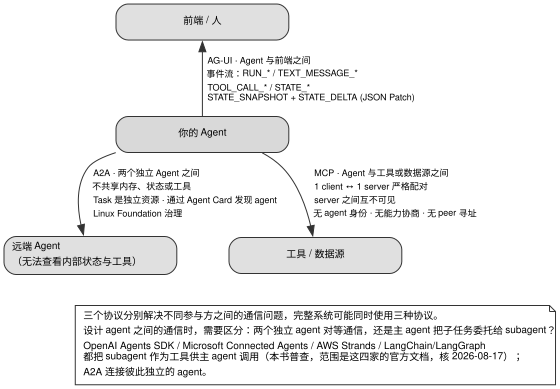

# 第 13 章 · 协议：MCP、A2A、AG-UI 分别连接哪些参与方

> **本章是全书时效性风险最高的一章。** 协议采用日期式或语义化版本，破坏性变更频繁。仅在本书资料整理期间，MCP 的若干条目就已经失效。本章的版本号与存活状态都只代表资料截止日。

---

## 13.1 三件不同的事，共用一个词

第 12 章完成了 Agent 拆分与否的工程决策；而在确定需要跨越进程或系统边界进行外部通信时，协议选型（Protocol Architecture）便成为决定系统拓扑与解耦深度的核心。

在当前大模型基础设施生态中，「Agent 协议」这一宽泛术语常被笼统用于指代三类截然不同、各司其职的通信维度：
- **垂直向下 · 工具与上下文交互**：Agent 如何标准化调用底层工具与挂载外部数据源；
- **水平横向 · 跨 Agent 对等协作**：两个或多个彼此独立的 Agent 之间如何安全交换意图与任务；
- **垂直向上 · 前端渲染与状态同步**：Agent 如何将内部思考轨迹与执行事件流式推送至用户界面。



图 13-1 展示了现代 AI Agent 架构中三大主流通信协议的正交三维拓扑映射：垂直向下的 MCP 协议专注于 Host 与数据源/工具 Server 之间的 1:1 星型挂载；水平维度的 A2A 协议专注于跨组织、跨信任边界的对等 Peer 协作与独立 Task 状态机流转；垂直向上的 AG-UI 与 A2UI 协议则专注于将 Agent 内部的思考轨迹、工具事件与组件状态实时同步至交互前端。三个协议在功能正交维度上各司其职，生产系统通常协同组合使用，绝非互斥替代关系。

**协议认知的典型工程误区**：最严重的架构错误是将 MCP 误用为 Multi-Agent 协作协议，将另一个完整的 Agent 强行包装为 MCP Server。这种做法虽能勉强调通，但由于 MCP 物理架构缺乏 Agent 身份认证、能力协商与任务全生命周期管理，会导致连接数随 Agent 规模线性暴增且失去对等协作能力。

---

## 13.2 逐轴解析：MCP、A2A、AG-UI 与存废协议全景

### 13.2.1 MCP：定位为标准工具与上下文层，而非对等协作层

MCP（Model Context Protocol）官方将其类比为 AI 时代的 LSP（Language Server Protocol），其核心使命是让工具与数据源实现跨应用标准化复用。

官方架构规范在 Scope 一节做出了明确的边界约束：

> MCP focuses solely on the protocol for context exchange—**it does not dictate how AI applications use LLMs or manage the provided context.**

表 13-1 阐明了 MCP 的三角色定义与严格拓扑约束。

表 13-1：MCP 的三角色拓扑与 1:1 连接约束

| 核心角色 | 角色物理定位与职责 |
|---|---|
| **Host** | AI 宿主应用本体，统一编排调度所有 Client 连接器 |
| **Client** | 驻留在 Host 内部的适配器，与**单一** Server 维持专属点对点连接 |
| **Server** | 提供特定上下文资源或工具能力的独立进程（本地 stdio 或远程 HTTP） |

**核心物理拓扑约束：1 Client $\leftrightarrow$ 1 Server 严格强绑定**。Host 若需连接 $N$ 个 Server，必须在内部实例化 $N$ 个独立的 Client 进程；**Server 彼此之间物理隔离、完全不可见且严禁横向通信**。这种星型结构从根本上决定了 MCP 无法承载 Agent 之间的去中心化对等协作。

### 13.2.2 MCP `2026-07-28` 核心修订：彻底倒向无状态设计

MCP 规范在 `2026-07-28` 版本中实施了剧烈的重构，全面废弃了此前 `2025-11-25` 版本的有状态假设，见表 13-2。

表 13-2：MCP `2026-07-28` 核心修订对系统工程的重大影响

| 协议核心变更条目 | 系统工程实现影响与应对策略 |
|---|---|
| **移除 `initialize` 握手，全面转向无状态** | 每个请求通过 `_meta` 显式携带版本与能力；新增 `server/discover` 声明端点 |
| **物理废除 `Mcp-Session-Id` 会话头** | 传输层不再维护协议级会话，会话绑定需完全退回应用层自行管理 |
| **废除 SSE 断线续传与 `Last-Event-ID`** | 数据流中断后在途请求直接作废，客户端必须使用全新 Request ID 重发 |
| **`subscriptions/listen` 替代显式订阅** | 采用长连接流接收主动推送通知，严禁 Server 推送未订阅的事件类型 |
| **Task 状态机移出核心规范并转为轮询** | 阻塞式 Task 结果改为基于 `tasks/get` 的被动轮询模型 |
| **日志与采样整体标为 Deprecated** | 废弃协议内日志，转向标准 OpenTelemetry 与标准模型 API 直连 |

**架构演进启示**：MCP 正在坚决剔除复杂的协议层有状态能力，将连接保活、断线重放与会话状态机的复杂度全部推回 Host 应用层（第 14 章的事件溯源正是应对该趋势的自研基础）。

### 13.2.3 A2A：坚持跨信任边界的对等 Peer 协作

A2A（Agent2Agent Protocol）由 Linux Foundation 托管，其核心设计立足于跨组织、跨厂商的黑盒 Agent 协作：

> **without needing access to each other's internal state, memory, or tools**

表 13-3：A2A 从 0.x 到 1.0 的破坏性重构

| 0.x 遗留规范 | 1.0 现行正式规范 |
|---|---|
| 斜杠路径方法名（`message/send`） | PascalCase 标准 RPC 方法名（`SendMessage`、`GetTask`） |
| 根路径元数据（`/.well-known/agent.json`） | 标准发现端点（`/.well-known/agent-card.json`） |
| 弱类型小写状态字符串 | 强类型枚举（`TASK_STATE_SUBMITTED`、`TASK_STATE_WORKING` 等 8 状态） |

A2A 将 **Task 视为具备完整独立生命周期的协议核心实体**，其状态机原生支持 `REJECTED`（被叫方主动拒单）与 `AUTH_REQUIRED`（跨层级级联授权链），天然契约化支持分布式长程任务。

### 13.2.4 AG-UI 与 A2UI：垂直向上的交互呈现层

- **AG-UI**：基于 SSE/WebSocket 规范 Agent 到前端的流式事件传输（`RUN_STARTED` $\rightarrow$ `TEXT_MESSAGE_*` / `TOOL_CALL_*` $\rightarrow$ `RUN_FINISHED`），并通过 JSON Patch（RFC 6902）实现高吞吐的状态增量同步（`STATE_DELTA`）；
- **A2UI**：专注于声明式 UI 描述，将 Agent 输出的结构化 JSON 映射为客户端原生组件。

### 13.2.5 协议存废与维护状态清单

表 13-4 基于代码仓的真实 Push 记录与归档状态，给出了业界主流协议的存活判定。

表 13-4：开源 Agent 通信协议维护现状核实（取数时间：2026-07-22 至 2026-08-18）

| 协议名称 | 代码仓库与核心指标 | 当前真实维护与存活状态 |
|---|---|---|
| **IBM/BeeAI ACP** | `i-am-bee/acp`（1,019 stars） | **已正式归档并全面并入 A2A 项目** |
| **Cisco AGNTCY ACP** | `agntcy/acp-spec`（166 stars） | **已正式归档停更** |
| **agents.json** | `wild-card-ai/agents-json`（1,315 stars） | **已实质停更停摆** |
| **AITP** | `nearai/aitp`（25 stars） | **已实质停更停摆** |
| **ANP** | `agent-network-protocol/AgentNetworkProtocol` | **基于 W3C DID 持续活跃维护中** |

---

## 13.3 判断标准：协议选型的四项核心准则

### 判断标准一：严格依据通信正交轴选型

坚决杜绝「一刀切」思维：向下对接工具选 MCP；横向跨信任边界协作选 A2A；向上对接前端选 AG-UI。

### 判断标准二：精准辨析 Peer 对等协作与 Tool 工具调用

表 13-5：Peer 对等模式与 Tool 调用模式的适用场景对比

| 协作模式 | 拓扑本质与权限特征 | 典型工程场景 |
|---|---|---|
| **Agent as a Tool** | 主控 Agent 维持全权控制，子 Agent 被封装为标准函数 | 同一代码仓、同一部署环境内部的紧耦合子任务 |
| **Agent as a Peer** | 双方地位对等，不暴露内部 Memory 与工具细节，通过 Task 契约交互 | 跨团队、跨公司、跨安全域的分布式异构 Agent 协作（A2A） |

### 判断标准三：清醒界定协议无法代劳的三项核心职责

协议适配层仅处理传输与序列化，以下三项必须由本地运行时直接实现：
1. **输入信任校验与转义**：协议绝不保证对端输出的安全性（第 11 章）；
2. **上下文 Token 预算管理**：协议绝不负责截断对端返回的大体积 Payload（第 3、9 章）；
3. **确定性重试与超时状态机**：协议不定义业务级的重试与补偿策略（第 5、14 章）。

### 判断标准四：显式锁定协议的具体版本号

在代码与 CI 中必须硬编码协议版本断言（如 `MCP_REVISION = "2026-07-28"`，`A2A-Version: 1.0`），坚决禁止使用漂移的 `latest`。

---

## 13.4 反面证据与失败模式

### 失败模式一：将复杂子 Agent 强行包装为 MCP Server

丧失 Agent 身份标识、丧失 Task 异步生命周期管理、连接数呈线性爆炸，且无法支持双向对等调度。

### 失败模式二：对端输出未做沙箱与转义即直接入模

盲目采信远端 A2A Peer 的返回文本，导致下游 Agent 遭受跨系统传播的 Prompt Injection 攻击。

---

## 13.5 可以直接采用的最小实现

### 13.5.1 协议适配层防御性校验伪代码

```typescript
// 1. 协议版本握手严格断言
export function validateProtocolHandshake(negotiatedVersion: string, expectedVersion: string) {
  if (negotiatedVersion !== expectedVersion) {
    throw new UnsupportedProtocolVersionError(
      `协议版本不匹配: 期望 ${expectedVersion}, 实际协商为 ${negotiatedVersion}. 拒绝降级执行.`
    );
  }
}

// 2. 外部输入统一安全收口
export function sanitizeRemoteAgentPayload(rawResponse: string, tokenBudget: number): string {
  // 必须执行第 11 章的标准防护流水线
  const escaped = escapeHtmlEntities(rawResponse);
  const framed = `<untrusted_peer_response>
${escaped}
</untrusted_peer_response>`;
  return truncateToTokenBudget(framed, tokenBudget);
}
```

### 13.5.2 验收测试矩阵

在交付协议接入层前，必须通过以下四项基础验证：
1. **版本不一致熔断测试**：模拟服务端返回未支持的 Protocol Version，断言客户端立即报错阻断而非隐式降级；
2. **连接中断自愈测试**：主动切断 SSE 连接，断言本地运行时依托自身的 Seq 序号恢复状态，而非依赖协议层会话；
3. **对端注入隔离测试**：模拟对端 Agent 返回包含系统提权指令的 Payload，断言本地 Host 严格将其包裹在不可信数据标签中；
4. **多 Server 资源隔离测试**：并发建立 10 个 MCP Server 连接，断言每个 Client 实例生命周期独立且无交叉泄漏。

---

## 13.6 版本与复核

### 本章基准

| 项 | 值 |
|---|---|
| 素材复核日期 | **2026-08-17 做了一次完整的版本重新核对（结论与底稿有实质出入），2026-08-18 把全章的规范条文、版本号、书目与仓库指标又逐条复核一遍** |
| 底稿 | `docs/multi-agent/protocols/`（核查日期 2026-07-22） |
| 项目 commit | 本章不引用项目源码；证据为规范文本与 GitHub API 硬指标，取数日期见各条 |
| 主证据清单 | MCP：spec revision `2026-07-28`——底稿记录的是 `2025-11-25`，两版之间有破坏性变更，见 §13.2.2。A2A：协议版本 `1.0`（规范站页头写 `1.0.0`，而规范仓库最新发布标签已是 `v1.0.1`，2026-05-28；patch 号不参与兼容判断，见 §13.2.3），`/.well-known/agent-card.json`，`GetTask`——与底稿一致 [核实于 2026-08-18]。AG-UI：无正式 revision 号；SSE 默认传输。GitHub API 取数：读 `api.github.com/repos/{owner}/{repo}` 的 `archived` / `pushed_at` / `stargazers_count` 三字段，取数 2026-07-22，共 10 个仓库——表 13-4 的六个，加上四个用于对照、stars 较多的协议仓库（`a2aproject/A2A`、`a2ui-project/a2ui`、`ag-ui-protocol/ag-ui`、`modelcontextprotocol/modelcontextprotocol`）；`eclipse-lmos/lmos` 与 `eclipse-lmos/lmos-protocol` 单独试查、不计入。表里两个归档日期取自仓库页顶部归档横幅（`archived` 是布尔值，给不出日期） |
| 已知过时项 | 底稿引用的 5 篇协议论文全部过时，**分析框架可用，事实陈述不可信**。书目按 arXiv API 与本仓库归档 PDF 首页逐篇核对 [核实于 2026-08-18]。四篇综述与威胁建模：*A Survey of AI Agent Protocols*（Yang 等，arXiv:2504.16736v3，2025-06-21）；*A survey of agent interoperability protocols: Model Context Protocol (MCP), Agent Communication Protocol (ACP), Agent-to-Agent Protocol (A2A), and Agent Network Protocol (ANP)*（Ehtesham 等，arXiv:2505.02279v2，2025-05-23）；*A Technical Taxonomy of LLM Agent Communication Protocols*（Sander 等，arXiv:2606.19135v1，2026-06-17）；*Security Threat Modeling for Emerging AI-Agent Protocols: A Comparative Analysis of MCP, A2A, Agora, and ANP*（Anbiaee 等，arXiv:2602.11327v2，2026-04-17）。一篇协议论文：*A Scalable Communication Protocol for Networks of Large Language Models*（Marro 等，arXiv:2410.11905v1，2024-10-14；**Agora 是论文里那套协议的名字，不是标题的一部分**，按标题去搜会搜不到）。五篇的最新版本都早于 MCP `2026-07-28`；其中 Yang 等、Ehtesham 等与 Marro 等三篇还早于 MCP `2025-11-25` 与 A2A `1.0.0` |

### 哪些会过期，怎么自己复核

**本章几乎全部会过期。** 相对稳定的只有三项结论：三种协议连接的参与方不同；agent 之间需要区分对等通信与主 agent 委托子任务；实现不应深度依赖某个协议当前版本的具体能力。

| 类别 | 保鲜期 | 复核方式 |
|---|---|---|
| 三种协议分别连接哪些参与方 | 长 | 不需要 |
| peer vs tool 的分歧 | 中 | 查四家官方文档的 subagent / agent-as-tool 章节，见下方命令 2 的说明 |
| **MCP 的具体 revision 与其内容** | **短** | 每次用前都要查，见下方命令 1 |
| **A2A 的版本与方法名** | **短** | 见下方命令 2 |
| 存活清单 | **短** | 见下方命令 3 |
| 四家 subagent-as-tool 的现状（本书普查） | **短** | §13.3 判断标准二给出四家的逐项引文，文档链接见下方命令 2 的说明。Microsoft 的实现正在换代，应优先复核 |
| 「5 篇论文过时」 | 长 | 不需要复核（结论只会更成立） |

复核本章时应查规范站点，不查实现源码。先确认 MCP 的 `latest` 当前指向哪个日期并阅读该 revision 的 changelog（本书写作时是 `2026-07-28`，底稿写作时是 `2025-11-25`），再查 A2A 的版本号与 well-known 路径，最后检查仓库的最后一次 push 与 `archived` 标记。官网和博客不能证明项目仍在维护。下面三组命令可以直接执行：

```bash
# 1. MCP：当前 latest 指向哪个 revision
#    故意不加 -L：latest 是一个指针，这里问的是它现在指着谁。不跟随时拿到的跳转页里
#    只有目标日期一个日期，答案唯一；加了 -L 会跟到 revision 正文页，页内列着历代 revision，
#    sort -u 之后是六行，反而看不出哪个是 latest。（要读那一版的正文时才加 -L）
curl -s https://modelcontextprotocol.io/specification/latest | grep -Eo '20[0-9]{2}-[0-9]{2}-[0-9]{2}' | sort -u

# 2. A2A：规范仓库的最新发布标签（注意规范站页头可能比它旧），与 well-known 路径
#    第一条是匿名调用，GitHub 限 60 次/小时；超了就换成 gh api repos/a2aproject/A2A/releases/latest
curl -s https://api.github.com/repos/a2aproject/A2A/releases/latest | grep -E '"tag_name"|"published_at"'
curl -s https://a2a-protocol.org/latest/specification/ | grep -o '/\.well-known/agent-card\.json' | sort -u

# 3. 存活性：归档标记与最后一次 push（仓库名见 §13.2.5 表；需先 gh auth login）
for r in i-am-bee/acp agntcy/acp-spec wild-card-ai/agents-json nearai/aitp \
         agora-protocol/python agent-network-protocol/AgentNetworkProtocol; do
  echo -n "$r  "; gh api repos/$r --jq '[.archived, .pushed_at, .stargazers_count] | @tsv'
done
```

命令 2 的两条结果要一起看。本书重新核对时，仓库标签是 `v1.0.1`，规范站页头仍写 `1.0.0`；两个数不同是正常的，因为 patch 号不参与兼容判断。代码中需要锁定的是 `Major.Minor`。命令 2 只能查到 A2A 自己的版本；要核实「peer 与 tool」的差异，还需逐家阅读 OpenAI Agents SDK、Microsoft Connected Agents、AWS Strands、LangChain/LangGraph 的官方文档，确认它们目前通过什么接口暴露 subagent。四家文档链接如下：

- OpenAI Agents SDK：`https://openai.github.io/openai-agents-python/multi_agent/`、`/handoffs/`
- Microsoft Connected Agents：`https://learn.microsoft.com/en-us/azure/foundry-classic/agents/how-to/connected-agents`
- AWS Strands：`https://strandsagents.com/docs/user-guide/concepts/multi-agent/agents-as-tools/`
- LangChain/LangGraph：`https://docs.langchain.com/oss/python/langchain/multi-agent`

MCP 的版本号必须在接入前重新查询。底稿在 2026-07-22 核查时记录的是 `2025-11-25`；约四周后再次核查，`latest` 已指向包含破坏性变更的 `2026-07-28`。本章列出的检查维度可以复用，版本号和方法名不能直接照抄。

下面按证据来源说明各节结论的可信范围。来源越容易变化，越需要在采用结论前重新核对。

1. **§13.2.2 全节**——出处是 MCP 规范自己的 Key Changes 页，以及 Streamable HTTP、subscriptions 两个规范页，没有使用二手转述。表 13-2 每一行都能对应 Key Changes 的具体条目：握手移除、会话头、SSE 续传等见 Major changes；Roots / Sampling / Logging 弃用是 Deprecated 一节第 1 条（SEP-2577），HTTP+SSE 重归类是第 2 条（SEP-2596），RFC 7591 弃用是第 4 条（PR #2858）；12 个月弃用窗口出自「Governance and process updates」一节（SEP-2596）；issuer 绑定是 Minor changes 第 9 条（SEP-2352），`iss` 的 SHOULD / MUST 分级是同节第 7 条（SEP-2468）。三处容易写错的细节已经按原文逐项核对：会话头的规范拼写是 `Mcp-Session-Id`（不是全大写的 `MCP-`，同一版新增的 `Mcp-Method`、`Mcp-Name` 用的也是这个约定）；「用新的 ID 重发」指的是**请求 ID**；旧流量的 405 与忽略遗留头，原文用的是 SHOULD 不是 MUST。
2. **§13.2.3**——版本、`A2A-Version` 规则与 TaskState 枚举取自规范正文，`v1.0.1` 取自 GitHub releases API，都是硬的。**但这一节有一处弱点**：2025-04-09 的发布日期与创始成员名单只有 Google 自己的两篇博客（A2A 周年博文，Patricia Cruz，Google Open Source Blog，2026-04-16；Google 捐赠 A2A 公告，Google Developers Blog，2025-06-23）。我没有找到独立于 Google 的来源，请按厂商自述理解。
3. **§13.2.4**——「AG-UI 无协议级认证」是一条否定断言，本书能提供的证据是文档站页面索引 `llms.txt` 的 60 个条目都没有涉及认证、授权或安全。该证据只能证明文档没有定义相关机制，不能证明所有实现都没有额外认证。A2UI 的版本与自我定位出自仓库 README。
4. **§13.3 判断标准二**——四家的引文逐句在官方文档页上比对过，四家文档链接见下方命令 2 的说明。四家里 Microsoft 正在换代，最先过期的会是它。
5. **§13.4 失败模式三**——五篇 PDF 的全文都检索过 ACP，「3 篇」是数出来的：哪三篇、每篇把 ACP 当在用协议的原话、以及另外两篇为什么不算，都写在正文里。
6. **§13.2.5**——存活清单取数 2026-07-22（口径见本章基准块），成文后用命令 3 重跑两次（2026-08-17、2026-08-18）：六个仓库归档状态都没变，其中五个最后 push 也没变（stars 的变化不超过 2），只有 ANP 出现新提交（最后 push 2026-07-13→2026-08-04，stars 1,364→1,390，未归档）；LOKA 无参考实现，eclipse-lmos 两仓库仍 404。四个用于对照、stars 较多的协议仓库也单独复核（取数 2026-08-18）：`a2aproject/A2A` 25,384 stars、`a2ui-project/a2ui` 16,139、`ag-ui-protocol/ag-ui` 15,353、`modelcontextprotocol/modelcontextprotocol` 8,982，均未归档。
