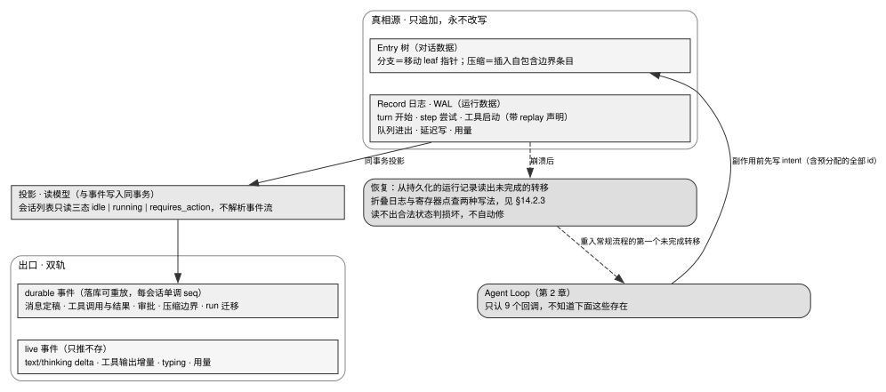

# 第 14 章 · Session Runtime：事件溯源、WAL 与崩溃恢复

---

## 14.1 循环管不到的一切：生产级会话运行时的系统职责

第 2 章定义了 Agent Loop 的单次推理循环状态机，而本章则深入探讨支撑整个会话全生命周期的核心引擎——会话运行时（Session Runtime）。

循环本身仅负责驱动当前轮次的决策步进，而会话运行时则统管循环边界之外的所有基础设施：会话的创建、挂起与销毁、跨节点分布式调度、只追加 WAL 日志流的原子落盘、崩溃后的确定性状态恢复、双轨事件的客户端可靠同步，以及并发写入时的物理围栏防护。缺乏坚固运行时支撑的 Agent 系统，在生产环境中必将遭遇任务静默丢失、状态污染与脑裂等严重灾难：

1. **节点遭遇 OOM 或抢占回收** → 用户执行数小时的长任务轨迹全量丢失；
2. **集群滚动发布与容器漂移** → 所有在途执行中的活跃会话发生级联断流；
3. **前端网络抖动刷新** → 历史执行轨迹与中间思考事件彻底断代；
4. **多个执行副本并发写入同一会话** → 对话历史严重交织且无任何报错。

本章确立的存储底层准则是：**只追加的日志流（Append-Only Log）是系统唯一的物理真相源（Source of Truth），一切上层数据表与展示视图均为可重建的只读投影（Read Models）**。

---

## 14.2 源码对照：两份日志、双轨事件与所有权围栏



图 14-1 展示了会话运行时分层架构中的核心数据流向与状态映射拓扑：系统自底向上划分为只追加的不可变真相源（Entry 树与 WAL Record 日志）、同事务原子提交的读模型投影层，以及向外分发的双轨事件管道（带单调 Seq 序号的 Durable 持久事件与只推不存的 Live 瞬态流）；当系统遭遇崩溃重启时，恢复引擎依托预写意图日志从持久化记录中准确还原未完成状态并实施安全重入。

### 14.2.1 事件溯源：opencode 的原子事务投影实现

opencode V2 将会话的历史对话与状态流全面解耦为领域事件流，投影器在**事件写入的同一个数据库事务内**将事件物化为只读数据表：

```typescript
/** Local operational projection committed atomically with a new durable event.
    Not replayed or serialized. */
readonly commit?: (seq: number) => Effect.Effect<void>
```
> `opencode/packages/core/src/event.ts:122-123`

其事务提交流程严格维持两大核心不变量：
- **单会话单调递增 Seq 序号**：为每一条持久化事件赋予唯一的单调序列号，构成可靠断线重传与去重的物理锚基；
- **`owner_id` 单写者状态校验**：通过在序号表中登记当前活动写者标识，防止脑裂状态下的并发写入。

事件日志作为唯一真相源，上层业务表仅作为读模型存在，任何时刻均可从原始事件全量重放重构。

### 14.2.2 预写日志（WAL）：先记录意图，再执行外部副作用

pi-mono 的 Harness 架构确立了严密的**三明治式副作用提交机制（The Effect Sandwich）**：在调用具有物理副作用的外部工具前，必须预先分配全部实体 ID 并将意图记录持久化至预写日志；待外部调用完成后，再追加写入结算记录：

```text
commit:  "about to do X; its output will use ids R and U"     ← 意图记录 (Intent)
         do X                                                  ← 外部不确定性操作
commit:  output + usage + next state                           ← 结算记录 (Settlement)
```
> `pi-mono/packages/agent/docs/harness.md:129-137`

预先持久化实体 ID 是实现崩溃恢复的关键——若崩溃发生在外部操作执行期间，重启后的系统可凭借持久化的 Intent 记录精准判断操作是否已处于在途状态，杜绝非幂等工具的盲目二次重放。

### 14.2.3 崩溃恢复：日志折叠与不可能状态损坏判定

针对崩溃后的状态重构，业界存在两种工程路线：
1. **纯函数日志折叠（Reducer Folding）**：通过纯函数对历史 Record 进行重放运算，定位首个未决的状态转移；
2. **持久化程序计数器寄存器（State Register）**：每步直接更新物理寄存器快照。

在恢复过程中，**若读取到逻辑上不可能出现的异常状态（如同时存在两个未决操作、结束标记后仍有记录），系统必须坚决判定为数据损坏（Corruption）并终止，严禁尝试自动猜测修补**：

```typescript
export type RecordLogCorruptionReason =
	| "multiple_open_operations"
	| "unknown_operation"
	| "record_after_finish"
	| "non_consecutive_attempt"
	| "invalid_compaction_reason"
	| "queue_after_abort"
	| "invalid_queue_cancellation"
	| "inconsistent_step"
	| "tool_call_mismatch"
	| "duplicate_tool_invocation"
	| "provisioned_entry_mismatch"
	| "invalid_deferred_handle";
```
> `pi-mono/packages/agent/src/harness/reducer.ts:22-34`

### 14.2.4 双轨事件架构与基于 Seq 的可靠断线重连

为了平衡实时交互体验与持久化存储成本，运行时必须对事件流实施严格的双轨分流：

- **Durable 持久化事件（落库、带 Seq、可重放）**：用户/助手消息定稿、工具调用参数与最终返回值、人工审批事件、压缩断点及生命周期状态迁移；
- **Live 瞬态流式事件（只推不存）**：逐 Token 的文本与思考增量、工具实时进度、Typing 状态与瞬态消耗。

**标准断线重连流水线**：
1. 客户端携带最后成功接收的 `lastSeq` 发起重连握手；
2. 服务端首先从事件表检索并重放 `[lastSeq + 1, currentSeq]` 之间的 Durable 存量事件；
3. 重放期间在服务端内存队列中暂挂新产生的实时事件，杜绝新旧事件在传输层交织错乱；
4. 若客户端断线过久导致缓冲已被淘汰，服务端显式返回 `stale` 错误，驱动客户端发起全量快照重拉；
5. 若执行体发生崩溃重启，服务端下发全新的世代标识符（`streamGeneration`），强制客户端主动丢弃此前尚未定稿的 Live 瞬态残余。

### 14.2.5 任务取消的持久化确定性语义

在可靠的运行时中，**取消（Abort）必须被视为持久化的控制状态，而非单纯的内存信号**：

```
持久化写入 control = cancel_requested 标记
  → 触发并向下游广播 AbortSignal
  → 级联终止外部工具进程组（SIGTERM -> SIGKILL）
  → 已经产生副作用的已完成轮次照常持久化落库
  → 在途被阻断的工具调用写入标准 Aborted 结构化错误
```

将取消标记强行落盘，能够彻底杜绝进程在崩溃重启后因丢失内存取消信号而发生死灰复燃、错误恢复执行。

### 14.2.6 三档运行载体架构

表 14-1：会话运行时的三档物理载体架构对比

| 载体分级 | 底层物理形态与隔离机制 | 代表开源实现 | 源码出处 | 适用业务场景 |
|---|---|---|---|---|
| **A 档 · 进程内对象** | 常驻进程内部的内存 `Map<sessionId, Session>` | craft-agents-oss | `craft-agents-oss/packages/server-core/src/sessions/SessionManager.ts:1203`（`Map<string, ManagedSession>`） | 单机开发环境、快速原型开发 |
| **B 档 · Serverless 实体** | 每会话对应持久化云实体（平台托管自动休眠与唤醒；cloudflare-os 另用 60 秒 keep-alive alarm 让 Durable Object 在服务重启后自行唤醒） | cloudflare-os | `cloudflare-os/packages/workshop-backend/src/overseer.ts:1432-1445` | 海量低频会话、无自建集群架构 |
| **C 档 · 隔离沙箱/MicroVM** | 动态调度的一会话一容器或 MicroVM（严密网络隔离） | Roomote、buzz | `Roomote/apps/controller/src/compute-providers/spawn-docker-worker.ts:258-266` | 生产级云端多租户、执行不可信代码 |

---

## 14.3 判断标准：会话运行时的五项底层不变量

### 判断标准一：真相源唯一且仅支持追加写

物理存储层只允许单一的追加写日志流，全量业务视图与查询表必须能够随时通过重放日志 100% 完整重构。

### 判断标准二：存储层强制保证单写者互斥（Fencing）

会话写权限的互斥必须由底层存储系统（如带有版本号的条件 UPDATE 或分布式锁）提供物理保证，杜绝旧执行体在网络分区或苏醒后发生脏写。

### 判断标准三：外部副作用必须前置持久化意图记录

在触发具有外部系统影响的操作前，必须先行完成意图日志落盘与 ID 预分配。

### 判断标准四：逻辑不可能状态坚决判定为数据损坏

遇到非法状态转移时立即进入损坏终态并冻结，严禁编写脆弱的自动修补逻辑污染审计链。

### 判断标准五：外部副作用必须显式声明重放语义

所有工具必须显式声明自身重放策略：幂等工具标记为 `replay: "safe"`；非幂等工具标记为 `replay: "never"`（恢复时向用户显式报告操作状态未知），杜绝静默重复执行。

---

## 14.4 反面证据与失败模式

### 失败模式一：全局单一边界总超时配置

让整个 Agent 运行共用单一的粗粒度总超时属于典型反模式。必须建立分层超时矩阵（见表 14-2）：
- Run 级硬上限（如 5 小时）；
- 单工具调用超时（默认 2 分钟，强行截断进程组）；
- 心跳探针与会话保活超时。

表 14-2：生产级会话运行时分层超时矩阵

| 超时维度 | 核心控制机制与目标 | 参考标准取值 | 源码出处 |
|---|---|---|---|
| **Run 执行总预算** | 全局硬上限，防止任务失控死循环消耗算力 | Roomote 沙箱 5 小时 / 任务 1 小时 | `Roomote/packages/types/src/compute-providers/worker-runtime.ts:8`、`Roomote/packages/types/src/constants.ts:12` |
| **单工具执行超时** | 限制单次命令执行耗时，超时级联回收整个进程组 | buzz 默认 2 分钟，上限 10 分钟 | `buzz/crates/buzz-dev-mcp/src/shell.rs:16-17` |
| **心跳失联判定** | Worker 上报心跳，超时调度器执行驱逐与对账 | Roomote 30 秒心跳 / 2 分钟判死 | `Roomote/packages/types/src/task-runs.ts:736, 742` |
| **空闲休眠保活** | 会话无新任务进入计时，到期持久化快照并释放资源 | Roomote 30 分钟空闲睡眠 | `Roomote/packages/types/src/constants.ts:15` |

### 失败模式二：将本地工作目录等同于安全沙箱

仅依靠路径字符串限制无法阻止 `../` 遍历或直接系统调用逃逸，必须依托操作系统级容器与沙箱实施强隔离（第 11 章）。

### 失败模式三：敏感凭证泄漏至不可信运行载体内部

严禁将长期 API 密钥或云凭证注入执行容器，所有外部调用必须经由宿主代理网关或 Sidecar 换取短期受限票据。

---

## 14.5 可以直接采用的最小实现

### 14.5.1 领域事件与预写日志数据契约

```sql
-- 1. 核心不可变事件表 (真相源)
CREATE TABLE session_events (
  aggregate_id VARCHAR(64) NOT NULL,
  seq BIGINT NOT NULL,
  owner_id VARCHAR(64) NOT NULL,
  event_type VARCHAR(64) NOT NULL,
  payload JSON NOT NULL,
  created_at TIMESTAMP NOT NULL,
  PRIMARY KEY (aggregate_id, seq)
);

-- 2. 预写日志表 (WAL)
CREATE TABLE session_records (
  session_id VARCHAR(64) NOT NULL,
  run_id VARCHAR(64) NOT NULL,
  seq BIGINT NOT NULL,
  record_kind VARCHAR(64) NOT NULL,
  intent_payload JSON,
  replay_policy VARCHAR(16) NOT NULL, -- 'safe' | 'never'
  PRIMARY KEY (session_id, run_id, seq)
);
```

### 14.5.2 状态恢复与重入流水线伪代码

```typescript
export async function recoverSessionState(sessionId: string): Promise<SessionState> {
  const records = await fetchSessionRecords(sessionId);
  const state = foldRecords(records);
  
  if (isImpossibleState(state)) {
    await markSessionCorrupted(sessionId, state.corruptionReason);
    throw new SessionCorruptedError(`会话状态损坏: ${state.corruptionReason}. 请人工介入处理.`);
  }
  
  // 恢复在途副作用
  for (const pendingOp of state.unsettledOperations) {
    if (pendingOp.replayPolicy === "safe") {
      await retryOperation(pendingOp);
    } else {
      await markOperationAbortedUnknown(pendingOp);
    }
  }
  
  return state;
}
```

### 14.5.3 验收测试矩阵

在交付会话运行时引擎前，必须通过以下七项基础验证：
1. **投影表全量重构测试**：物理 DROP 所有业务查询表，断言从事件表全量重放后数据 100% 吻合；
2. **并发写者围栏阻断测试**：模拟两个执行实例并发抢占同一会话，断言仅持有当前 Owner ID 的写入被放行；
3. **副作用执行中途断电恢复测试**：在工具执行中途向进程发送 `kill -9`，重启后断言系统精准识别在途状态且标记为 `replay: "never"` 的工具不发生重复执行；
4. **不可能状态损坏拦截测试**：向 WAL 注入包含非法时序的记录，断言系统触发损坏报警并拒绝恢复；
5. **过旧 Seq 断线续传测试**：客户端携带已过期的 `lastSeq` 发起重连，断言收到 `stale` 错误并触发全量拉取；
6. **崩溃重启世代隔离测试**：模拟服务端崩溃重启，断言客户端收到新 `streamGeneration` 并丢弃旧的 Live 瞬态内容；
7. **取消状态持久化测试**：在会话取消后向进程发送 `kill -9`，重启后断言会话保持终结状态，绝不恢复执行。

---

## 14.6 版本与复核

### 本章基准

| 项 | 值 |
|---|---|
| 素材复核日期 | 2026-08-17（§14.2.1、§14.2.3、§14.2.4、§14.2.6、§14.3 判断标准二、§14.4 六处；以上六处于 2026-08-18 补证） |
| 底稿 | `docs/cloud-agent/session-runtime-and-agent-loop.md` §5、`docs/cloud-agent/session-runtime-best-practice.md`、`docs/cloud-agent/pi-harness-v2-deep-dive.md`、`docs/cloud-agent/ui-agent-state-realtime-sync.md` |
| 项目 commit | opencode `5f5ea53afb` (08-27)、pi-mono `ccfe79ed2` (08-27)、craft-agents-oss `d7592c48` (08-27)、cloudflare-os `1411714` (08-26)、buzz `c856be0fb` (08-27)、Roomote `49c97769` (08-27)、codebuff `6e4f6d642` (08-27) |
| 外部规格基准 | 本章不依赖厂商 API 规格；下行通道的 SSE / WebSocket 行为按各自 RFC，本章的判断标准不落在协议细节上，无版本敏感点。§14.4 的关停流程引用 Kubernetes 默认宽限期 30 秒，以及 buzz 方案文档声明的 60 秒；后者属于项目自述 |

### 哪些会过期，怎么自己复核

| 类别 | 保鲜期 | 复核方式 |
|---|---|---|
| 事件溯源 + 投影 | 长 | 原理性内容，无需定期复核；若 opencode 的事件层换代，直接读 `event.ts:122-123`（`commit` 字段）与 `:243-249`（`owner_id`）是否还在 |
| 先写意图记录再执行副作用 | 长 | 原理性内容，无需定期复核；读 `harness.md:129-137` 中 The effect sandwich 的三行示意是否还在 |
| 单写者 + 围栏 | 长 | 原理性内容，无需定期复核；读 `event.ts` 的 `claim()` 与 `commitDurableEvent` 两处是否还在 |
| 「读不出合法状态就判损坏」 | 中 | 跑下方数 `RecordLogCorruptionReason` 成员数的那条命令；同时读 `harness.md` §1.8，看恢复模型还是不是折叠（§14.2.3 记的那场立场之争） |
| **§14.2.3「寄存器模型只写在规格里」** | **短** | 这一结论可能随实现提交变化。运行下方最后两条命令：`op.state` 一旦出现命中，或 `create.restore` 不再抛出 `HarnessNotImplemented`，就说明寄存器版本开始实现，§14.2.3 需要重写 |
| 三档运行载体 | 中 | serverless 的运行机制仍在变化；按 §14.2.6 和 §14.4 给出的路径检查相关常量是否仍然存在 |
| 超时矩阵的具体数值 | **短** | 见 §14.4 表内各格出处，逐条 grep；按 §14.2.6/§14.4 出处行的路径读 Roomote 那四个常量的位置 |
| 损坏原因的具体枚举 | **短** | 跑下方数 `RecordLogCorruptionReason` 成员数的那条命令（成稿时 12 种，底稿写作时 11 种） |
| 「三家做了 durable/live 二分」「所有权三条一致」 | **短** | 重跑普查：按后记 B 项目索引逐个查是否出现反例（把 delta 也落库、或不做单写者的项目）。durable/live 二分的判定方法：看事件类型定义里「定稿内容」与「流式增量」是不是两类不同的东西，前者带 aggregate 内单调序号、可重放，后者没有。所有权三条的判定方法：读认领、围栏与状态登记三处源码，看「谁在写」放在哪一层 |

```bash
cd projects   # 未克隆先见前言《怎么拿到这些项目的代码》
grep -n "RecordLogCorruptionReason" -A 15 pi-mono/packages/agent/src/harness/reducer.ts
# §14.2.3 的判断（寄存器模型只在规格里）是否还成立：
# 第一条应为 0 命中；第二条应找到 create.restore 抛出 HarnessNotImplemented 的代码
grep -rn "op\.state" pi-mono/packages --include="*.ts" | grep -v node_modules | wc -l
grep -n "HarnessNotImplemented(\"create.restore\")" pi-mono/packages/agent/src/harness/agent-harness.ts
```

**§14.4 两条 buzz 结论的出处。** 「一个总超时是反模式」出自关停代码里的注释 `buzz/crates/buzz-acp/src/lib.rs:3440-3441`；「工作目录不是沙箱」出自路径解析模块的模块级注释 `buzz/crates/buzz-dev-mcp/src/paths.rs:3-7`。

pi-mono 的 harness 设计文档比实现完整。底稿记录的 33 个包中完成了 9 个；持久化层已经实现，`AgentHarness` 中负责 prompt、resume、abort、steer、watch、lane 等工作的 22 个编排方法仍会抛出 `HarnessNotImplemented`，只有配置读写与 `getLeafId` 可以运行（`pi-mono/packages/agent/src/harness/agent-harness.ts:355-357, 363-504`）。本章采用了设计文档中的协议与方法，包括先记录意图再执行副作用、恢复模型和损坏枚举；这些内容属于未完成的设计，不能当作已经运行的实现。

**opencode 单写者普查的判定方法。** §14.3 判断标准二「本地写路径上没有别的写者互斥」是这样查出来的：读 `event.ts` 的三条提交路径；扫全仓文件锁工具 `packages/core/src/util/flock.ts` 的调用点——命中的是 npm 安装、仓库缓存、全局配置、models.dev 缓存、插件与 MCP 鉴权，没有会话；同进程内的 `session/run-coordinator.ts:1-16` 是按会话 key 串行化的执行协调，不是跨执行体的存储层互斥，不计入。

**待核实清单**：本章 2026-08-18 清空了原先的六条，本轮新增一条，目前共两条，正文对应位置均已说明证据边界：

1. **§14.4 超时矩阵中，turn 超时没有对应的源码实现。** 本书在 Roomote、cloudflare-os、craft-agents-oss、oh-my-pi、openclaw、codex 六个项目中检索了看门狗、静默阈值与「先核实再动手」相关的标识符。找到的都是队列层的停滞任务检测，例如 Roomote 的 `STUCK_IN_QUEUE_THRESHOLD_MINUTES = 60`（`Roomote/packages/types/src/sandbox-spawn.ts:83`），没有一个用于限制单个 turn。这项内容是本书的设计建议，不是行业已有做法，正文已明确说明。
2. **pi-mono 对 §14.2.5 取消流程第 3 步（终止并回收工具进程树）的实现，2026-08-27 已核实一半。** 它在环境层实现了进程树回收（`pi-mono/packages/agent/src/harness/env/nodejs.ts:253-280`，Unix 上 `process.kill(-pid, "SIGKILL")`，Windows 上 `taskkill /F /T`），但只有立即 SIGKILL，没有先 SIGTERM 再等待的两段式；正文的两段式流程仍以 buzz 为依据。原待核实项保留如下。命令 `grep -i "process group\|killpg\|process tree\|SIGKILL\|SIGTERM" pi-mono/packages/agent/docs/harness.md` 没有结果；设计文档 §4.6 只写到「pulls the signal and cancels unreleased gated effects」，没有进程级操作。正文把这一步的实现依据改为 buzz（`shell.rs:713-723`，见 §14.4）。pi-mono 的实现代码是否存在文档未提及的等价机制，仍待技术作者核实。
