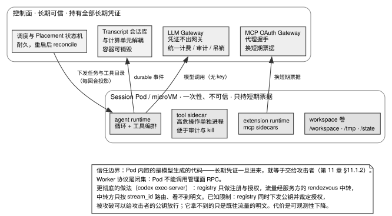

# 第 15 章 · 从单机到云端：多租户与会话载体

> 本章只讨论把 agent 作为多租户云产品运行时增加的能力。只做单机 agent 的读者可以跳过大部分内容，但 §15.3 判断标准一同样适用于本地运行。
>
> **读本章前建议先读第 14 章。** 本章说明会话运行时进入多租户环境后需要增加的控制面、租户隔离和恢复机制。第 14 章 §14.2.6（三档运行载体）与 §14.3 判断标准二（单写者与所有权）是本章的直接前置。

---

## 15.1 系统演进：从本地单机到云端多租户的治理鸿沟

第 14 章构建了单机与进程内部的会话运行时；而当系统从本地走向大规模云端多租户服务（Cloud Multi-Tenancy）时，核心挑战将不再是模型自身的单步推理，而是企业级的资源隔离、凭证防护、分布式调度与控制面对账治理。

本地执行环境向云端多租户演进时，必须在基础设施层补齐五大核心能力：
1. **多层级租户数据隔离**：基于组织（Organization）、项目（Project）与用户（User）实施强制的数据库行级安全（Row-Level Security, RLS）；
2. **严密的凭证代理边界**：任何长期 API 密钥严禁注入执行容器，统一经由网关签发受限的短期临时票据；
3. **计算与状态的彻底解耦**：计算容器一次性可销毁，全量对话轨迹（Transcript）与状态机必须实时落盘至持久化控制面；
4. **分布式资源对账与孤儿回收**：面对节点崩溃、网络分区或控制面重启，调度器具备自动对账并回收泄漏资源的能力；
5. **同构 Workspace 适配层**：保持 Agent Loop 核心逻辑与底层物理载体（本地 Worktree / 远程 Pod / MicroVM）解耦。

缺乏上述机制的云端系统，必将面临租户越权串读、密钥泄漏、容器崩溃导致历史全丢以及云资源泄漏失控等致命事故。

---

## 15.2 源码对照：隔离、载体与所有权边界

### 15.2.1 四级资源模型与五层隔离防御

企业级系统将资源与安全边界自顶向下划分为四级：

```
Organization  ← 计费主体与全局安全策略 (SSO, 插件白名单)
  └── Project ← 代码库/知识语料集合, 映射至具体的代码仓
        └── User      ← 组织内具体成员, 关联个人设置与授权
              └── Session ← 独立的运行时实例, 绑定独立计算单元与存储卷
```

表 15-1 汇总了多租户系统必须全链路落实的五层硬隔离手段。

表 15-1：云端多租户的五层纵深隔离体系

| 隔离层级 | 核心技术方案与实现 | 安全检查基准与判定准则 |
|---|---|---|
| **计算层** | 每 Session 分配独立 Pod 或 MicroVM 实例 | 容器间严禁共享物理内存与命名空间 |
| **存储层** | 动态挂载项目级持久卷至 `/workspace` | Session A 访问 Session B 卷路径必须报「路径不存在」 |
| **网络层** | 网络策略默认切断公网出站，MCP/LLM 走网关代理 | 容器内尝试直连外部网络必须被物理丢包拦截 |
| **身份层** | JWT Claims 贯穿全链路（防 Confused Deputy） | 工具与 MCP 调用必须显式携带当前用户的身份标识 |
| **数据层** | 数据库强制开启行级安全（`FORCE RLS`） | 必须使用非属主连接并执行每事务 `SET LOCAL` 租户变量 |

### 15.2.2 会话载体抽象：隔离级别作为部署时旋钮

通过抽象通用的 `Workspace` 适配器（参考 MiMo-Code 设计），系统能够在完全不修改 Agent 核心循环代码的前提下，支持本地进程、远程 Pod 与 MicroVM 之间的平滑切换：

```
Session Pod 容器内部拓扑
├── agent runtime        核心推理循环、决策调度与工具编排
├── tool sidecar         高危命令执行（Bash/Git），独立进程便于审计与信号回收
├── extension runtime    沙箱化加载租户自定义扩展与脚本
├── mcp sidecars         stdio MCP Server 独立容器化运行，暴露本地 RPC
└── workspace volume     挂载代码卷（/workspace）、临时卷（/tmp）与状态卷（/state）
```

将高危 Shell 操作剥离至独立的 Tool Sidecar 进程，能够极大地提升系统在遭遇失控命令时的进程回收确定性。

### 15.2.3 所有权拓扑：谁跑循环、谁持密钥

openclaw 的 Cloud Workers 架构确立了严密的所有权切分边界（见表 15-2）。

表 15-2：openclaw Cloud Workers 的所有权切分规范

| 系统组件与关注点 | 物理部署位置与权限属性 | 源码出处与设计依据 |
|---|---|---|
| **Agent 推理循环与工具执行** | **一次性临时云 Worker（不可信域）** | `openclaw/docs/gateway/cloud-workers.md:24` |
| **模型 Provider 长期 API 密钥** | **受控 API 网关（高安全域）** | 仅由网关代理请求，绝不注入 Worker 环境变量 |
| **历史 Transcript 与会话状态** | **持久化数据库（控制面）** | 每一个 Turn 定稿后实时写入，解耦计算生命周期 |
| **Workspace 变更落盘回写** | **Git Ref 暂存与控制面对账** | 规避容器突发失效导致的代码改动全量丢失 |



图 15-1 展示了云端 Agent 系统中控制面与执行容器（Session Pod）之间的所有权拓扑分界线：长期可信的控制面集中保管调度状态机、会话 Transcript 库与全量静态凭证；而不可信的一次性 Session Pod 仅负责运行 Agent 决策循环与具体工具代码。模型推理统一由网关代理解析，MCP 长期凭证经网关置换为受限短期票据后下发，执行事件以 Durable 形式持久化回写至控制面，彻底实现计算与状态的物理解耦。

### 15.2.4 端到端加密执行信道：codex 的极简控制面模型

codex 的 `exec-server` 展现了极致防御纵深的设计：控制面仅负责环境注册与公钥分发，Harness 与远端执行节点之间建立基于 Noise 协议框架（`Noise_hybridIK_X25519+MLKEM768_AESGCM_SHA256`）的端到端加密流，中转节点仅按 `stream_id` 进行盲路由。即便控制面遭遇未授权入侵，历史执行明文依然受到密码学保护。

### 15.2.5 异步对账：将分布式状态不一致作为系统常态

在云端环境中，Redis 队列、数据库行与沙箱底层 Runtime 之间的物理状态必然存在时间差。成熟系统（如 Roomote）放弃了脆弱的强同步假设，转向基于后台持续对账的自愈循环：
- 调度器定期扫描超时处于 `running` 却失联的会话；
- 采用 `FOR UPDATE SKIP LOCKED` 并发拉取超时孤儿并执行重新调度；
- 对反复失败的会话施加有限重试，超限后把任务置为失败终态（Roomote：沙箱创建的单个阶段最多重试 3 次，整次 spawn 最多 2 次，`Roomote/packages/types/src/sandbox-spawn.ts:5, 24`）。

---

## 15.3 判断标准：构建企业级多租户体系的五项准则

### 判断标准一：清醒审视系统是否已跨越云端复杂度红线

只要系统满足「多用户并发访问」「长任务不能容忍单点丢失」或「环境存在敏感凭证」中的任一项，就必须坚决落实对应的云端隔离与凭证代理机制。

### 判断标准二：执行容器内物理清空所有长期凭证

模型生成的不可信代码在容器内仅能访问带有严格 TTL（本书建议 1 小时以内；Roomote 给沙箱的 OIDC 票据是 1 小时，`Roomote/packages/auth/src/sandbox-oidc.ts:18`）与最小作用域的临时 Token，严禁任何 LLM API 密钥或全局 Git 凭证进入容器环境变量。

### 判断标准三：数据隔离必须下沉至数据库引擎层

严禁仅在应用层通过代码过滤拼接租户 ID，必须依托数据库原生的行级安全策略（RLS）提供物理级防泄露保障。

### 判断标准四：控制面重启具备完备的资源对账自愈能力

控制面遭遇崩溃或重启后，必须能依据持久化的状态机主动发现并回收孤儿 Pod，杜绝计算资源泄漏。

### 判断标准五：运行时载体必须实现完全可插拔

从本地 Worktree 切换到远程 Pod 或 MicroVM，上层 Agent 循环与工具编排代码必须保持零改动。

---

## 15.4 反面证据与失败模式

### 失败模式一：误将普通 Docker 容器当成坚固沙箱

普通容器共享宿主机内核，存在已被广泛验证的内核提权与容器逃逸路径（见表 15-3）。面对完全不可信代码，必须升级至 MicroVM（Firecracker / Kata）或用户态内核（gVisor）。

表 15-3：三档沙箱技术的隔离深度与已知限制

| 隔离等级 | 核心实现手段 | 适用业务场景 | 系统开销与已知安全限制 |
|---|---|---|---|
| **弱隔离** | 普通容器 + seccomp | 内部受信团队工具 | 共享宿主内核，无法抵御内核提权逃逸 |
| **中隔离** | gVisor（用户态 Sentry 内核） | 多租户 SaaS 生产起步 | 存在系统调用性能损耗，Sentry 自身构成攻击面 |
| **强隔离** | MicroVM（Firecracker / Kata） | 运行完全不可信代码 | 内存与冷启动开销稍高，需专门处理设备虚拟化 |

### 失败模式二：将会话历史错误驻留在执行容器内

将 Transcript 保存于容器本地存储，一旦遭遇节点抢占、OOM 杀死或滚动更新，会话上下文将彻底湮灭。

---

## 15.5 可以直接采用的最小实现

### 15.5.1 五层多租户隔离检查清单

- [ ] **计算隔离**：一会话一容器/MicroVM，隔离级别支持配置化平滑切换
- [ ] **存储隔离**：每个项目绑定独立持久卷，挂载于 `/workspace`，跨租户物理不可达
- [ ] **网络封锁**：默认断开公网出站，模型调用与 MCP 交互全部经过鉴权网关
- [ ] **身份透传**：JWT Claims 贯穿全链路，消除 Confused Deputy 提权风险
- [ ] **数据安全**：PostgreSQL 强制启用 `FORCE ROW LEVEL SECURITY`，连接池每事务调用 `SET LOCAL`

### 15.5.2 凭证代理架构规范

```
控制面（安全域）:
  ├── 保管 LLM Provider 长期凭证 → 经统一网关代理请求，绝不外发
  ├── 保管 MCP OAuth 客户端密钥   → 统一执行握手，置换为短期票据
  └── 保管 Git 部署密钥          → 按需签发单仓库、1 小时有效期的临时 Token

执行 Pod（不可信域）:
  └── 仅持有带有效期的短期临时票据（TTL 1 小时以内），无任何长期凭证
```

### 15.5.3 验收测试矩阵

在交付云端多租户基础设施前，必须通过以下七项基础验证：
1. **行级安全漏查防御测试**：故意在查询中省略 `WHERE org_id = ?`，断言数据库 RLS 拦截并返回零行；
2. **凭证扫描测试**：在 Session Pod 内部全盘检索环境变量与文件系统，断言无任何长期 API 密钥；
3. **控制面崩溃恢复对账测试**：在多任务执行中向控制面发送 `kill -9`，重启后断言所有活动 Pod 被对账重新认领或安全回收；
4. **跨 Session 存储越权测试**：尝试在 Session A 中直接 `ls` Session B 的挂载路径，断言返回「路径不存在」；
5. **网络出站硬阻断测试**：在 Session Pod 内部尝试发起直接外网 HTTP 请求，断言网络策略立即拒绝；
6. **分布式状态对账测试**：人为构造数据库 running 与底层容器已销毁的不一致状态，断言周期对账循环在 60 秒内将其修正为明确终态；
7. **运行时载体切换测试**：将 Agent 运行配置从本地 Worktree 切换为云端 Pod 模式，断言业务编排代码零修改且测试通过。

---

## 15.6 版本与复核

### 本章基准

| 项 | 值 |
|---|---|
| 素材复核日期 | 2026-08-17（三类外部规格的版本、页面与 CVE 于 2026-08-18 补充核实） |
| 底稿 | `docs/cloud-agent/harness-agent-cloud-proposal.md`（主方案）、`harness-agent-cloud-proposal-review-2026-07.md`（基于 17 个项目源码的 review）、`buzz-cloud-agent-source-analysis.md` 等 4 篇 Buzz 专项 |
| 项目 commit | codex `694edc23b2` (08-27)、openclaw `9bd50c803cc` (08-27)、MiMo-Code `35bb2636` (08-27)、Roomote `49c97769` (08-27)、buzz `c856be0fb` (08-27)（本章没有 buzz 的 `file:line`，它出现在底稿与 §15.4 失败模式一对第 14 章的回指里）。括号内均为提交日期，用 `git -C projects/<repo> log -1 --format='%h %cs' <短哈希>` 取得（2026-08-27） |
| 外部规格基准 | 本章有三处判断标准依赖外部规格，逐条给出本书核对的版本与页面 [核实于 2026-08-18]。Kubernetes：Pod 生命周期与终止宽限期语义（§15.2.2、§15.2.5），核实的是官方文档 v1.36 版（撰稿时最新稳定版 1.36.3，2026-07-22 发布；v1.37 排期 2026-08-26），「Pod Lifecycle」页（`kubernetes.io/docs/concepts/workloads/pods/pod-lifecycle/`）写明宽限期默认 30 秒。PostgreSQL：行级安全与 `FOR UPDATE SKIP LOCKED`（§15.2.1、§15.2.5），核实的是 18 的文档（`postgresql.org/docs/current/`，撰稿时最新 18.6，2026-08-13 发布），行级安全在 §5.9、`SKIP LOCKED` 在 `SELECT` 页的锁定子句一节、`SET LOCAL` 在 `SET` 页。三种沙箱运行时：隔离能力与限制（§15.4 失败模式二），依据是 gVisor 官方安全说明与性能指南、Firecracker 官方站点（`firecracker-microvm.github.io`）的性能自述（最新发布 v1.16.1，2026-07-02），CVE 编号与日期取自 NVD。gVisor 一共核实了三处引文、落在两类文档上：「second layer of defense」与「chaining an exploit」两句出自 gVisor 安全文档，前者在《Introduction to gVisor security》（`gvisor.dev/docs/architecture_guide/intro/`，对应 g3doc 源文件在 `google/gvisor` 仓库最近一次提交是 2025-06-11）里，后者在《Security Model》（`gvisor.dev/docs/architecture_guide/security/`，最近一次提交 2024-09-22）里；网络栈「advanced recovery mechanisms」一句与结构性成本/实现成本的划分都出自《Performance Guide》（`gvisor.dev/docs/architecture_guide/performance/`，最近一次提交 2023-06-13）。这三页正文都未标注版本号，本书给的「最近一次提交」是对应源文件在仓库里的 commit 时间，不代表页面渲染时间[核实于 2026-08-18]。以上四类外部文档本仓库都没有页面快照，读者请按地址自行核对。**本书没做的是在这些版本上实测本章的任何一条判断标准**，读者复核时以自己在用的版本为准 |

**17 个项目 review 的口径。** 日期 2026-07-29，覆盖 `projects/` 下 17 个项目（含当时仍在池中的 Claude Code 公开材料，现已不算源码项目，下面只列 16 个开源项目）：其中 12 个是当时未调研或未调研透的项目——Roomote、cline、kilocode、codebuff、crush、kimi-code、aider、MiMo-Code、oh-my-pi、cindy、better-harness、OpenMinis；另 4 个是对 codex、opencode、openclaw、goose 的复核。判定方法是逐项目读源码并给出路径。逐条结论写在本仓库的一份内部 review 文档里（`docs/cloud-agent/harness-agent-cloud-proposal-review-2026-07.md`，随书仓库可见，与主方案一起列在上面「底稿」行）；那份文档按「文档修缮、按章节补强、建议新增章节、跨项目共识」四部分组织，每条结论都附 `projects/` 相对路径证据。本书没有把 17 条逐条判定搬进正文。

### 哪些会过期，怎么自己复核

| 类别 | 保鲜期 | 复核方式 |
|---|---|---|
| 四级资源模型 | 长 | 通用 SaaS 模式 |
| 五层隔离手段 | 长 | 不需要 |
| 凭证边界 | 长 | 不需要 |
| 「三处状态不同步」 | 长 | 分布式系统常识 |
| 沙箱技术的分级 | 中 | gVisor / Kata / Firecracker 的相对位置在变；各档的已知限制按你要用的版本重查一次 |
| §15.4 失败模式二提到的隔离运行时漏洞 | **短** | 本章没有列具体 CVE 编号；隔离运行时（gVisor、Kata、Firecracker）持续有漏洞披露，用下面最后一条命令按运行时名重查 NVD，2026-08-27 查到 gVisor 最新一条是 CVE-2026-24002 |
| Pod 内部结构 | 中 | 具体实现会随基础设施变化 |
| 17 个项目的 review 口径 | 短 | 名单、日期与判定方法见上面「17 个项目 review 的口径」一段；逐条结论在「底稿」行列出的那份 review 里 |
| 三类外部规格的版本 | 短 | 本书核实到的是 Kubernetes v1.36 文档、PostgreSQL 18 文档、Firecracker v1.16.1（见本章基准「外部规格基准」行）；换版本先重读那三页 |
| **本章整体架构的置信度** | — | 见 §15.4：这是方案，不是被验证的系统 |

```bash
cd projects   # 未克隆先见前言《怎么拿到这些项目的代码》
# 载体适配器
grep -n "target(" -B5 -A10 MiMo-Code/packages/opencode/src/control-plane/types.ts
# 端到端加密信道：中转、握手与授权
sed -n '27,30p;116,119p' codex/codex-rs/exec-server/README.md
sed -n '1,10p' codex/codex-rs/exec-server/src/noise_channel.rs
# 所有权边界（openclaw 官方文档的「What runs where」表）
sed -n '20,32p' openclaw/docs/gateway/cloud-workers.md
# 隔离运行时的最新漏洞（把 gvisor 换成 kata+containers、firecracker 各跑一次）
curl -s "https://services.nvd.nist.gov/rest/json/cves/2.0?keywordSearch=gvisor" | \
  python3 -c "import sys,json;[print(v['cve']['id'], v['cve']['published'][:10]) for v in json.load(sys.stdin)['vulnerabilities']]"
```

整体架构无法只靠阅读单个项目的代码复核。应以 §15.5.3 的验收测试检查实现；内部组织方式即使与图不同，只要七条全部通过，就满足本章对隔离、授权和恢复的要求。架构变化后，验收测试也要随新的攻击面更新。
