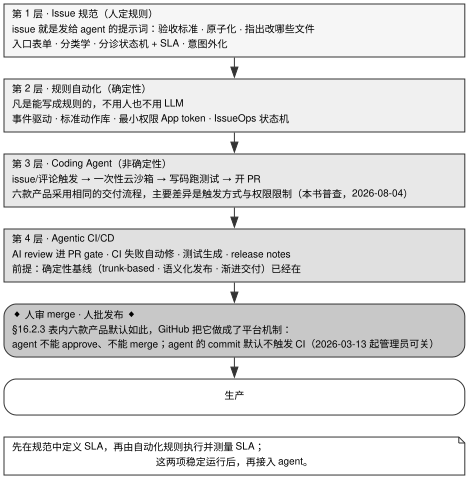

# 第 16 章 · 接进交付流水线：issue 进，PR 出

---

## 16.1 自动化交付前沿：已实现自动化的半场与坚守人工的终局

前 15 章详尽解构了 Coding Agent 本体的构建、记忆演进、安全沙箱与会话运行时；本章则聚焦于如何将 Agent 规范地接入现代工程团队的真实生产交付流水线（Issue → PR → CI/CD → Production）。

当前业界工程实践呈现出高度清晰的半场分界：
- **「Issue 进，PR 出」的前半程已高度成熟**：GitHub Copilot、OpenAI Codex、Anthropic Claude Code 与 Cognition Devin 均已在超大规模生产环境中实现日常化运行；
- **「PR 合并与生产发布」的后半程严守人工审批**：主流代码托管平台与企业级安全合规体系均强制将「Agent 禁止自主 Approve、禁止自主 Merge、生产部署需人工放行」设为不可绕过的硬性安全边界。

自动化流水线建设的核心准则是：**严禁跳过确定性基础直接接入 Agent**。没有严密测试套件与结构化 Issue 规范作为基底，盲目引入 Agent 只会指数级放大系统缺陷，导致工程师陷入漫长的人工排错泥潭。

---

## 16.2 现代交付流水线的四层架构体系



图 16-1 展示了现代软件工程交付流水线的四层递进拓扑与人机协作边界：流水线自底向上划分为标准化的 Issue 结构化规范（定义 SLA 与验收断言）、确定性的规则自动化分诊（有限状态机处理）、非确定性的 Coding Agent 编码探索（云沙箱隔离执行），以及 Agentic CI/CD 质量门禁；而在整个自动化链条的终点，系统强制保留人工审核 PR 与人工审批生产发布两道硬性卡点，构建坚固的质量与安全防线。

### 16.2.1 第 1 层 · Issue 即提示词：结构化任务规格设计

GitHub 官方核心指导原则指出：**"it's useful to think of the issue you assign to Copilot as a prompt"**。高水准的 Issue 规范即是最高质量的 Agent 任务提示词。

构建生产级 Issue 规范的五大准则：
1. **如同指导新同事般详尽**：明确定义改动范围、预期影响、关联模块与详尽验收断言；
2. **原子化任务拆解**：严禁提交过于宽泛的宏任务，依托 Sub-issues 将大需求拆解为独立可验证的微任务；
3. **提供可运行的确定性验证命令（Pass/Fail）**：为 Agent 提供单条即可执行的测试/构建命令，提供明确的反馈回路；
4. **仓库通用约定下沉**：将代码风格、构建规范与提交指南集中写入根目录指令文件（如 `AGENTS.md`），Issue 仅聚焦具体任务差量；
5. **严守任务排除负面清单**：跨仓库大规模重构、缺乏测试的历史遗留代码、高危安全鉴权逻辑严禁直接交由 Agent 独立处理。

### 16.2.2 第 2 层 · 确定性规则自动化：能用代码解决的坚决不用模型

在引入 LLM 之前，必须首先将所有具备确定性逻辑的流程沉淀为规则状态机（IssueOps）：
- 基于 GitHub App Token / Webhook 驱动有限状态机（FSM）流转；
- 自动化处理标签打标、负责人分派、重复 Issue 查重与分诊 SLA 统计（如 Time in Label）；
- 严禁调用昂贵且不稳定的 LLM 去执行简单的 `if/else` 规则判断。

表 16-1：主流 IssueOps 机器人架构对比

| 架构形态 | 代表工程方案 | 适用场景与维护成本 |
|---|---|---|
| **集中式服务 + 仓内声明** | Kubernetes Prow、triagebot | 适合超大型单体仓，支持基于 OWNERS 细粒度授权；需独立运维服务 |
| **声明式策略引擎** | microsoft-github-policy-service | 适合非开发人员维护标准化 if/then 业务规则 |
| **纯 Actions Serverless** | GitHub Actions Workflow 体系 | 零独立运维成本，直接复用平台内置算力 |

### 16.2.3 第 3 层 · Coding Agent 隔离执行拓扑

表 16-2 汇总了业界主流 Coding Agent 产品的运行模式与权限边界。

表 16-2：主流 Coding Agent 产品的触发、沙箱与 PR 生成模式

| 产品方案 | 核心触发事件 | 运行时隔离环境 | PR 产出与合并控制 |
|---|---|---|---|
| **GitHub Copilot Cloud Agent** | Assign Issue 显式派发 | Actions 临时隔离容器 | 自动提交 Draft PR，严格禁止自批自合 |
| **Claude Code Action** | 评论 `@claude` 或打标签 | 仓库 Actions Runner | 仅推送独立分支并生成链接，由人工确认开 PR |
| **OpenAI Codex Cloud** | PR 评论 `@codex` | 独立云沙箱（默认切断外网） | 需人工点击触发 PR 生成 |
| **Devin** | Linear/Jira 状态流转 | 每任务独立全新虚拟机镜像 | 自动提交 PR 并回写工单进度 |

**云端 Agent 执行的七大安全底线**：
1. 仅限具备写权限（Write Permission）的受信团队成员可触发；
2. 运行环境必须为单任务隔离的一次性沙箱/虚拟机；
3. 只能向特定命名空间分支推送代码，物理禁止直接操作默认分支；
4. **Agent 严格禁止拥有 PR Approve 与 Merge 权限**；
5. Agent 提交的代码变更默认不自动触发特权 CI 流水线；
6. 容器网络出站默认施加严格白名单限制；
7. 外部评论与 Issue 文本入模前必须完成隐匿控制字符清洗与安全转义（第 11 章）。

### 16.2.4 第 4 层 · 确定性测试前置过滤与 Agentic CI/CD

AI 模型的引入是为流水线注入非确定性推理能力，但其产出必须受到确定性测试套件的严格过滤：
- **Meta TestGen-LLM 黄金过滤范式**：Agent 生成的测试用例必须连续通过三道机器断言（可编译构建 → 无 Flaky 稳定通过 → 实测提升代码覆盖率），唯有通过全部过滤的产物方可推送给工程师评审；
- **AI Code Review 作为辅助预检门禁**：在人工介入前预先扫描 P0/P1 级语义缺陷，但其输出同样按不可信数据对待。

---

## 16.3 判断标准：交付流水线建设的四大准则

### 判断标准一：严格遵循递进建设顺序

必须在 Issue 结构化规范与确定性规则自动化完全跑通后，方可引入 Coding Agent，严禁在混乱的流程之上叠加 AI。

### 判断标准二：严格对照任务适宜性负面清单

表 16-3：Coding Agent 任务分派决策矩阵

| 坚决禁止派发给 Agent 的任务 | 强烈推荐派发给 Agent 的任务 |
|---|---|
| 涉及多个分布式代码仓的架构级大重构 | 单仓库内部边界清晰的局部模块迭代 |
| 缺乏单测且无历史文档的黑盒遗留代码 | 具备完善单元测试与断言覆盖的核心模块 |
| 生产核心链路突发严重事故与应急排障 | 日常低风险缺陷修复与语法版本平迁 |
| 核心鉴权逻辑、支付与合规敏感模块变更 | 结构化测试用例补全与接口文档对齐 |

### 判断标准三：必须配备单条命令可断言的验证信号

每个分派给 Agent 的任务，必须能够通过单条命令返回确定的 Pass/Fail 状态，否则严禁进入全自动流水线。

### 判断标准四：合并与发布卡点必须强制保留人工确认

系统必须确保任何合入主干的代码均存在明确的人工责任人，杜绝无人值守下的幽灵代码合入。

---

## 16.4 反面证据与失败模式

### 反面证据一：资深工程师的主观体感与实测产出可能发生背离

METR 严格受控实验（针对资深开源维护者的随机对照测试）显示：在自身高度熟悉的成熟代码库中，使用 AI 导致任务完成耗时实际增加了 19%，但受访者事后主观估计自己提速了 20%。流水线效能评估必须依赖客观数据，绝不能依赖主观体感。

### 反面证据二：恶意 Issue 诱导有害补丁的成功率高达 90%

对抗性测试研究表明，黑客构造的恶意 Bug 报告有高达 90% 的概率诱导 Agent 产出包含漏洞的有害代码，最强的前置防御仅能拦截 47%。人工代码审查是不可替代的安全防线。

### 失败模式：跳过确定性规则与测试基线直接接入 Agent

缺乏测试覆盖的系统在接入 Agent 后，只会以极高的速度批量生成包含隐蔽缺陷的低质代码，引发灾难性的系统崩溃。

---

## 16.5 可以直接采用的最小实现

### 16.5.1 生产级 Issue 规范模板

````markdown
## 1. 业务背景与缺陷现状
<简明描述问题现状、预期表现及复现步骤>

## 2. 验收标准与断言清单
- [ ] 核心功能断言 1: <具体可验证行为>
- [ ] 边界异常断言 2: <输入非法参数时返回特定错误码>
- [ ] 单元测试要求: 必须补充对应的单测覆盖新增逻辑

## 3. 确定性验证命令
```bash
pnpm test:unit -- packages/core/src/session.test.ts
```

## 4. 涉及文件与模块
- `packages/core/src/session.ts` — 核心逻辑修改
````

### 16.5.2 三段式代码审查流（Three-Stage Review Pipeline）

```
[Coding Agent 产出 PR]
       │
       ▼
[确定性过滤流水线] ── (编译失败 / 测试未过 / 覆盖率下降) ──> [自动打回重试]
       │
       ▼ (100% 确定性通过)
[AI Reviewer 预审] ── (扫描高危 P0 缺陷并打标) ──> [非阻塞建议标注]
       │
       ▼
[工程师人工终审 (Final Human Gate)] ──> [人工 Approve 并合并]
```

### 16.5.3 核心效能与质量监控指标矩阵

表 16-4：自动化交付流水线核心度量体系

| 度量指标名称 | 监控目标与业务价值 | 起步推荐基线与预警阈值 |
|---|---|---|
| **Time in Label (`needs-triage`)** | 衡量 Issue 自动化分诊与响应 SLA | 目标 $\le 1$ 个工作日内完成分诊 |
| **Agent PR 合并成功率** | 评估任务分派合理性与 Agent 交付质量 | 先建立基线，若连续两月下滑需收紧任务派发 |
| **Agent PR 人审交互轮次** | 评估代码可读性与团队审查负载 | 期望中位数 $\le 2$ 轮交互 |
| **变更失败率（CFR）与 MTTR** | DORA 核心稳定性指标，防范缺陷扩散 | 必须维持不高于引入 Agent 前的历史基线 |

---

## 16.6 版本与复核

### 本章基准

| 项 | 值 |
|---|---|
| 素材复核日期 | 2026-08-17 |
| 底稿 | `docs/issue-driven-automation/report.md`（2026-08-04 成文）+ `notes/01`–`08` 八篇调研笔记 + `papers/` 与 `industry-articles/` 下 132 篇一手资料存档（38 篇论文、94 篇官方文档与文章快照） |
| 项目 commit | 本章不引用项目源码；证据为官方文档、厂商公开博客与论文，取数日期见各条 |
| 主证据清单 | 论文：arXiv:2402.09171（TestGen-LLM）、2509.05372（对抗性 bug 报告）、2310.06770（SWE-bench）、2410.06992（SWE-Bench+）、2410.03859（SWE-bench Multimodal）、2505.23419（SWE-bench Live）、2504.02605（Multi-SWE-bench）、2502.12115（SWE-Lancer）、2308.10022（Cupid），另有 *Who Should Fix This Bug?*（ICSE 2006）。官方文档：GitHub Copilot cloud agent 文档、Claude Code Action 文档、Codex 文档，均抓取 2026-08-04。厂商与实践者材料：DORA 2025 报告（2025-09-23）、METR 随机对照试验（2025-07-10，arXiv:2507.09089）、Thoughtworks Radar Vol 31/32（2024-10-23 / 2025-04-02）、Cognition 两篇（2025-11-14、2026-02-27）、OpenAI 两篇（2025-12-04；Lopopolo，2026-02-11）、Cursor《Building a better Bugbot》（2026-01-15）与 Latent Space 访谈（2026-03-06）、Meta ACH 博客（2025-02-05） |
| 已知过时项 | 产品格局部分基准为 2026 年中，是本章最先过期的一块；METR 那条已由发布方在 2026-02-24 声明属历史快照；Thoughtworks 那条 blip 停在 2025-04-02，已不在当期 Radar 上；「agent 的 commit 默认不触发 CI」自 2026-03-13 起可被管理员显式关掉 |

本章引用的厂商自述数据及其用途已在 §16.4 表 16-4 逐条列出；这些数据不用于证明因果关系。

### 哪些会过期，怎么自己复核

| 类别 | 保鲜期 | 复核方式 |
|---|---|---|
| 四层框架 | 长 | 看是否出现第五层，或某一层被平台整个吸收进去 |
| 「issue 就是提示词」 | 长 | 不需要复核，它不依赖版本 |
| 「人审 merge、人批发布」（§16.1 与 §16.3 判断标准四，全称断言） | 短 | 普查口径：范围＝表 16-2 六款产品的官方文档加 GitHub、OpenAI、Anthropic、Cognition 四家公开博客，判定＝官方文档里 agent 能不能 approve / merge、博客里有没有宣称无人合入（材料抓取 2026-08-04，复核 2026-08-17）。复核时先跑下面的命令 1，再逐家打开六家官方文档看有没有哪一家宣称可以无人合入 |
| 七条安全底线（§16.2.3，以 GitHub 一家为基准的对照清单） | 短 | 先看 GitHub 那两页有没有再松动（2026-03-13 已松过一条）；再拿这七条去对另外五家的官方文档，看谁补齐了哪几条 |
| 「GitHub 是唯一把 AI review 做成仓库规则的平台」（§16.2.4，唯一性断言） | 短 | 查 GitLab、Bitbucket 这些平台的仓库规则文档里有没有等价能力，出现一个就推翻 |
| 产品格局表 | 最短 | 逐个打开六家的官方文档页，比对触发方式与 PR 生成策略（Claude Code Action 的「不自动开 PR」是刻意设计，它一旦改了，说明行业的保守程度在下降） |
| 厂商自述的百分比 | 短 | 取各家最新博客重读，比对适用条件是否同口径；口径不同的两个数不要相减 |
| METR 的对照试验结论 | 中 | 查 metr.org 有没有复现结果或新的更新声明 |
| 安全结论（90% / 47%） | 中 | 查 arXiv:2509.05372 的被引，看拦截率有没有被新方法推高 |

复核方法（本章不看源码，看官方文档与平台约束）。下面三条可以直接粘贴执行。命令 1 读的是 GitHub 官方那张「Copilot cloud agent 的风险与缓解」页。看 agent 能不能 approve / merge、workflow 还要不要人批。本章「人审 merge 是机制不是流程习惯」这个招牌结论就建在这一页上。命令 2、3 查的是你自己仓库的两个数，agent 署名 PR 的合并率与人审轮次，也就是表 16-6 里最要紧的那两行。

```bash
# 1. 平台硬约束是否还在：读 GitHub 官方的 cloud agent 风险与缓解页，
#    看 approve / merge 与 workflow approval 两处说法有没有变。
#    -L 是必须的：这个站换路径时会 301/308 跳转，不跟随会静默输出空，
#    你会误以为页面上已经没有 approve 字样了。
#    输出里会混进页面自带的 JSON 结构（形如 approval","title":"..."），
#    看含 approve 的自然语句那几行就行。
curl -sL https://docs.github.com/en/copilot/concepts/agents/cloud-agent/risks-and-mitigations \
  | grep -Eo 'approv[a-z]*[^<]{0,80}' | sort -u

# 2. 你自己的数据（把 OWNER/REPO 换成你的仓库）：agent 署名 PR 按状态分组计数，
#    MERGED ÷ 合计就是合并率
gh pr list -R OWNER/REPO --author "app/copilot-swe-agent" --state all \
  --limit 200 --json number,state \
  --jq 'group_by(.state)|map({state:.[0].state,n:length})'

# 3. 人审轮次：逐个 agent PR 的 review 次数，自己取中位数比对 §16.5.6 的「≤2 轮」。
#    这条里 OWNER/REPO 出现两处（-R 与 API 路径），两处都要换成你的仓库，
#    只换第一处的话 gh api 会对每个 PR 报 404，刷出一屏错误。
#    注意它会按 PR 逐个打 API，100 个 PR 就是 100 次请求
gh pr list -R OWNER/REPO --author "app/copilot-swe-agent" --state merged \
  --limit 100 --json number --jq '.[].number' \
  | xargs -I{} gh api repos/OWNER/REPO/pulls/{}/reviews --jq 'length'
```

命令 2、3 里的 `app/copilot-swe-agent` 是 GitHub Copilot cloud agent 的署名。换别家 agent，就把署名换成对应的机器人账号名。这两条命令无法计算变更失败率；该指标必须从团队自己的发布记录中取得。命令 1 与命令 2 本书在 2026-08-18 实跑过（命令 2 使用公开仓库代跑），命令 3 未实跑。

本章的正面数据以厂商自述为主，采用前应先读 §16.4 的反面证据。METR 的对照试验测得速度下降 19%，说明工具在厂商案例中有效，不能证明它能缩短你团队的交付时间。请用自己的 issue 和审查流程做对照试验。

**待核实清单（本书尚未落实出处，读者引用前请自行核实）**：

1. TestGen-LLM 论文（arXiv:2402.09171）正文里，对「生成的测试必须可构建、可稳定通过、实测提升覆盖率才推荐给人」这套机制到底用的是哪个英文词。本书能确认的只有 Meta 在 ACH 的说明里用 Assured LLM-based Software Engineering 指这一系工作的原则（§16.2.4），论文本身是否也这么叫，本书未逐字核对原文——所以正文不给这套过滤器起中文专名，只按动作描述它。
2. GitHub 2026-03-13 那条「可显式跳过 Copilot coding agent 的 workflow 审批」changelog（§16.2.3），本书是通过底稿记录的链接引用的，未直接抓取该页。
3. §16.4 表 16-4 中 Cursor 数据的第一个时间点（2025-12 约 10%），本书只在底稿里查到，未定位到 Cursor 官方页面上的原始出处；后三个时间点（2026-02、2026-06、2026-07）有官方博客与 changelog 对应。
4. §16.2.3 列出的七项安全要求，本书只对 GitHub 的实现逐项完成了核实；另外五家已核实的部分写在该节正文中，完整的逐项对照矩阵尚未完成。Codex cloud 与 Jules 的产品文档、Claude Code Action 的官方安全文档均未在本仓库保存页面快照，底稿中只有逐字引句。
