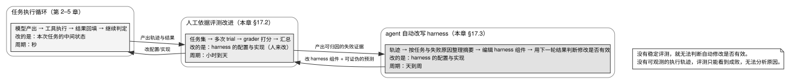

# 第 17 章 · 评测与 harness 自动改进：先建立评测，再自动调整实现

---

## 17.1 系统认知偏差：开发者对退化风险的极低预判力

> 读本章前建议先读第 1 章 §1.4。本章使用其中两项限制：自动修改难以预测会破坏哪些已有能力，而且多个组件各自的收益不能直接相加。

前 16 章详尽拆解了从底层 Agent Loop、上下文生命周期治理到云端多租户会话运行时的系统工程全貌。然而，任何未经严格回归验证的架构调整，均可能在修复局部问题的同时引入毁灭性的全局退化。

AHE 实证研究揭示了系统优化中的核心认知偏差（见表 17-1）：

表 17-1：演化 Agent 对代码修改效果的真实预测精度

| 效果预测类型 | 实际精准率（Precision） | 实际召回率（Recall） | 相对随机猜想的有效倍数 |
|---|---|---|---|
| **预测能够修好哪些缺陷** | 33.7% | 51.4% | 约 5 倍 |
| **预测可能弄坏哪些已有功能** | **11.8%** | **11.1%** | **仅约 2 倍** |

**核心系统结论**：开发者与演化 Agent 对「修复成功」的预判能力约为随机水平的 5 倍，但对「破坏已有功能（Regression）」的预判能力仅为随机水平的 2 倍（几乎等同于盲猜）。

**没有严密的回归测试集，任何对 Harness 的代码重构与 Prompt 调整都在盲目冒险**。建立可重复、基于结果状态断言的评测体系，是采用本书前 16 章所有建议的绝对先决条件。

---

## 17.2 建立可重复的工程化评测体系

### 17.2.1 核心评测概念与实体契约

表 17-2：评测体系核心概念规范与边界

| 核心实体 | 英文术语 | 系统工程定义与边界约束 |
|---|---|---|
| **任务** | Task | 具备确定性环境初始状态与明确成功判定标准的独立用例 |
| **试次** | Trial | 针对单个任务的一次完整尝试（因模型存在非确定性采样，必须多次运行） |
| **评分器** | Grader | 对 Agent 表现特定维度实施打分的逻辑模块（一个任务可挂载多个 Grader） |
| **执行轨迹** | Transcript / Trace | 单次试次的完整时序日志（模型输出、思考流、工具调用与中间结果） |
| **物理结果** | **Outcome** | **试次结束时底层宿主环境的物理最终状态（文件、数据库行、退出码）** |
| **评测框架** | Evaluation Harness | 驱动自动化批量评测的基础设施套件 |
| **受测系统** | Agent Harness | 接受质量评估的 Agent 宿主运行时本体（即本书研究对象） |

**评分基本原则：必须严格评分 Outcome 物理结果，严禁仅凭 Transcript 中的模型自述判定成功**。模型宣称「单测已全部通过」与宿主环境中 `pytest` 退出码确实为 0 是完全不可等同的两回事。

### 17.2.2 评测套件的最小构建配置

启动评测无需复杂的重型平台，**10 个高质量任务即可构建起步回归集**：

```typescript
interface EvaluationTask {
  taskId: string;
  initialEnvironment: EnvironmentSnapshot; // 隔离的 Git Worktree 或 Docker 镜像
  inputPrompt: string;
  graders: Grader[];                      // 首选确定性断言
  trialsPerRun: number;                   // 必须 >= 3，消除输出采样噪声
}
```

**多试次（Trials $\ge 3$）是滤除采样噪声的刚性要求**：评测随机性研究表明，单次 Pass@1 的测量波动高达 2.2 pp 至 6.0 pp。脱离多次试验的微小指标增长往往只是随机数发生器的统计噪声。

### 17.2.3 评分器优先级梯队

表 17-3：评分器选型的优先级阶梯

| 选型优先级 | 评分技术方案 | 判定适用场景与置信度特征 |
|---|---|---|
| **第一优先级** | **宿主环境物理状态断言** | 验证文件树、数据库持久行、编译通过、单元测试退出码（100% 确定性） |
| **第二优先级** | **代码静态分析与 Lint** | 检查类型系统完整性、语法规范与代码复杂度 |
| **第三优先级** | **确定性结构化文本对比** | 校验输出 JSON 架构与特定枚举值匹配 |
| **第四优先级** | **LLM Judge 语义裁判** | 仅用于开放式语义质量评估，必须强制配备人工校验基准 |

### 17.2.4 系统不变量测试：进入 CI 的确定性硬门禁

表 17-4：业务任务评测与系统不变量测试的本质差异

| 评估维度 | 业务任务评测（Task Eval） | 系统不变量测试（Invariance Test） |
|---|---|---|
| **核心目标** | 评估 Agent 在具体业务上的表现优劣 | 验证 Harness 底层架构物理约束是否成立 |
| **输出形式** | 连续的百分比分数或胜率 | 确定性的通过 / 失败（Pass / Fail） |
| **执行归属** | 异步离线评测套件 | **同步阻塞式单元测试，强制合入 CI** |

四大必须纳入 CI 的核心不变量测试：
1. **KV Cache 前缀不变性测试**（第 6 章）：断言连续交互中 Provider 侧的缓存前缀字节完全不变；
2. **WAL 预写日志任意切片可恢复性**（第 14 章）：截取历史动作的任意前缀，断言 Reducer 均能解析出合法状态；
3. **安全沙箱 Fail-Closed 默认阻断**（第 11 章）：断言未显式授权的高危命令一律被拦截；
4. **历史对话只追加约束**（第 6 章）：断言任何内部状态修改均发生在尾部，杜绝前缀作废。

---

## 17.3 基于评测反馈的 Harness 自动化优化循环

### 17.3.1 三层控制回路的拓扑关系



图 17-1 展示了 Agent 系统演进过程中的三层控制回路拓扑结构：最内层为秒级的任务执行循环（修改单次会话的上下文中间状态）；中间层为小时至天级别的人工工程迭代回路（工程师依据评测报告修改 Harness 架构代码与策略）；最外层为天至周级别的自动演化回路（演化 Agent 依据结构化评测轨迹执行组件级定向自愈与回滚裁决）。外层回路的有效性严格建立在内层回路完备的可观测性与确定性评测断言之上。

### 17.3.2 AHE：基于高可观测性的 Harness 自动优化架构

AHE 论文证实：**制约 Harness 自动优化的瓶颈在于系统可观测性的结构化程度，而非优化模型本身的单步推理能力**。

生产级自动优化框架的三大支柱：
1. **组件解耦与挂载点文件化**：将 System Prompt、工具声明、拦截中间件、技能包等七大核心组件全面文件化，使每次策略修改对应精确的 Git Commit 与文件 Diff；
2. **海量轨迹结构化蒸馏**：将数千万 Token 的原始试次日志提炼为聚焦失败归因的万级别结构化诊断摘要；
3. **带可证伪预测的变更清单（Change Manifest）**：优化 Agent 在提交代码时必须显式声明预期修复目标与潜在退化风险，由下一轮真实评测执行逐项判定与自动文件级回滚。

### 17.3.3 自动优化 Agent 的防作弊安全沙箱

为确保优化成果真实有效，必须对演化 Agent 施加严格的只读约束：
- 严格限制其仅能修改 Harness 工作区文件；
- 评测基准套件、校验器代码与模型推理超参数设为**物理只读**；
- 严禁针对特定任务逆向硬编码判定逻辑。

---

## 17.4 反面证据与失败模式

### 反面证据一：组件收益不可线性相加

AHE 消融实验证明（见表 17-5）：分别单独引入 Memory（+5.6 pp）、Tool（+3.3 pp）与 Middleware（+2.2 pp）的收益总和高达 +11.1 pp，但在全量组合启用后整体收益仅为 +7.3 pp（甚至出现 Prompt 单独生效为负收益的情况）。过度堆叠防卫与检查逻辑会导致推理预算耗尽。

表 17-5：AHE 各组件独立替换对任务成功率的增益矩阵

| 独立换入的系统组件 | 相对基线的通过率增量 |
|---|---|
| **长期记忆机制（Memory）** | **+5.6 pp** |
| **工具定义与编排（Tool）** | **+3.3 pp** |
| **生命周期中间件（Middleware）** | **+2.2 pp** |
| **系统提示词微调（System Prompt）** | **−2.3 pp** |

### 失败模式一：仅评分模型轨迹而忽略物理环境结果

评分器仅抓取 Assistant 回复文本，导致在模型产生「幻觉式假汇报」时误判为任务成功。

### 失败模式二：脱离评测基线盲目启动自动化修改

在缺乏可重复评测套件的前提下启用自动优化，只会导致 Agent 在毫无方向的无效修改中耗尽 Token 预算。

---

## 17.5 可以直接采用的最小实现

### 17.5.1 最小回归集与评测运行器伪代码

```typescript
export async function runRegressionSuite(harness: AgentHarness, tasks: EvaluationTask[]) {
  const report: TaskResult[] = [];
  
  for (const task of tasks) {
    const trialResults: TrialOutcome[] = [];
    for (let trial = 0; trial < 3; trial++) {
      const sandbox = await prepareFreshSandbox(task.initialEnvironment);
      const trace = await harness.execute(task.inputPrompt, sandbox);
      const isPassed = await evaluateOutcomeGraders(task.graders, sandbox);
      trialResults.push({ trial, isPassed, tokens: trace.totalTokens });
      await sandbox.destroy();
    }
    report.push(aggregateTaskReport(task.taskId, trialResults));
  }
  
  return report;
}
```

### 17.5.2 验收测试矩阵

在交付评测体系前，必须通过以下四项基础验证：
1. **假汇报拦截测试**：注入仅口头宣称成功但未产生任何物理改动的假 Agent，断言评分器严格给出失败判定；
2. **多试次方差收敛测试**：在相同配置下连续运行两次全量评测，断言通过率波动不超过 $5\text{ pp}$；
3. **评测配置版本化测试**：修改评测模型或 Judge 参数，断言新参数被强行记录在评测报告元数据中；
4. **探针用例阻断测试**：向回归集中注入已知必败的缺陷用例，断言评测套件能够准确捕获。

---

## 17.6 版本与复核

### 本章基准

| 项 | 值 |
|---|---|
| 素材复核日期 | 2026-08-17 |
| 底稿 | `docs/benchmarks/`（**仅 15 份论文 PDF，零原创综合**）、`docs/cybernetics/landscape/07` §5（AHE 精讲）；本章为新写 |
| 项目 commit | goose `caf59517c` (08-27)、pi-mono `ccfe79ed2` (08-27) |
| 外部来源基准 | 论文：AHE (*Agentic Harness Engineering: Observability-Driven Automatic Evolution of Coding-Agent Harnesses*, Lin et al., arXiv:2604.25850, v4 2026-05-18)、Meta-Harness (*Meta-Harness: End-to-End Optimization of Model Harnesses*, Lee et al., arXiv:2603.28052, 2026-03-30)、Terminal-Bench 2.0 (*Terminal-Bench: Benchmarking Agents on Hard, Realistic Tasks in Command Line Interfaces*, Merrill, Shaw et al., arXiv:2601.11868, 2026-01-17)、SWE-Bench+ (*SWE-Bench+: Enhanced Coding Benchmark for LLMs*, Aleithan et al., arXiv:2410.06992, 2024-10-09)、*On Randomness in Agentic Evals* (Bjarnason, Silva & Monperrus, arXiv:2602.07150, v3 2026-03-25, ICLR 2026 Workshop on Agents in the Wild)、τ²-Bench (*τ²-Bench: Evaluating Conversational Agents in a Dual-Control Environment*, Barres et al., arXiv:2506.07982, 2025-06-09)、UTBoost (arXiv:2506.09289, 2025-06-10)、Beyond Black-Box Benchmarking (arXiv:2503.06745, 2025-03-09)、Lessons from the Trenches (arXiv:2405.14782, 2024-05-23)。厂商文章：Anthropic《Demystifying evals for AI agents》，2026-01-09，`anthropic.com/engineering/demystifying-evals-for-ai-agents`；本仓库存档 `docs/harness-engineering/industry-articles/anthropic_demystifying-evals-for-ai-agents.md` [核实于 2026-08-17]。理论著作：Chris Argyris & Donald A. Schön，*Organizational Learning: A Theory of Action Perspective*，Addison-Wesley，1978；Heinz von Foerster 主编，*Cybernetics of Cybernetics: Or, the Control of Control and the Communication of Communication*，BCL Report 73.38，University of Illinois，1974 |

**对照面板的两个项目。** AHE 论文的对照面板含 Codex CLI 与 opencode。论文参考文献 `[2]` 给的 URL 是 `github.com/anomalyco/opencode`，与本书 `projects/opencode` 是同一个仓库；`[25]` 给的是 Codex CLI 的官方页 `developers.openai.com/codex/cli`，本书核对过 `projects/codex` 的 remote 是 `github.com/openai/codex`——这条对应关系是本书核对 remote 查证出来的，不是论文写的。

### 哪些会过期，怎么自己复核

| 类别 | 保鲜期 | 复核方式 |
|---|---|---|
| task/trial/grader/outcome 的定义 | 长 | 不需要 |
| 「评结果不评轨迹」 | 长 | 不需要 |
| 三层回路的划分 | 长 | 不需要 |
| 评分器优先级 | 长 | 不需要 |
| AHE 的具体数字 | 中 | 单篇论文单基准，需要复现 |
| Meta-Harness 的 76.4% 与它在 Terminal-Bench 2 榜单上的名次 | **短** | 榜单持续更新，名次与对照项（ForgeCode 81.8%）随时会变；回原论文（arXiv:2603.28052）与官方榜单各核实一次 |
| SWE-bench Verified 的饱和状态 | **短** | 基准在持续演进，厂商自述的成绩也在变 |
| 「自动改写 harness 无法准确预测回归」 | **短** | 这是当前仍在快速变化的研究方向 |

```bash
cd projects   # 未克隆先见前言《怎么拿到这些项目的代码》
# 两个不变性测试的实例
grep -n "seeded_regression\|vacuous" goose/crates/goose-provider-types/tests/prefix_invariance.rs
grep -n "validPrefixes\|valid section 6 durable prefixes" \
  pi-mono/packages/agent/test/harness/reducer.test.ts
```

每个季度先把 5 个真实故障改写成回归任务；5 个是本书建议的起步值，应按实际故障频率调整。随后用旧评测集检查这些故障是否本可提前暴露。没有被旧评测捕获的故障，必须加入新的回归集。

---

## 尾声 · 全书收束

本章到此结束，下面这几段收的是整本书。本书从第 1 章的公式开始：

$$\text{Agent} = \text{Model} + \text{Harness}$$

到这一章，它以另一种形式回来了——Anthropic 评测方法文章里的一句定义：

> When we evaluate "an agent," we're evaluating **the harness and the model working together.**
>
> —— Anthropic 评测方法文章（着重为本书所加，原文用斜体）

**你测出来的每一个分数，都属于这个组合。** 换掉模型，前 16 章里那些为弥补模型缺陷而写的东西会变成负担（第 7 章 §7.4）。换掉 harness，模型的能力则可能根本释放不出来（第 1 章的三组实验）。

这本书能提供的是：**其他项目面对同类设计问题时采用了什么方案，以及选择方案时依据了哪些条件**。它无法替你决定最适合自己项目的方案，因为你的模型、任务分布和团队都不同。

我希望你合上这本书时，手里不是一套必须照抄的答案，而是一组能够在自己系统里逐项验证的选择。最后留下哪些，仍要由你的任务、回归集和运行数据决定。
